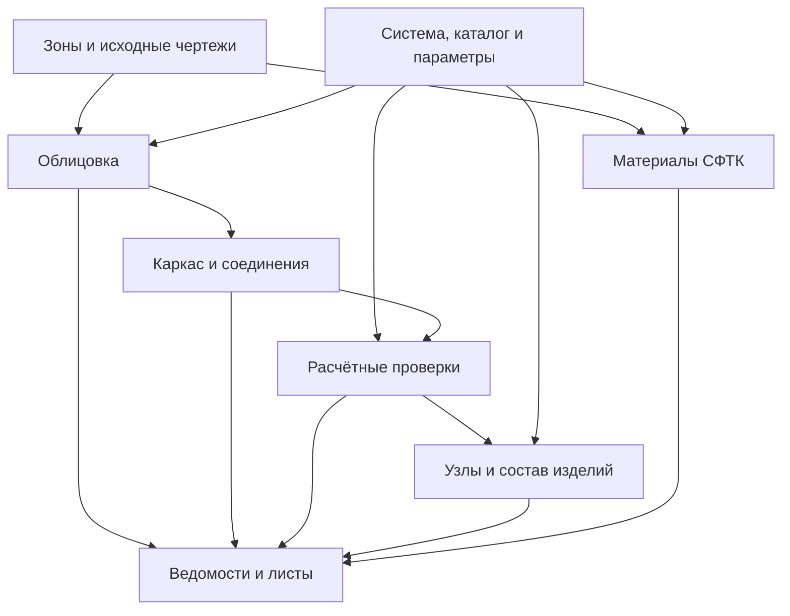

# Единый фасадный комплекс: архитектура и пошаговая реализация

Дата: 30.09.2026. Заказчик — Денис Зинченко, инженерная проверка — Герман.
Основание: собранные пожелания о ведомостях, параметрических узлах, полном проектировании НВФ и отдельном направлении СФТК.
Срез кода: `06e1cb9c19b4a43a7ddea0d2449f836c9aae9a19`; продуктовый код — `8f580aa`.

**Статус: Q-01…Q-06 реализованы в исходниках после этой плановой точки.** `ATFTABLE → Облицовка / Подсистема` использует проверяемые паспорта физических деталей AClad/AFrame и общий вывод DWG/XLSX. Фактическое поведение — [облицовка](CLADDING_QUANTITIES_30.09.md) и [подсистема с требованиями производительности](FRAME_QUANTITIES_30.09.md). Групповой раскрой облицовки и оценка хлыстов каркаса отделены от установленных деталей. Ручные образцы регистрируются через `ATFTABLE → Ручные` и входят в общий состав; поведение и границы — [Q-06](MANUAL_QUANTITIES_01.10.md). Этап 2А добавляет справочные идентичности и геометрический паспорт соединений; дальнейшие инженерные этапы остаются планом. Новый установочный выпуск и живая проверка AutoCAD ещё не выполнены. Действующие ограничения перечислены в разделе 10. Исторические планы не являются списком незакрытых ошибок.

## Текущий маршрут — 01.10.2026

Ведомости Q-01…Q-06 завершены в исходниках на `5dfb01c` (передача `0a397c2`). Следующее приращение — **2А: справочная идентификация по источникам и диагностический паспорт соединений**. Это начало этапа 2, а не завершённый каталог изделий или разрешение полной статики. Результат и точные границы описаны в [CATALOG_CONNECTIONS_01.10.md](CATALOG_CONNECTIONS_01.10.md).

| Шаг | Пользовательский результат | Положение на маршруте |
|---|---|---|
| 1. Зоны, раскладки и ведомости | Работы, облицовка, подсистема и зарегистрированные ручные элементы; DWG/XLSX с проверкой актуальности | Q-01…Q-06 реализованы; живая приёмка ещё впереди |
| 2А. Источники и геометрия соединений | Связь направляющих с кандидатами опор, интервалы и свободные концы; видимые неизвестные закрепления/стыки | Реализовано в исходниках; идентичности расчётного примера не являются SKU |
| 2Б. Каталог и параметры одного решения | Подтверждённая редакция альбома, изделия и исполнения, базовые плоскости, диапазоны регулировки, явный выбор в проекте | Следующий шаг после 2А |
| 2В. Монтажный контракт | Реальные сборки, отверстия, разрешённые перемещения, стыки, передача усилий и комплектность | По первичным узлам; пробелы не закрываются пользовательской галочкой |
| 3А. Расчёт одного вертикального решения | Нагрузки и проверки по фактическому каркасу, опорам и стыкам; положительные и отказные эталоны | После подтверждённых 2Б/2В; действующие отказы сохраняются |
| 3Б. Параметрические узлы | Вынос, утеплитель, кронштейн, откосы и размеры в проверенных шаблонах | Геометрический пилот после этапа 2; инженерная приёмка связана с 3А |
| 4. Состав узлов и материалы | Полная спецификация крепежа, комплектов и материалов; раскрой и закупка отдельно | После подтверждения состава узлов и совместимости |
| С. Материалы СФТК | Расходы по зонам для одной системы и подтверждённым нормам | Отдельная параллельная линия на общей базе зон/источников/ведомостей |
| 5. Комплект проекта | Согласованные фасады, узлы, ведомости, расчёты и листы изменений | Сквозной эталон и живая проверка AutoCAD после правок и ревизии |
| 6. Расширение | Дополнительные системы, облицовки и сложные случаи | Каждая область проходит источники → реализацию → эталон → проверку |

Для 2А сначала воспроизведён квадратичный поиск опор в чистом ядре. Индексирование сохраняет исходные координатные предикаты и порядок результатов; паспорт переиспользует извлечённые данные и не добавляет обход DWG на каждую направляющую. Замеры чистого ядра и CAD doubles не заменяют время живого AutoCAD.

Ни один шаг не означает автоматическую публикацию установочного выпуска: для неё требуется отдельная команда Дениса «Собираем». До этого публикуются только проверенные исходники рабочей ветки. Разделы ниже сохраняют исходное обоснование архитектуры; описанные там ранние задачи ведомостей не открываются заново.

## 1. Решение и границы

Развиваем существующие Facades, AClad, AFrame и общий фасадный код в один пользовательский процесс: исходные чертежи → зоны → решение системы → раскладка → каркас и соединения → проверки → узлы → ведомости и листы. СФТК использует те же зоны, каталог источников и ведомости, но собственные правила состава и расхода материалов.

Единство означает согласованные данные и обновление зависимых результатов. Оно не требует объединять три плагина в одну DLL или переписывать рабочую геометрию. Сохраняем текущую связку C# / AutoCAD и детерминированных Python-движков, версионированные JSON-контракты, независимые бандлы. Облачный сервис и общая серверная БД для первого этапа не нужны.

Пользовательский фундамент уже реализован: **ведомости облицовки и установленных элементов подсистемы через `ATFTABLE`**, в DWG и XLSX. Инженерная линия продолжает незакрытый контракт опор, стыков и соединений; её первое диагностическое приращение — 2А. Создание таблиц не снимает ограничения расчёта.

ATableSpec и ABlockGen остаются вне изменений. Старое намерение использовать атрибутный мост в ATableSpec сохраняется как совместимость; новая фасадная функция не должна требовать изменения светопрозрачных модулей.

## 2. Исходная постановка и новые области

Таблица фиксирует исходный срез `06e1cb9`; актуальная реализация Q-01…Q-06 и 2А указана выше.

| Пожелание | На исходном срезе | Предусмотренная работа |
|---|---|---|
| Выбрать вид ведомости одной командой | `ATFTABLE`: «Зон / Штукатурка / Вентфасад», выбор «Слой / Объекты» | Расширить действующий вход, сохранить старые режимы |
| Таблица площадей и длин | Ведомость зон, проёмов и парапетов; DWG / XLSX / оба | Переиспользовать `ZoneTable` и экспорт |
| Ведомости работ НВФ и СФТК | XLSX по формам Германа; площади, погонажи, группы толщин утеплителя | Не создавать повторно; отличать от спецификации материалов |
| Количества облицовки | Движки дают целые/подрезные элементы, геометрию; ATTILE также типы, заготовки и отходы | Сохранить проверяемый состав и вывести его таблицей |
| Количества каркаса | Профили, кронштейны, кляммеры, шины, условные соединительные элементы и сводки | Ведомость по реальным маркам/длинам и зонам, проверка актуальности |
| Динамические блоки | Уже меняются свойства образцов плит/направляющих | Библиотека инженерных узлов с явными параметрами и связями |
| Полная спецификация крепежа | Нет замкнутого состава всех узлов | Подтверждённые комплектации, совместимость, отсутствие двойного счёта |
| Автоподбор кронштейна по выносу | Полного узлового механизма нет | Каталог изделий + геометрическая совместимость + расчётный допуск |
| Полный расчёт НВФ | Только ограниченные цепочки; межэтажный автоматический режим заблокирован | Реальная модель опор/стыков, нагрузки, соединения и полный перечень применимых проверок |
| Материалы СФТК по нормам | Есть геометрическая база и ведомость работ, нет отдельного движка норм расхода | Одна подтверждённая система, затем расширение |

Подтверждение текущего состояния: `Facades/src/AFacadesPlugin/{TableCommand,ZoneTable,WorkStatement,XlsxWriter}.cs`, `AClad/engine/{clad_engine,tile_pattern}.py`, `AFrame/engine/{frame_engine,frame_plan,frame_rules,frame_topology}.py`, методы сохранения метаданных в командах AClad/AFrame. Верхние записи NEXT и [статическая ревизия](STATIC_MODEL_REVIEW_30.09.md) важнее старых абзацев «кода нет» в концептах.

### Четыре разных результата

| Результат | Что означает |
|---|---|
| Ведомость работ | Площади, длины и виды операций по принятой форме |
| Ведомость элементов | Количества и размеры фактически учтённых плит, профилей и других элементов |
| Спецификация материалов и изделий | Номенклатура системы, включая подтверждённый состав узлов и нормируемые материалы |
| Закупочная ведомость | Потребность с подтверждённым раскроем, допустимым запасом, длинами поставки и округлением упаковок |

Один набор данных может питать все четыре представления. Пропущенную позицию нельзя превращать в ноль, а неизвестное изделие — в ближайшую известную марку. Отчёт о количествах геометрии допустим при ограниченном расчёте, но он сохраняет этот статус и не выдаётся за полный проверенный проект.

## 3. Общая модель данных

На первом этапе — небольшие версионированные структуры поверх действующих контрактов. Новая схема не требует массовой миграции всех старых DWG.

| Сущность | Обязательный смысл |
|---|---|
| Проект и вариант | ID проекта/варианта, единицы, исходные DWG, область работ, версии параметров |
| Зона | Существующая геометрия и `zone_id`; назначение НВФ/СФТК, система, материал, цвет, слои, локальные параметры |
| Решение системы | Системодержатель, альбом и редакция, тип решения, совместимые изделия/узлы, границы применения |
| Каталожное изделие | ID/артикул, марка, материал/покрытие, размеры, единица, подтверждённые свойства, источник каждого существенного свойства |
| Размещённый элемент | Стабильный ID, зона, изделие или явное «не распознано», фактическая геометрия, происхождение, связь с DWG |
| Соединение / экземпляр узла | Соединяемые элементы, закрепления/разрешённые перемещения, передача усилий, непрерывность, комплектация, ссылка на узел альбома |
| Проверка | Метод и редакция, входы, рассмотренные состояния, результаты, непроверенные пункты, ссылка на расчётный эталон |
| Ведомость | Снимок выбранной области, строки с единицами и происхождением, группировка, полнота, версии входов |

Узел — общая связка расчёта, спецификации и чертежа. Динамический блок представляет узел графически; его форма сама по себе не доказывает прочность и не задаёт комплект крепежа.

Не смешиваем два состояния: **актуальность** (актуально / устарело / источник отсутствует) и **инженерное покрытие** (геометрия / ограниченная проверка / проверено в заявленной области / неподдерживаемо). «Проверено в заявленной области» всегда сопровождается перечнем выполненных проверок, ограничениями и инженерным рассмотрением; одной пользовательской галочки недостаточно.

### Зависимости и обновление

В автоматическом подборе генератор и расчёт могут итеративно уточнять каркас; окончательная проверка выполняется по полученному каркасу. Диаграмма показывает зависимости результата, а не разрешает использовать неподтверждённый расчёт.

Каждый результат хранит ревизии входов, каталога, шаблона и алгоритма. Смена выноса, утеплителя, основания или альбома делает зависимые результаты устаревшими. Сначала рассчитываем и проверяем весь затронутый набор, затем заменяем его атомарно. При отказе прежний результат сохраняется с явным статусом актуальности. Ручные изменения и локальные переопределения не стираются молча.

Параметры проекта — значения по умолчанию; параметры зоны могут их явно переопределять. «Обновить всё» означает обновить связанные элементы выбранного проекта/варианта, учитывая эти переопределения. Между несколькими DWG сначала нужен отдельный договор обмена версиями: первоначальный сценарий ограничен текущим DWG.

## 4. Первый этап: ведомости облицовки и подсистемы

### Пользовательский сценарий

Расширяем `ATFTABLE` последовательно: сначала «Облицовка», затем «Подсистема». Действующие «Зон / Штукатурка / Вентфасад» остаются совместимыми. После появления материалов добавляем соответствующий режим и сводную выдачу; не показываем работающими ещё не реализованные пункты.

Последовательность: вид ведомости → зоны/слой/объекты → группировка по зонам или общая → проверка состава и просмотр → DWG/XLSX/оба. Предпросмотр должен показывать нераспознанные позиции и причины неполноты. Правки примечаний сохраняются отдельно от вычисляемых количеств. Редактирование Excel не меняет исходный проект автоматически.

| Ведомость | Минимальные строки |
|---|---|
| Облицовка | Зона, материал/тип/цвет, размеры или идентификатор формы, целая/подрезная/фигурная, шт., фактическая площадь |
| ATTILE: заготовки | Отдельно установленные куски, исходные заготовки после принятого раскроя и отходы; параметры раскроя; запас на бой только при отдельном обоснованном вводе |
| Подсистема | Зона, категория/роль, марка, материал/покрытие, длина/типоразмер, шт. и суммарный погонаж |
| Шины | Стартовые/рядовые/концевые, марка, фактические куски и длины; горизонтальные направляющие отдельно |
| Неполнота | Неизвестная марка, отсутствующее свойство, ручной объект без классификации, неподтверждённый состав узла |

Фигурные плиты учитываются и тогда, когда нарисованы полилиниями. Равный габарит разных контуров не делает их одинаковым изделием. Группировка не объединяет разные материалы, покрытия, марки, ориентации значимых поверхностей и несовместимые типоразмеры.

`rail_stock_est` сейчас является оценкой по сумме длин, а не решением раскроя. Сохранить её только как явно названную оценку; не помещать в колонку закупки. Условные `fittings` не превращать автоматически в комплект болтов/шайб/вставок. Комплектность станет доступна после подтверждения состава узлов.

### Почему нельзя просто переписать строку F2 в таблицу

ATCLAD/ATTILE сохраняют часть параметров, осей и ссылок, но не полный состав ведомости/раскроя. ATFRAME сохраняет ссылки, настройки и границы покрытия, но не полноценную номенклатуру каждого элемента и связанный расчётный снимок. Проверки исходных зон не доказывают сохранность всех построенных элементов после ручного изменения.

Поэтому сначала нужен **паспорт результата**: состав физических элементов, идентичность и геометрия, количественные строки, ссылки на исходные ревизии. Проверка `ZoneGeometryGuard` / `LayoutGeometryGuard` переиспользуется; поверх неё проверяется сам результат. Файл рядом с DWG допустим как кеш/экспорт, но не как безусловное доказательство состояния чертежа.

Минимальный предлагаемый контракт `facade_quantities/1`:

- `schema`, `report_id`, `kind`, `document_id`, `scope`, `run_id`;
- ссылки на зоны, раскладку/каркас, алгоритм и ревизии источников;
- элементы с `element_id`, списком `cad_entities[]`, ролью, изделием, геометрическим отпечатком и происхождением; у DWG-объектов свои роли: внешний/внутренний контур, заливка, предупреждающая графика;
- строки с единицей, количеством, размером/формой, основанием количества (`installed`, `cutting`, `consumption`, `procurement`) и ID исходных элементов;
- `completeness`, непроверенные позиции и инженерное покрытие.

Координаты движков остаются в согласованных миллиметрах; длины/площади ведомости имеют явные единицы. Округление отображения не изменяет исходные количества. Расчётные числа в ячейках XLSX остаются числами.

Одна физическая подрезка ATTILE может включать несколько контуров, штриховку и красную обводку. Это одна деталь, площадь которой учитывает отверстия; вспомогательные объекты не добавляют количества. Паспорт записывается после существующих проверок принятия динамических размеров и фактического размещения (`DynSizeMatches` / `RequirePlacement`), без ослабления их отказа и отката. При чтении паспорта изменения этих объектов повторно проверяются.

Установленные элементы можно ограничить выбранными зонами после проверки всей группы источников. Заготовки/отходы совместного раскроя имеют собственную область: в первом этапе показывать их отдельным блоком для всей явно указанной группы либо отказывать в частичной выдаче раскроя. Нельзя приписывать весь групповой раскрой одной выбранной зоне.

### Ручные элементы, дубли и старые файлы

Сохраняем ранее согласованное требование: наше и ручное входят в общую ведомость. Для ручного объекта нужен проверяемый адаптер образца/атрибутов/динамических свойств и явное сопоставление изделию, единице и зоне. Неизвестные объекты показываются в составе неучтённых, а не исчезают из результата.

Повторно выбранная ссылка на тот же физический элемент считается один раз. Совпадение координат разных деталей узла не означает дубль. Подозрительные совпадения выдаются в проверке; ведомость ничего не удаляет. Существующая `ATDEDUP` остаётся отдельной командой.

Старые метки без достаточных данных требуют контролируемого пересоздания либо проверенного импорта. Ни счётчик `count`, ни имя слоя не восстанавливают утраченную номенклатуру. Полный исходный набор общей раскладки проверяется до формирования отчёта; выбор части её зон не должен обходить проверки или молча включать в итог лишние зоны.

### Исполнимые задачи ближайшей итерации

Q-01…Q-06 завершены в исходниках; критерии ниже сохранены для приёмки. Далее — каталог изделий и паспорт соединений выбранной вертикальной системы. Локальные проверки не заменяют живую проверку DWG и интерфейса AutoCAD.

| ID | Изменение | Готово, когда |
|---|---|---|
| Q-01 | Контракт и чистое ядро строк в общем фасадном коде | Одни входы дают одни строки; единицы, формы и неизвестные значения не теряются |
| Q-02 | AClad: сохранение состава результата и связь с реальными объектами | Целые, подрезные и фигурные элементы восстанавливаются; деталь с отверстием, заливкой и обводкой считается один раз; `by_type` и групповой раскрой ATTILE сохраняются раздельно |
| Q-03 | Адаптер DWG и проверка источников/результата | Удаление, изменение, COPY, подмена марки или неполная группа обнаруживаются до выдачи итоговой ведомости |
| Q-04 | `ATFTABLE → Облицовка`, DWG/XLSX | Оба формата используют одинаковые строки; повтор обновляет выбранную таблицу без дублей; Esc не меняет прежнюю |
| Q-05 | AFrame: тот же контракт и режим «Подсистема» | Профили по реальным маркам/длинам, кронштейны, кляммеры, шины и условные соединения сходятся с составом |
| Q-06 | Импорт распознаваемых ручных образцов | Наше и ручное считаются совместно; неподдержанные образцы и подозрительные дубли видны явно |

Реализованы `Common/FacadeQuantities.cs` — типы и чистая агрегация, `Common/FacadeQuantityStore.cs` — DWG-паспорт и проверка, `AClad/…/CladdingQuantities.cs` — производитель, `AFrame/…/FrameQuantities.cs` — производитель подсистемы, `Facades/…/FacadeQuantityTableCommand.cs` — общий вывод, `CladdingTableData`/`FrameTableData` — разные формы. Подсистема хранит уникальные источники и типизированный отчёт один раз на построение; старые паспорта облицовки совместимы. Не вводить зависимость Facades.dll от AFrame.dll: обмен через контракт. Изменение формата — с номером версии и явной обработкой старого состояния.

Законченные инкременты: Q-01…Q-04, Q-05 и Q-06. Неполный режим не называется полной ведомостью проекта. Снимок `summary` сразу после построения можно использовать в отладочном прототипе, но он не заменяет ведомость актуального DWG.

### Производительность как критерий архитектуры

История задержек AutoCAD 26.09b/c восстановлена; действующие прототипы, пакетное клонирование и ограничения реакторов сохраняются. В Q-05 воспроизведена и устранена повторная нативная проверка общих источников у каждого владельца; независимые счётчики CAD doubles проверяют рост числа операций. Новые паспорта каркаса и облицовки не сериализуются строкой JSON внутри другого JSON; старые паспорта облицовки читаются прежним путём. Предпросмотр виртуализирован, чистая агрегация отделена от CAD.

Для будущего расчёта: один проверенный снимок DWG, чистые вычисления по DTO, затем проверка и запись. Не вызывать CAD API в цикле вариантов или из фонового потока. Кеши ограничивать операцией либо явной версией входов; перед изменением чертежа подтверждать свежесть. Замерять отдельно извлечение, расчёт, отрисовку и паспорт; проверять множество зон и различных типоразмеров, память и отмену. Скорость живого AutoCAD подтверждать на реальном проекте после ревизии. Форматы старой облицовки с повторными снимками и синхронный разбор больших JSON остаются обозначенным техническим долгом, не скрытым обещанием линейного времени всего приложения. Подробности и сценарий пилота — [Q-05](FRAME_QUANTITIES_30.09.md).

## 5. Альбомы, ИИ и параметрические узлы

**Да, ИИ может использовать загруженный альбом для подготовки узлов и динамических блоков.** Рабочая схема состоит из извлечения данных, параметризации и проверки, а не из безусловного превращения любого PDF в утверждённую библиотеку.

1. Получить исходник и его редакцию: предпочтительно DWG/DXF вместе с PDF; для скана отдельно проверить распознанные размеры и обозначения.
2. Выделить узлы, базовые плоскости, размеры, ограничения, изделия, состав и зависимые параметры. Каждое правило связано со страницей/номером узла и хешем источника.
3. Подготовить кандидаты геометрии и паспорт параметров. Числа проекта-примера остаются проектными; недостающие характеристики не придумываются.
4. Сверить паспорт и эталонные варианты с Германом; подтверждение не заменяет отсутствующий первоисточник.
5. Подготовить и испытать DWG-шаблоны. Программа заполняет только известные свойства и проверяет фактический результат после записи.

Для первого пилота — одна вертикальная система из доступного подтверждённого альбома и небольшой набор узлов: рядовой кронштейн, оконное примыкание/откос, угол, если соответствующие решения есть в источнике. Один сложный универсальный блок на все системы не нужен.

Autodesk документирует изменение свойств готового динамического блока через C# и отдельный процесс подготовки поведения в Block Editor: геометрия, ограничения, параметры, действия, тестирование. Отсюда выбран практичный первый путь — **проверенные DWG-шаблоны + явный паспорт + программное изменение экземпляров**. Автоматическое создание полной динамической схемы из PDF — отдельное исследование, не условие выпуска первых узлов. Для сложных случаев можно генерировать обычную параметрическую геометрию; редактирование нативными ручками без нашего плагина — отдельный критерий изделия.

Паспорт блока задаёт точное имя свойства, тип, единицы, смысл, разрешённые значения/диапазон, порядок зависимостей, ожидаемый результат, версию DWG. Эвристика «изменить самое большое числовое свойство», встречающаяся в текущей работе с направляющими, не переносится на узлы.

### Сценарий «вынос + утеплитель → кронштейн и узлы»

Пользователь задаёт систему, основание, вынос конкретной поверхности облицовки относительно указанной плоскости, слои утеплителя, облицовку и необходимые местные размеры. Воздушный зазор и регулировочные диапазоны проверяются по выбранному решению.

Программа отбирает **существующие** совместимые кронштейны/удлинители по геометрии, затем проверяет их в подтверждённой расчётной модели. Если годных вариантов несколько, применяется явный согласованный критерий выбора. Если данных или допустимого изделия нет, выдаётся причина; вымышленного типоразмера не появляется.

Формула «длина кронштейна = вынос − утеплитель» не вводится. Текущий `FrameSettings.Offset` используется расчётом как плечо и не считается автоматически универсальным расстоянием до наружной грани облицовки. Нужны определения базовых плоскостей, толщин профиля/крепления, положения слоёв и регулировки по конкретному узлу.

Изменение параметров обновляет связанные узлы, размеры, марки и ведомости выбранной области. Откосы/отливы дополнительно зависят от фактического положения окна и глубины проёма: одна толщина утеплителя этих размеров не определяет. Предварительная проверка всего набора, перечень изменений, транзакция и Undo обязательны. Неутверждённый графический пилот маркируется как подготовка узла, а не готовое проектное решение.

Официальные источники Autodesk, проверенные 30.09.2026:

- [Пример C# изменения параметров существующего DWG](https://get-started.aps.autodesk.com/tutorials/design-automation/prepare-plugin/) — использован как подтверждение API; подключение облачного APS в проект не планируется.
- [Создание и испытание динамических блоков](https://help.autodesk.com/cloudhelp/2026/ENU/AutoCAD-Core/files/GUID-DF133028-1A0C-4739-859F-83D967041B91.htm).

## 6. Расчётная часть НВФ

Развивать по одной системе и подтверждённой области применения. Сначала контракт реальных опор/стыков и независимый эталон, затем расчёт, подбор и проверка уже построенного каркаса. Нельзя открыть межэтажный режим после добавления только графики узла.

Матрица покрытия для каждой системы должна включать:

| Группа | Что требуется определить и проверить |
|---|---|
| Исходные воздействия | Собственный вес всех учитываемых элементов, ветер и краевые области, сочетания; дополнительные воздействия — по применимости выбранных норм и объекта |
| Реальная схема | Пролёты, неравные участки, консоли, опоры, fixed/sliding, стыки, температурные перемещения, непрерывность и путь передачи веса |
| Направляющие | Подтверждённое сечение/материал, прочность, устойчивость и деформации в применимой постановке |
| Кронштейны/удлинители | Реальный вынос, регулировка, совместимость, действующие усилия и подтверждённые несущие характеристики |
| Анкеры/основание | Изделие, основание, условия установки, расстояния/группы и результаты требуемых испытаний; параметры из каталога не заменяют сведения об основании |
| Соединения | Крепёж, отверстия, допускаемые перемещения и передаваемые усилия, температурные стыки |
| Облицовка и её крепления | Плита/кассета/плитка, конкретный узел крепления, допустимые размеры/нагрузки/деформации |
| Смежные ограничения | Пожарные решения, коррозия/совместимость, теплотехнические и влажностные условия; явное покрытие или ссылка на отдельную проверку |

Это перечень для разработки матрицы применимости, не утверждённая методика и не заявление, что каждый пункт нужен одинаково на любом объекте. Нормативные документы, редакции, сочетания и коэффициенты проверяются при реализации конкретного расчётного модуля. Каждое заключение перечисляет выполненные и невыполненные проверки.

Автоматический подбор должен проходить независимый повтор по итоговой геометрии. Положительные и отрицательные инженерные эталоны нужны отдельно от тестов «формула совпала сама с собой». Прежние 24 группы проверок подтверждают прежний срез, а не будущие расчётные возможности.

## 7. СФТК: собственные правила на общем фундаменте

Начинаем с одного системодержателя, подтверждённого состава слоёв и одной зоны с проёмом. Выдаём две связанные формы: ведомость работ и потребность в материалах. Имена слоёв остаются способом импорта существующих файлов; итоговые толщина, система и материал хранятся явными полями с проверкой конфликтов.

Для каждого правила расхода сохраняем материал, измеряемую базу, единицу, применимость, формулу/таблицу, норму и источник, включённые в норму припуски, отдельный запас, правило округления и упаковку.

| Материал/работа | Возможная база; конкретное правило берётся из системы |
|---|---|
| Утеплитель | Площадь слоя, толщина, раскрой/плиты, локальные участки |
| Клей, базовый/декоративный слой, грунт, окраска | Площадь именно обрабатываемой поверхности и условия нанесения/толщины |
| Сетка | Геометрия покрытия, подтверждённые нахлёсты и дополнительные усиления |
| Уголки, цокольные профили, примыкания | Классифицированные длины кромок, проёмов и стыков |
| Откосы | Длина и действительная ширина/глубина, выбранный состав |
| Локальное армирование | Тип/количество проёмов и правило выбранного узла |
| Тарельчатый крепёж | Принятая схема, основание, ветровые/краевые области и применимые подтверждённые данные |

Общая вычислительная схема для правила с подтверждённым линейным расходом: измеряемая база × норма; отдельные надбавки и закупочное округление применяются только согласно паспорту правила. Линейное масштабирование по толщине не предполагается автоматически. Не добавлять нахлёст/отход второй раз, если он уже включён в норму.

Площадь зоны не заменяет все перечисленные основания. Если глубина откоса или схема крепежа отсутствует, соответствующая позиция остаётся неопределённой с причиной. Число дюбелей на м² из одного проекта не становится нормой для всей СФТК.

Этот модуль можно вести параллельно узлам/статике НВФ после общего контракта ведомостей и паспорта источников. Упрощённый расчёт материалов не объявляется автоматической проверкой всей системы СФТК.

## 8. Этапы и критерии перехода

| Этап | Результат для пользователя | Зависимость и критерий готовности |
|---|---|---|
| 0. Карта возможностей и архитектура | Один актуальный план, разделение уже сделанного и нового | Этот документ; неопределённости вынесены в соответствующие этапы |
| 1А. Облицовка | `ATFTABLE` выдаёт проверяемую ведомость плит и подрезок | Q-01…Q-04; эталон с прямоугольной и фигурной подрезкой, повтор и ручное изменение |
| 1Б. Подсистема и ручные элементы | Та же команда считает реальные марки/длины/роли, учитывает распознанное ручное | Q-05…Q-06; шины, кляммеры, неизвестные позиции, отсутствие двойного счёта |
| 2. Каталог и соединения одной вертикальной системы | Общие параметры проекта, подтверждённые изделия и паспорт закреплений | Источники/редакции, реальные геометрические базы и независимые расчётные случаи |
| 3А. Расчётный сценарий выбранной системы | Подбор с последующей проверкой реального каркаса | Матрица применимости, положительные/отрицательные эталоны, все заявленные проверки закрыты |
| 3Б. Пилот параметрических узлов | Вынос/слои меняют выбранные узлы и марки согласованно | После 2; геометрический прототип возможен параллельно 3А, рабочий допуск зависит от нужных проверок 3А |
| 4. Состав узлов и материалы | Связанная спецификация изделий/крепежа и обоснованный раскрой/закупка | Подтверждённый состав; одна физическая деталь учитывается ровно один раз |
| С. СФТК одного изготовителя | Работы + материалы по системе и фактической геометрии | После ядра ведомостей и источников; может идти параллельно 2–4 |
| 5. Проектный комплект | Согласованные схемы, узлы, спецификации, расчётные приложения, ревизии листов | Сквозной эталон и живая проверка AutoCAD после ревизии кода |
| 6. Расширение покрытия | Новые системы, облицовки, типы узлов, более сложные фасады | Каждый новый сценарий проходит тот же цикл источники → реализация → эталон → проверка |

Сроки оцениваются по задачам этапа после аудита конкретного альбома и образцов; календарное обещание для «всех систем» сейчас было бы необоснованным. Закрытый рабочий сценарий одной системы ценнее пустых пунктов для множества систем.

## 9. Источники, эталоны и приёмка

Реестр продолжает подход `frame_rules.py`: альбом, каталог, расчёт, проект-пример и пояснение инженера — разные виды свидетельств. Новый файл получает ID, хеш, редакцию, указатель страницы/узла и область применения. Противоречащие источники останавливают соответствующее правило до разбора; более новый файл не переписывает ранее выпущенные проекты автоматически.

Оригиналы, реальные проекты и реквизиты остаются в `zinchenko-denis/atspec-testdata`. В основной репозиторий идут код, разрешённые структурированные правила, обезличенные воспроизведения и ссылки на идентичности источников. Для чертёжной библиотеки отдельно проверяем условия использования предоставленных DWG. Полный альбом или клиентский чертёж не публикуется вместе с плагином автоматически.

ИИ извлекает кандидаты данных, готовит код/геометрию и помогает искать противоречия. Подтверждённые численные правила исполняет воспроизводимый движок; Герман проверяет инженерный смысл и эталоны. Денис определяет приоритеты и командует выпуском. Вопросы по источникам сначала проверяются в уже переданных альбомах и проектах, затем собираются только реальные пробелы.

Для этапа 1 готовим независимые эталоны: обычная стена; фронтон с фигурными кусками; деталь с отверстием и вспомогательной графикой; несколько зон/цветов и частичная выборка общей группы раскроя; наша и ручная раскладка; шины; удалённый/изменённый элемент; COPY/SaveAs; старая метка; неизвестная марка; двойной выбор; повтор обновления и отмена. Результат DWG и XLSX сравниваем по одному набору строк. Отдельно проверяем неполноту, а не только совпадение общей суммы.

Для узлов добавляем минимальное/типовое/максимальное **подтверждённое** значение, переход между изделиями, недопустимую комбинацию, неизвестную редакцию, неверные единицы, пропавшее свойство, изменение всех связанных узлов и исключение с локальным переопределением. Динамические свойства, Undo, сохранение/открытие и размеры проверяются в живом AutoCAD после завершения кода и ревизии.

Роли сквозного сценария: проектировщик меняет конструкцию; чертёжник обновляет графику; инженер проверяет расчёт и узлы; комплектовщик сверяет изделия/упаковки; проверяющий воспроизводит происхождение позиции. Каждая роль использует одни исходные данные, но видит нужное представление.

После каждого изменения поведения — адресные регрессии, обязательные фасадные проверки/компиляция и затронутая синтетика, затем сценарии ролей. Новое поведение описывается в руководстве новичка. Документальная дорожная карта сама по себе не требует изменения учебных DXF или объявления новых команд в руководстве.

## 10. Сохраняемые ограничения

- Тип 5 и NordFOX пока не реализованы; АТР Вектор-4 отсутствует в доступных источниках.
- Расчёт НСП-2 и ГП-60-40 ограничен до подтверждения сечений.
- АКП поддерживается как каркас без подтверждённого узла крепления кассеты.
- Автоматический межэтажный расчёт закрыт до модели опор/стыков/закреплений. Успешная ограниченная цепочка vertical/ortho не подтверждает полную статическую модель.
- Пожарные и специальные узлы не считаются реализованными из-за наличия предупреждения или строки в каталоге.
- Нового выпуска и живой проверки AutoCAD нет. Документ не меняет эти статусы.
- Работа только в `feat/auto-reactor`; `main` и светопрозрачные модули без отдельного разрешения не изменяются. Установочный выпуск — только по команде Дениса **«Собираем»**.

Ближайшая работа по коду: каталог изделий и проверяемый паспорт соединений; Q-01…Q-06 реализованы в исходниках, живая приёмка ещё требуется. Незакрытая инженерная работа: паспорт соединений и проверяемая статическая модель выбранной вертикальной системы. Полнота будущей спецификации достигается через эти данные, а не переименованием существующей сводки.
