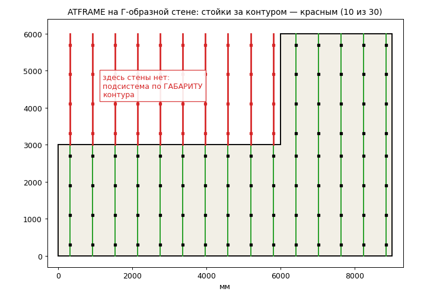
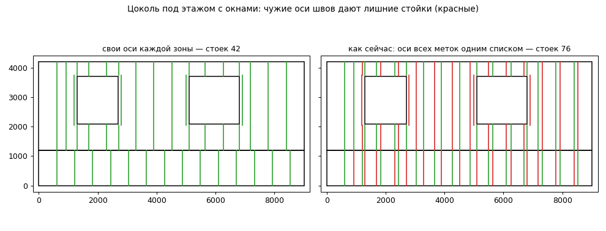
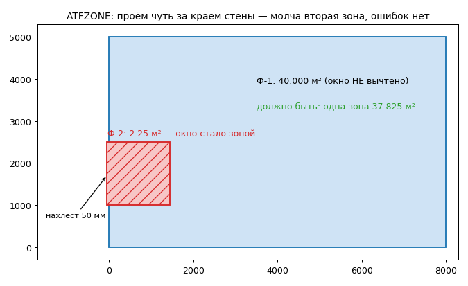

# Разбор проекта «AutoCAD — фасады» — 23.09.2026

Ветка `feat/auto-reactor`, от коммита `2e6a937`. Поведение программ в этой
сессии **не менялось**: добавлены только проверочные инструменты, записи в
NEXT.md и этот отчёт. Все числа — из прогонов в песочнице (Python 3.12,
shapely 2.1, ezdxf 1.4, mono), команды — в конце.

## Коротко

Модули в хорошем состоянии там, где их проверяли юниты и живые эталоны:
все существующие тесты и аудиты зелёные, сверки с ручными чертежами
Германа и Алексея воспроизводятся. Проблемы — на **стыках** (форматы
данных между модулями, которые никто не прогонял целиком) и на
**непроверенных формах** (непрямоугольные стены, числа на границе
округления). Главное:

1. **ATTILE по штриховке зоны не работает** — в движок уходит метка без
   геометрии, раскладка отказывает. Герман упрётся в это на живом тесте.
2. **ATFRAME не читает зоны этапа 1** с первого дня (24.07): движок ждёт
   поле `contour`, а зоны пишутся с `outer`. Подсистема строится только по
   голым полилиниям; ЗАХВАТКА в знаках — хэндл полилинии, не «Ф-1».
3. **ATFRAME на Г-образной, ступенчатой, П-образной стене и фронтоне**
   ставит всё по габаритному прямоугольнику — стойки и кляммеры висят там,
   где стены нет (рис. 1).
4. **Оси швов одной зоны попадают в соседнюю** — лишние стойки (рис. 2).
5. **ATableSpec после любой правки чертежа** может разбить одну позицию на
   несколько строк (динблоки с длиной вида 1499.99999999998): авто-пересчёт
   не чистит числа, как первичная команда.
6. **ATFZONE: проём с нахлёстом за край стены** молча становится отдельной
   зоной, а из стены не вычитается (рис. 3).
7. **ABlockGen: одинаковое стекло — два размера и две марки** (3353Х392 и
   3352Х392) и одинаковые ригели — марки Р1 и Р2, когда размер попадает
   ровно на половину миллиметра.

Пункты 1, 2, 5, 7 и защита от задвоения зоны в ATFRAME — точечные правки
на часы. Пункт 3 — работа на 1–2 дня с синтетикой как приёмочным тестом.
Подробности, доказательства и план — ниже.

## Как проверял

**Все существующие тесты и инструменты** — зелёные:

| Модуль | Что | Результат |
|---|---|---|
| ATableSpec | юниты отчёта, 40 сценариев аудита, штапики | ОК; аудит 0 BUG, 2 EDGE |
| | интеграция на живых DXF В-13/В-32 | ОК (13 и 5 марок) — только после правки пути, см. §ATableSpec |
| | winrepro (mono+xvfb) | 99/99; `FormPatched.cs` совпал с перегенерацией |
| | e2e на atspec-testdata | 22/22 |
| ABlockGen | план 54, распознавание 102, краш 32 | ОК; D-эталоны 33/49/60/67/67 |
| Facades | зоны 35 + CLI 22 | ОК |
| AClad | кассеты 58, CLI 12, плитка 152, краш-аудит 124 | ОК, 0 нарушений |
| | синтетика разбежки, сиды 2309/77/5 | 3×696 сценариев, 920 954 куска, 0 провалов |
| | окно ATTILE (mono), контракт C#↔движок | ОК; 35 ключей, 10 запросов, 0 недостающих |
| | фикстура 290×82 | 145 333 плитки (118 367 целых), отходы 3,2 %, 26 с |
| AFrame | расстановка 128, расчёт 79, CLI 8, краш-аудит 181 | ОК |
| | сверка с полигоном Германа | кронштейны 628/611 (+2,8 %), совпавших позиций 133 |

**Новые инструменты** (все в ветке, в CI не подключены — это предложение):

| Инструмент | Что делает | Итог |
|---|---|---|
| `tools/xmod_check.py` | цепочки C#-команд между модулями: сборка запроса — зеркало строк C#, дальше настоящие движки | 8 проверок: 5 ошибок, 1 скрытая, 1 норма, 1 замер |
| `tools/engine_contract.py` | каждый ключ, который C# читает из ответа, есть в реальных ответах (перехват во время юнит-тестов) | 139 ключей в 5 модулях + 35 ATTILE — недостающих 0 |
| `AFrame/tools/frame_synth.py` | 600 сценариев на сид: 5 форм стены × 5 вариантов подсистемы; 15 правил расстановки + 6 расчёта | 3 сида, 774 328 элементов, ~15 с на сид |
| `Facades/tools/zones_synth.py` | 840 зон на сид: 7 форм, проёмы прямые/арочные/круглые/трапеции, двери, обход, мм↔м, сдвиг, плохие входы | 2 сида, ~2 500 проёмов, ~95 с |
| `ATableSpec/tools/report_synth.py` | 600 таблиц × 4 вида «шума» в данных, свой расчёт фильтров, групп, сумм | чистые данные — 0 расхождений по сути |
| `ABlockGen/tools/vitrage_synth.py` | 1500 витражей на сид, геометрия в shapely, 12 правил | 2 сида |

Проверка во всех синтетиках — **независимая**: геометрия считается shapely,
дуги — своей формулой, правила — словами ТЗ, а не функциями движка.

---

## Facades (ATFZONE, ATFTABLE) — этап 1

**Что делает.** Человек обводит стену и проёмы полилиниями; движок
группирует контуры по вложенности, проверяет (самопересечения, проём вне
стены, наложения), считает площади брутто/нетто, периметры, отливы, откосы
и пороги, нумерует зоны «снизу вверх, справа налево». C# ставит штриховку,
марку, размеры, пишет данные зоны в метку `ATFZONE` на штриховке и марке и
в `<dwg>_fzones.json` — это вход ATCLAD, ATTILE и ATFRAME.

**Здоровье.** 57 юнитов, синтетика 2×840 зон: площади, периметры, нетто,
кромки прямых проёмов, проверки, нумерация, суммы и объединение зон —
0 расхождений с независимым расчётом, результат не зависит от обхода
вершин, дублей, «хвоста» обводки и сдвига чертежа.

**Проблемы.**

- **Важно — проём с нахлёстом за край стены становится отдельной зоной.**
  `facade_zones.py:793` — проём считается проёмом, только если целиком внутри
  стены; контур, пересекающий край, становится зоной верхнего уровня.
  Ошибок и предупреждений нет. Стена 8×5 м с окном, вылезшим за край на
  50 мм: Ф-1 = 40,000 м² вместо 37,825, плюс «зона» Ф-2 = 2,25 м² — само окно
  (рис. 3). Воспроизведение: `Facades/tools/zones_synth.py` (плохие входы).
  *Предложение:* новая ошибка «проём пересекает край зоны» с именем контура
  (или, по решению Германа, обрезка проёма по стене с предупреждением).
  Трудоёмкость 1–2 ч + юнит. Риск низкий.
- **Мелочь — дуги.** Дуга режется хордами со стрелкой 0,5 мм, хорда целиком
  идёт в отлив или откос; хорда ровно под 45° падает то туда, то сюда в
  зависимости от положения окна на чертеже. У круглых окон раздел отлив/откос
  «гуляет» до 17 см при сдвиге; у арочных верхов сумма откосов не меняется.
  *Предложение:* делить дугу точно по углу 45° (аналитически). 1–2 ч.
- **Скрыто (сейчас не стреляет) — зона в метрах.** Формат `facade_zone/1`
  допускает `units: m`, но `_parse_poly` (`facade_zones.py:382`) сравнивает
  хвост обводки с 0,5 в единицах зоны — 0,5 **метра**: проём со стороной
  ≤0,5 м теряет вершину. Хорды дуг — тоже 0,5 м. C# всегда шлёт мм.
  *Предложение:* переводить допуски в мм, как уже сделано в
  `build_zones_from_contours`. 30 мин.
- **Вопрос — частичная кромка на границе.** Бок окна, наполовину лежащий на
  краю Г-стены, считается откосом целиком (порог — «всё или ничего» по
  концам кромки). Решение за Германом.

## AClad (ATCLAD, ATCLADDIM, ATTILE) — этап 2

**Что делает.** ATCLAD — раскладка кассет по ТЗ Германа 22.07 (целая по
центру простенка, сдвиг на полплиты при куске <300). ATTILE — универсальная
разбежка мелкоштучной облицовки: смещения рядов, отсчёт от 9 точек или общей
точки, руст вокруг проёмов, Г-куски, малая подрезка, раскрой с отходами.
Обе пишут метку («ATCLAD»/«ATTILE») с параметрами, хэндлами вставок и осями
швов для ATFRAME; повторный запуск удаляет прежнюю раскладку по хэндлам.

**Здоровье.** Самый проверенный модуль: 222 юнита, краш-аудит, синтетика
разбежки на 920 тыс. кусков, прогон окна под mono, контракт ключей.

**Проблемы.**

- **Критично — ATTILE по штриховке/марке зоны.** `TilePatternCommand.cs:128–140`
  кладёт в запрос содержимое метки `ATFZONE` (`zone_id`, `cladding`, `report`) —
  геометрии в ней нет; ATCLAD в той же ситуации грузит её из `_fzones.json`
  (`CladCommand.cs:167–180`). Движок отвечает «нет пригодных зон/контуров»
  с нотой «негодная геометрия зоны ('outer')». Подсказка команды прямо
  предлагает выбирать штриховки. Работает, только если в выборку попали и
  полилинии. Так с 09.09 (`e60a1e3`). Доказательство: `tools/xmod_check.py`.
  *Предложение:* взять код ATCLAD — геометрия из `_fzones.json`, полилинии
  зоны убрать из «голых» (иначе после починки зона разложится дважды).
  1–2 ч C#, проверка — CI + зеркало в xmod_check. Риск низкий.
- **Важно — оси швов в метке ATCLAD.** `clad_engine.py:216` собирает оси швов
  всего прогона, `CladCommand.cs:570` пишет это объединение в метку КАЖДОЙ
  зоны. ATTILE пишет оси по зоне — у неё правильно. См. §Стыки.
- **Замер — размер метки ATTILE.** Метка хранит хэндлы всех кусков. На
  фикстуре 290×82: 183 746 хэндлов, самая большая метка 345 КБ (1 414 строк
  Xrecord), скопирована на 4 объекта зоны; все метки — 2,8 МБ в чертеже. Не
  авария, но каждый запуск ATCLAD/ATTILE/ATFRAME читает и разбирает эти метки.
  *Предложение:* хэндлы — в отдельный словарь чертежа (NOD) по зоне или
  XData-признак на самих вставках (поиск по фильтру выбора), в метке —
  только параметры и оси. 0,5 дня, риск средний (совместимость со старыми
  метками — читать обе формы).
- **Не проверено вживую — одна транзакция на ~150 тыс. объектов** (плитка +
  полилинии кусков + штриховки с `EvaluateHatch`). По времени и памяти на
  фасаде уровня фикстуры — вопрос к живому тесту Германа.
- **Документы.** Команда сборки окна ATTILE под mono нигде не записана;
  рабочая: `mcs -r:System.Windows.Forms.dll -r:System.Drawing.dll
  -r:System.Web.Extensions.dll tools/attile_ui/UiCheck.cs
  src/ACladPlugin/BondForm.cs src/ACladPlugin/BondSettings.cs`. Цифра
  143 803 из PDF 09.09 не воспроизводится (известно).

## AFrame (ATFRAME, ATFRAMEDIM, ATDEDUP) — этапы 3–4

**Что делает.** Три типа подсистемы НВФ по раскладке: вертикальная (хлысты
или с отметками перекрытий), межэтажная, ортогональная. Стойки по осям
рустов + оконные/угловые/краевые, кронштейны по шагу (из справочника или
расчёта несущей способности по методике «Вектор фасад»), кляммеры по типам
от положения оси. ATDEDUP чистит задвоенные вставки.

**Здоровье.** 128+79+8 юнитов, краш-аудит 181, сверка с полигоном Германа.
Синтетика: сдвиг чертежа, обход вершин, повторный прогон, сводка, сетка
ортогональной 300/900/…/2700 и монотонность расчёта (ветер по высоте и
местности; проверки и шаг по нагрузке; «лимитирует анкер — профиль шаг не
поднимает») — **0 нарушений** на 1800 сценариях.

**Проблемы.**

- **Критично — зоны этапа 1 не читаются.** `frame_engine.py:48` берёт
  `zone.contour.pts`; формат зон `facade_zone/1` — `zone.outer.pts` и
  `openings[].poly`. Нота вводит в заблуждение: «меньше 3 вершин — пропуск».
  Юнит `test_frame_engine.py:39` написан на тот же несуществующий формат —
  движок и тест согласны друг с другом, но не с этапом 1. Так с `d027bf6`
  (24.07). Следствие по коду: работает только путь голых полилиний, и
  ЗАХВАТКА в знаках — «контур <хэндл>», а не «Ф-1».
  *Предложение:* читать оба формата, тест переписать на настоящий
  `_fzones.json`. 30 мин + тест. Риск низкий.
- **Скрыто, проявится после починки — задвоение зоны.** Если рамкой выбраны
  и штриховка зоны, и её полилинии, `FrameCommand.cs:266–286` отправит зону
  дважды (в ATCLAD вычет есть — `CladCommand.cs:185–196`). Модель: 246
  элементов вместо 123. Чинить **вместе** с предыдущим пунктом.
- **Критично — непрямоугольные стены.** Всё ставится по габариту контура:
  `frame_plan.py:774` (`_bbox(outer)`), `:846` (`spans = [(y0, y1)]` — полная
  высота габарита на каждой оси). В синтетике — во всех 480 непрямоугольных
  сценариях на сид есть стойки и кляммеры за контуром. Г-стена 9000×6000 с
  полкой 3000: за стеной 10 стоек из 30, 40 кронштейнов из 120, 50 кляммеров
  из 165 (рис. 1). AClad такие контуры раскладывает (Г и ступени — с 04.08),
  так что Герман на это наткнётся.
  *Предложение:* пролёты оси — пересечение вертикальной линии с полигоном
  стены минус проёмы (у движка уже есть обходы по отрезкам), кронштейны и
  кляммеры — только внутри; для фронтона — правило у ската от Германа.
  1–2 дня, приёмка — `frame_synth.py` (F1–F5 = 0) + сверка полигона без
  изменений. Риск средний: ядро расстановки.
- **Важно — оси швов общим списком.** `FrameCommand.cs:104–121` сливает оси
  всех выбранных меток, движок фильтрует их только по габариту зоны. Цоколь
  9000×1200 под этажом с окнами: в цоколе стоек 14 → 29, кронштейнов 28 → 58;
  на этаже стоек 28 → 47 (рис. 2). *Предложение:* оси — по зоне (`zones[]` и
  `contours[]` несут свои `joints_x/rows_y`, общий список — только для ручного
  режима). Меняет контракт C# ↔ движок: 0,5 дня, риск средний.
- **Важно — ортогональная: кусок вертикали без опоры.** Кусок после стыка
  3000 выше последнего горизонтального профиля или между стыком и окном ни
  на один горизонтальный профиль не опирается (стена высотой 9300: кусок
  9005–9300). 3–6 прямоугольных стен из 120 на сид. Нужно правило Германа.
- **Мелочь — межэтажная.** Подоконный СП-60-40 тянется до ближайших осей и
  может пройти сквозь соседнее окно (1–4 из 120).
- **Вопрос — ветер ниже 5 м.** Формула без нижней отсечки высоты: на 2 м
  пиковая ветровая на 23 % меньше, чем на 5 м. По памяти, в СП 20.13330
  таблицы коэффициентов начинаются с «≤5 м» — проверить по тексту СП.
- **CI.** В `check.yml:111` для AFrame гоняется только `test_frame_plan.py`:
  расчёт несущей способности (79) и CLI (8) CI не проверяет.
- **Документы.** В NEXT.md шапка говорит 128/79 проверок, раздел «Файлы» —
  42/71; пункт 1 «Дальше» предлагает написать ATFRAME и бандл — давно
  сделано. Сверка полигона: ортогональные направляющие 180 против 347 у
  Германа (−48 %) — скорее счёт кусков, но не разобрано.

## ATableSpec (ATSPEC…) — боевой у Алексея

**Что делает.** Ведомости и спецификации из блоков без СПДС: построитель
(секции, выражения, фильтры в строках, группы, объединённая шапка),
раскрой, штапики с терморазрывом, CSV-выгрузка; определение хранится в
таблице, реактор пересчитывает таблицы после правки блоков.

**Здоровье.** Юниты, аудит, штапики, winrepro 99/99, e2e 22/22 на живых
DXF. Синтетика: на чистых данных фильтры, группы, количество, суммы,
нумерация, сортировка и ИТОГ совпали с независимым расчётом во всех 600
таблицах.

**Проблемы.**

- **Важно (боевое) — пересчёт не чистит числа.** Первичная ATSPECREPORT
  прогоняет атрибуты и дин.свойства через `NumClean` (`ReportCommand.cs:585`,
  «1499.99999999998» → «1500»); `ReportReactor.CollectRecords`
  (`ReportReactor.cs:473–510`) — нет. Через него идут авто-пересчёт,
  ATSPECUPDATE и ATSPECEDIT. Динблоки с длиной-double: таблица «900×2,
  1500×3» после любой правки становится пятью строками-дублями. Прецедент
  той же породы уже был (реактор не читал дин.свойства). Правка — 2 строки.
- **Важно — ключ группы в движке — сырое значение.** `atspec_report.py:412`
  группирует по вычисленному значению как есть, `Obj` (`:71`) не обрезает
  пробелы значений: «С12 » и «С12», 1500 и 1499.99999999998 — разные строки,
  печатаются одинаково. При этом фильтр «=» числа сравнивает с допуском
  1e-6 — внутри движка несогласованно. *Предложение:* ключ группы — как
  сравнение фильтра (числа с допуском, строки без крайних пробелов). Это
  страхует и от первого пункта. 1 ч + тесты; согласовать с Алексеем —
  разбитые сейчас строки сольются.
- **Мелочь — «<первое>, разн.».** Берётся первый блок в порядке чертежа:
  тот же набор блоков в другом порядке даёт другую таблицу (после
  копирования/отмены таблица «сама меняется»). Брать, например, наименьшее
  по натуральному порядку.
- **Вопрос — область пересчёта.** Таблица строится по рамке, а пересчёт
  обходит ВСЕ блоки модели (`CollectRecords`). Если на листе два фасада, а
  таблица по одному, после первой правки она начнёт считать оба. Так задумано?
- **Для сведения.** Латинские двойники марок (С/C, Р/P) печатаются
  одинаково и считаются раздельно — предупреждения нет.
- **Тесты.** `test_audit_scenarios.py` печатает `[BUG]`, но всегда выходит с
  кодом 0 — CI регрессию не заметит. Интеграционный тест ищет DXF в
  `/mnt/user-data/uploads` (остальные — в `atspec-testdata`) и поэтому всегда
  «пропуск». Движок ATableSpec, в отличие от фасадных, не stdlib-only
  (ezdxf, pyyaml) — это нормально, но в описаниях проекта сказано иначе.

## ABlockGen (ATVITRAGEAR, ATVITRAGE)

**Что делает.** Витражи из блоков чертежа: по прямоугольнику проёма и сетке
(Э1) или по распознанному АР (Э3) — стойки, ригели, заполнения с
атрибутами ИМЯ/ДЛИНА/РАЗМЕР_ЗАП, размеры; ведомость — ATableSpec.

**Здоровье.** Все юниты и пять D-эталонов Алексея байт-в-байт. Синтетика
2×1500 витражей: заполнения внутри проёма, без наложений, не на телах
профилей, баланс площади, сводка, детерминизм — 0 нарушений.

**Проблемы** (одна причина — число double на границе округления;
`_rnd`/`fmt_len` без предварительного `round(v, 6)`):

- **Важно для заказа стекла.** Одинаковый свет заполнения даёт разные
  РАЗМЕР_ЗАП и марки: 3337,5 мм → «3353Х392/Сп1» и «3352Х392/Сп2» в одном
  витраже (2 из 1500 на сид, чаще при равных долях пролётов).
- **Важно для ведомости.** Ригели одной длины 1985,15 — марки Р1 и Р2
  (`vitrage_plan.py:227`, ключ `_rnd(span*10)`): 13–24 витража из 1500.
- **Мелочь.** Сдвиг витража по чертежу меняет марки и текст ДЛИНА
  («217.67» → «217.68»): 36–38 из 1500. Ячейка тоньше `min_fill` (50 мм)
  между ригелями выбрасывается без ноты (по ширине нота есть).

*Предложение:* округлять через `round(v, 6)` перед «половиной вверх» в трёх
местах. 30 мин + тесты. Риск низкий, D-эталоны должны остаться байт-в-байт.

---

## Стыки между модулями

Проверено `tools/xmod_check.py` (зеркала строк C# + настоящие движки) и
`tools/engine_contract.py`. **Ответы движков C# читает правильно** —
все 174 ключа на месте. Ломаются **запросы и данные между модулями**:

| Стык | Итог | Где |
|---|---|---|
| ATFZONE → ATCLAD (`_fzones.json`) | работает | `CladCommand.cs:167–196` |
| ATFZONE → ATTILE (метка зоны) | **не работает** — нет геометрии | `TilePatternCommand.cs:128–140` |
| ATFZONE → ATFRAME (`_fzones.json`) | **не работает** — не тот формат | `frame_engine.py:48` |
| ATCLAD/ATTILE → ATFRAME (оси швов) | **смешиваются между зонами** | `clad_engine.py:216`, `CladCommand.cs:570`, `FrameCommand.cs:104–121` |
| выборка «штриховка + её полилинии» | ATCLAD — вычитает; ATFRAME, ATTILE — нет (скрыто) | `FrameCommand.cs:266–286` |
| группировка голых контуров | ATCLAD — точка в полигоне; ATFRAME — по габаритам: зона в «кармане» Г-стены у ATFRAME становится проёмом и остаётся без подсистемы | `frame_engine.py:67` |
| ATSPEC: первичная таблица ↔ пересчёт | **разные данные на входе** | `ReportReactor.cs:473–510` |

Общий вывод: сознательное дублирование помощников (бандлы обновляются
независимо) **разошлось**. `CallEngine`, `Get`, `SafeStr` — в 7 файлах,
запись/чтение метки Xrecord — в 4 местах (ATFZONE, ATCLAD, ATFRAME, таблицы
ATSPEC), группировка контуров — в 3 движках с тремя разными правилами. Предлагаю не объединять код, а завести **общие контрактные
тесты** (один набор входов — все три группировки, все читатели `_fzones.json`)
и включить `xmod_check.py` в CI.

## Сквозное: C# в живом AutoCAD, CI, документы

- **Вызов движка без таймаута — важно.** Все 7 вызовов (5 модулей; у
  ATableSpec три, включая реактор) делают `ReadToEnd()` + `WaitForExit()` без
  срока. Зависший exe (антивирус, повреждённый бандл) вешает AutoCAD; у
  реактора — после каждой команды. *Предложение:* `WaitForExit(ms)` + `Kill` +
  понятное сообщение; для реактора — короткий срок и тихий пропуск. 1 ч.
- **Запуск exe.** PyInstaller `--onefile` распаковывается во временную папку
  при КАЖДОМ запуске — для реактора это пауза после каждой правки блоков.
  `--onedir` стартует заметно быстрее; бандл и так папка. Замерить на
  Windows до решения.
- **Культура чисел — чисто.** Числа в JSON и метки — через InvariantCulture,
  показ — ru-RU; `ToString` без культуры — только GUID.
- **DPI — риск, не проверено.** Ни в одной из 8 форм не задан
  `AutoScaleMode`, контролы расставлены в пикселях. На экранах 125–150 %
  возможны обрезанные подписи. Проверить на ноутбуке Германа/Алексея.
- **CI и сборка.** `build.yml` не гоняет тесты перед выкладкой; версии
  PyInstaller/ezdxf/pyyaml/openpyxl не закреплены (`build.yml:58`,
  `check.yml:66`) — одна и та же сборка через месяц может дать другой exe.
  Релиз `build-N` подписан SHA коммита build-trigger (у №20 — `db446b7`), а не
  кода (`8c31b96`) — для отката надо искать вручную. В CI нет AFrame-расчёта,
  синтетик, xmod/контракта, winrepro, сверок с живыми чертежами (приватный
  репо — можно через секрет только на push в свои ветки).
- **Ветки.** `main` — предок `feat/auto-reactor`, отстаёт на 180 коммитов:
  слияние — перемотка без конфликтов. **Внимание:** push в `main` сам
  запускает build-bundle и перезаписывает `latest` — «Пушим» = «Собираем».
  `feat/expr-engine` и `feat/reactor` полностью влиты — можно удалить.
- **Размеры файлов.** `ReportBuilderForm.cs` 2 729 строк, `FrameCommand.cs`
  1 766, `CladCommand.cs` 1 164 (58 КБ), `TilePatternCommand.cs` 830,
  `tile_pattern.py` 1 616, `frame_plan.py` 1 408. Резать ради резки не
  предлагаю; выносить стоит только то, что меняется вместе с починкой
  (чтение зон, вызов движка).

## План по этапам

**Этап 0 — до живого теста Германа (≈ 1 день, всё — точечно).**

| Что | Даёт | Риск |
|---|---|---|
| ATTILE: геометрия зоны из `_fzones.json` + вычет полилиний зоны | ATTILE по штриховке работает | низкий |
| ATFRAME: чтение `outer/openings[].poly` + вычет полилиний зоны; тест на настоящий формат | подсистема по зонам этапа 1, ЗАХВАТКА = «Ф-1» | низкий |
| ATableSpec: `NumClean` в `CollectRecords` | пересчёт = первичной таблице | низкий |
| ABlockGen: `round(v, 6)` перед округлением (3 места) | одно стекло — один размер и марка | низкий |
| ATFZONE: ошибка «проём пересекает край зоны» | нет фантом-зон | низкий |
| CI: AFrame-расчёт и CLI в check.yml; аудит ATableSpec с кодом выхода | регрессии видны | нулевой |

**Этап 1 — неделя.** Непрямоугольные стены в ATFRAME (приёмка —
синтетика); оси швов по зонам (контракт C# ↔ движок); таймауты вызова
движка; нормализация ключа группы ATSPEC (с Алексеем); сборка только после
зелёных тестов, закреплённые версии; `xmod_check.py`/`engine_contract.py`/
синтетики — в CI (быстрые режимы); слияние в `main` по «Пушим».

**Этап 2 — по мере сил.** Хранение хэндлов вне метки ATTILE; общий набор
контрактных тестов для трёх группировок контуров; DPI форм; точное деление
дуг по 45°; ортогональная — опора обрезков (после правила Германа); уборка
документов (числа в NEXT, путь интеграционного теста).

**Что не трогать.** Пять кронштейнов на 3-метровой направляющей
(300/900/1500/2100/2700) и правило «шаг лимитирует анкер, а не профиль» —
синтетика это подтверждает. Сознательное дублирование кода между бандлами —
вместо слияния общие тесты. Подход winrepro и stdlib-only для фасадных
движков.

## Вопросы

**Денису:** делать ли этап 0 до теста Германа («Делаем»); собирать ли после
него (№21); удалить ли влитые ветки; держать ли «Пушим» отдельно от сборки
(сейчас push в `main` = новый `latest`).

**Герману:** подсистема на Г-образной стене и фронтоне — обрезать по
контуру, как ставить стойки у ската; обрезок вертикали в ортогональной выше
последнего горизонтального профиля — добавлять профиль или тянуть кусок;
проём с нахлёстом за край зоны — ошибка или обрезка; бок окна частично на
краю зоны — откос или нет; ортогональные направляющие на полигоне (180
против 347) — как он их считает.

**Алексею:** таблица по рамке при пересчёте считает все блоки модели — так
и надо?; слить ли в одну строку «С12» и «С12 » (и 1500 с 1499.99…).

## Картинки

Рис. 1 — ATFRAME на Г-образной стене (красное — за контуром):


Рис. 2 — цоколь под этажом: свои оси против общего списка:


Рис. 3 — ATFZONE: проём с нахлёстом стал второй зоной:


Картинки строятся из настоящих прогонов: `docs/review_2309/make_pics.py`.

## Как повторить

```
export PYTHONUTF8=1
python3 tools/xmod_check.py                     # стыки модулей (выход 1 = ошибки)
python3 tools/engine_contract.py                # ключи C# ↔ ответы движков
python3 AFrame/tools/frame_synth.py --seed 2309 # --quick, --dump DIR
python3 Facades/tools/zones_synth.py --seed 2309
python3 ATableSpec/tools/report_synth.py --seed 2309
python3 ABlockGen/tools/vitrage_synth.py --seed 2309
python3 AClad/tools/attile_synth.py --seed 2309
python3 docs/review_2309/make_pics.py
```
Все новые инструменты завершаются кодом 1, пока найденные ошибки не
исправлены, — после этапа 0 их можно включать в CI.
