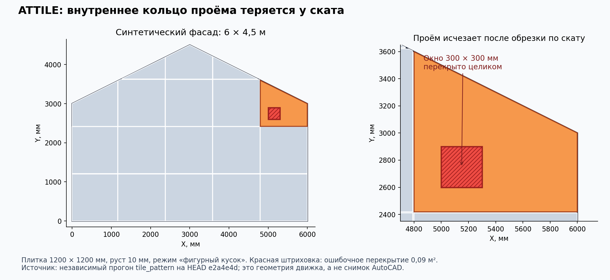

# Независимая ревизия «AutoCAD — фасады»

**Дата: 30 сентября 2026 года. Проверенный код: `e2a4e4df69a1936664c76c44cacff311ad44b07d`, ветка `feat/auto-reactor`.**

Тестовые данные: `atspec-testdata`, `18a80ca049c00627881ddfb16286f0ad9c185a81`. Выпуск №30: `build-103`, код `611bdf32a82f357cf63d763a9b7d631e1b6d74df`. Между выпуском и проверенным HEAD изменены документы и генератор хронологии, не производственные движки/плагины. `main` и рабочая ветка в начале проверки совпадали.

## 1. Вердикт для Дениса

**Проект уже представляет практическую ценность для фасадной компании. Однако весь комплекс пока нельзя принимать как средство самостоятельного выпуска проверенной рабочей документации.** Боевые сценарии спецификаций и обычных зон имеют накопленную проверку; новые расчётные, фронтонные и ведомостные функции требуют исправлений и ограниченной живой приёмки.

Прошлая ревизия привела к реальным улучшениям: исправлены повторные вычитания проёмов, часть ошибок связей зон, большие задержки раскладки; появились проверки перед выпуском, паспорта сборок и объектные ссылки в метках трёх команд. Эти исправления не следует отменять. Но заявление «всё зелёное» описывает только существующие проверки. Новые независимые сценарии воспроизводят существенные ошибки, которых в этих проверках не было.

Наиболее важные результаты:

1. **Расчёт и выданная схема межэтажной подсистемы расходятся.** При этажах 3/3/4 м расчёт использует 3 м. Повторная проверка фактического длинного пролёта и фактически выданных шагов обнаруживает превышения по анкеру, удлинителю и профилю.
2. **Исходные нагрузки могут изменяться не по материалу.** Переключение на межэтажную заменяет массу 25 на 8 кг/м², в том числе когда 25 было задано явно. Коэффициент веса выбирается по каркасу, а не по материалу, расходясь с переданной методикой. Режим композита выдаёт тот же крепёж, что керамогранит.
3. **В новой обработке фронтонов есть геометрические дефекты.** ATTILE полностью перекрывает внутреннее окно 300×300 мм в плитке у ската. На соединении двух фронтонов оба движка недокрывают 0,72 м². ATCLAD не принимает самостоятельный треугольник.
4. **Защита повторной обработки неполна.** ATCLAD всё ещё считает пропущенную зону успешной при смешанном выборе; по этому статусу C# разрешает удаление её прежней раскладки. Новые линии ATFZONE хранят текстовые хэндлы без защиты владельца: методы удаления на скопированных метаданных удаляют линии оригинала.
5. **Ведомости и витражи имеют отдельные ошибки данных.** Неизвестный утеплитель получает чужую толщину; подключённый заполненный пользовательский шаблон может сохранять старые количества. Повтор отметки ригеля создаёт совпадающие вставки без предупреждения. Старые дефекты нормализации спецификаций и округления витражей остаются открытыми.

**Рекомендация:** сохранить существующую архитектуру и принятые сценарии; первым этапом устранить ошибки исходных нагрузок, связи расчёта с геометрией, удаления и учёта. После этого принимать один законченный объект выбранной системы. Добавление новых производителей и большая перепись интерфейсов сейчас имеют меньшую ценность.

## 2. Что проверено и насколько доказаны выводы

Проверены пять модулей, их C#/Python-контракты, правила выпуска, текущие журналы, ответ на ревизию 23.09, ТЗ Германа, конспекты и переданные первоисточники АТР/расчётов. Пять специализированных проходов сверены основным ревизором; ключевые новые воспроизведения повторены отдельно. Дополнительно проверены сами доказательства на ложные срабатывания.

Уровни доказательства в этом отчёте:

- **Исполнено:** настоящий Python-движок либо чистый производственный C# под Mono; проверка результата независимым инвариантом, Shapely или чтением XLSX.
- **Исполнен отдельный путь C#:** производственные методы с тестовой заменой CAD API либо воспроизведённый явный фильтр геометрии. Это не реальная работа AutoCAD.
- **Статический вывод:** конкретный маршрут записи/чтения/удаления установлен в коде; нужен живой сценарий для окончательной проверки хоста.
- **Предметное ограничение:** функция не покрывает часть требуемого комплекта, либо выдаёт предупреждение и требует решения инженера. Это не обязательно скрытая ошибка.

**AutoCAD 2021/2024 здесь не запускался.** Не выполнены реальные COPY/Undo/SaveAs/WBLOCK, отрисовка/динамические блоки, DPI/лента/меню. WinForms-драйверы скомпилированы, но оконные прогоны блокированы средой: Xvfb не может открыть local/unix sockets. Старые результаты 99/99 и 22/22 не приписаны этой ревизии. Чистые C# настройки, роли и ведомости выполнены через локальный Mono 6.8.

Среда: Python 3.12.14; ezdxf 1.4.4; openpyxl 3.1.5; PyYAML 6.0.3; Shapely 2.1.2. Точные версии — [environment.json](review_3009/environment.json). Часть старых тестов ищет DXF по абсолютному `/home/claude/...`; они повторены с заменой префикса **только в памяти**, без правки защищённых модулей. Пропуск фикстуры не засчитан как её прохождение.

Все находки относятся к зафиксированному HEAD. Ссылки `файл:строка` в приложениях — к этому срезу, до добавления записи о ревизии в журналы. Инструкции и исходники продукта не переписывались; в ATableSpec/ABlockGen изменений нет.

## 3. Фактические результаты запусков

Разные скрипты считают разные сущности: проверки, сценарии, DXF-сверки и куски плитки. Их нельзя складывать в одно число «пройденных тестов» или считать процентом правильных проектов.

| Область | Выполнено | Результат и оговорка |
|---|---|---|
| AFrame | frame_plan 230; calc 79; CLI 9; audit 181 | Все штатные проверки прошли, включая доступный эталон |
| AFrame, полная синтетика | 3 seed × (600 обычных + 360 плиточных) = 2880 сценариев | По 2/2/1 несовпадению повторных кляммеров, разрешённому `--allow F16`; других нарушений этих инвариантов нет |
| Facades | 52 + 33; ведомости 15 | Прошли |
| Зоны, полная синтетика | 840 сценариев, 2419 проёмов | 0 нарушений; у 716 дуговых проёмов отклонение длины от оракула: медиана 0,5 мм, максимум 0,8 мм |
| AClad | cladding 66; CLI 12; tile 180; audit 124 | Прошли |
| ATTILE, полная синтетика | 741 сценарий, 376086 кусков | 0 нарушений существующего набора; новые фронтонные случаи в нём не покрыты |
| ATTILE, большой эталон | 159695 геометрических элементов; 145333 плитки с учётом заготовок | Точный текущий эталон, отходы 3,230554%; JSON ответа 38035339 байт |
| Роли через настоящий FrameSettings | 18 ролей, 168 фасадов на seed; 3 seed = 504 фасада | Все жёсткие проверки прошли; неподпёртые шины остаются в INFO: 188/160/104 куска. Это не число уникальных фасадов |
| ATableSpec | test_atspec_report; S1–S40; B1–B13 и D1–D4 | Штатные assert прошли; в S-наборе 0 BUG, 2 EDGE; В-13 = 13 марок, В-32 = 5 |
| ATableSpec, report_synth | 4 × 600 сценариев | Обнаружены прежние различия группировки. Чистые 540 срабатываний — смена подписи первого представителя, **не ошибка количества/суммы** |
| ABlockGen | plan 54 + 33 DXF-сверки; recognize 102 + 49/60/67/67 DXF-сверок; crash 32 | Штатные проверки прошли, crash содержит 3 EDGE |
| ABlockGen, vitrage_synth | 1500 сценариев | 132 срабатывания инвариантов, exit 1; несколько срабатываний могут относиться к одной конструкции |
| Межмодульная проверка | 8 пунктов, включая большую фикстуру | 6 OK, 1 INFO, 1 известная ошибка пересчёта ATSPEC; exit 0 только с разрешённым исключением |
| Контракты | engine_contract; label_refs_check; ATTILE 10 запросов из C#, 48 читаемых ключей | Прошли в пределах своих методов; это не полная проверка типов/семантики/AutoCAD |
| C# вне AutoCAD | чистые settings/локали/ведомости; 4 фасадных UI-драйвера и актуальная форма ATableSpec скомпилированы | Чистая логика исполнена; оконные сценарии не исполнены |

Быстрые прогоны также выполнены: зоны 70/226, ATTILE 164/113504, AFrame 100+60, роли 18/42. Они не добавляют независимости повторно выполненным полным наборам.

Новый набор `tools/review_3009/` намеренно красный на проверенном коде: 6 фронтонных тестов, 4 предметных, 5 AFrame, 2 движковых Facades, 2 из 4 ATableSpec, 5 из 6 ABlockGen; отдельно ошибку показывают C# проверки копирования, двух ведомостей и настроек массы. Это **24 упавших unittest-проверки из 27**, плюс отдельные C# воспроизведения; это не 24 независимые первопричины. Чистый C# инспектор локалей возвращает 0, а ошибки формы только описывает в выводе.

Логи: [каталог протоколов](review_3009/logs/), [манифест новых проверок](review_3009/manifest.json). Запуск: `python3 tools/review_3009/run_review.py --out /tmp/autocad-review-3009`. Зависимости и пределы воспроизведения — [README проверок](../tools/review_3009/README.md).

## 4. Модули: польза, зрелость и приоритетные проблемы

### 4.1. ATableSpec — спецификации, ведомости и раскрой

Модуль превращает блоки и их параметры в таблицы, поддерживает фильтры, выражения, группировку, экспорт и автоматический пересчёт. Имеет документированную боевую приёмку Алексеем и наиболее устойчивый прикладной сценарий. **Оценка: боевой инструмент в принятом контуре использования, с открытыми рисками пересчёта.** Новые фасадные исправления не устраняли его старые ошибки.

| Проблема | Важность / доказательство | Что требуется | Оценка разработки и риск |
|---|---|---|---|
| Первичный отчёт очищает double-хвосты, реактор — нет; 1500 и 1499,99999999998 превращаются в две одинаково отображаемые строки | Критично для раскроя; исполнено. `ReportCommand.cs:68,78`, `ReportReactor.cs:488,499`, `atspec_report.py:412–414` | Один сборщик и согласованная нормализация ключа | 4–8 ч; низкий/средний риск изменения группировки |
| Первичный выбор рамкой, последующий пересчёт — все INSERT в ModelSpace | Критично при нескольких конструкциях одного слоя; статический путь, известный вопрос контракта. `ReportCommand.cs:45,59`, `ReportReactor.cs:172,478–504` | Явно сохранить область отчёта, согласовать добавление новых блоков | 8–16 ч; средний, требуется решение Алексея |
| Esc в ATSPECUPDATE попадает в пересчёт всех таблиц | Важно; статически. `ReportReactor.cs:53–65` | Cancel/Error должны отменять; полный пересчёт — явный выбор | 1–3 ч; низкий, проверить Undo |
| ATSPECEDIT при той же форме таблицы сохраняет новый scale/font/merges, но может не применять их к ячейкам | Важно; чистый ComputeShape исполнен, маршрут статический. `ReportReactor.cs:224–236,353–414` | Различить редактирование оформления и бережное автообновление данных | 4–8 ч; средний |

Пробелы в марках, NaN-атрибуты, отсутствие таймаута и невидимый неуспешный пересчёт описаны в [приложении](review_3009/ATableSpec_ABlockGen.md). Представитель «С1, разн.» по первому объекту — действовавшее ТЗ; 540 срабатываний на перестановку нельзя объявлять 540 неверными ведомостями. Гипотеза о неизбежном сохранении старой таблицы при корректном пустом результате опровергнута тестом.

### 4.2. ABlockGen — построение витража и распознавание АР

Модуль создаёт стойки, ригели и заполнения из образцов блоков по заданной сетке либо распознанному чертежу. Реальные DXF-эталоны проходят. **Оценка: управляемый пилот, полезный для повторяющихся витражей; заказ стекла и количеств требует независимой сверки.** README называет его боевым, хронология и handoff — пилотом; при отсутствии новой приёмки принимается более осторожный статус.

| Проблема | Важность / доказательство | Что требуется | Оценка и риск |
|---|---|---|---|
| Одинаковая геометрия заполнений даёт размер стекла 3353×392 и 3352×392, разные марки | Критично для заказа; исполнено, прежний дефект. `vitrage_plan.py:35–48,237–247` | Единая квантовка до округления и присвоения марок | 4–8 ч; низкий/средний, обязательны DXF-эталоны |
| Отметки `[1500,1500]` создают 4 совпадающих ригеля вместо 2 | Важно для количества; новый исполняемый случай. `VitrageForm.cs:142–150`, `vitrage_plan.py:188,220–228` | Отказ или дедупликация с предупреждением | 2–4 ч; низкий |
| Отрицательные тело профиля/термозазор принимаются и дают выход за проём/нахлёст | Важно; исполнено. `VitrageForm.cs:154–170`, `vitrage_plan.py:167–186` | Проверять диапазоны и конечность в UI и движке | 2–4 ч; низкий |
| Обычный нединамический образец может игнорировать размеры; нет обратной проверки принятого dyn-значения | Важно; статический маршрут. `VitrageCommand.cs:215–286,379–381` | До вставки проверить контракт блока, после — фактические значения | 6–12 ч; средний, нужен AutoCAD |

Полные числа синтетики и остальные риски — в [приложении СПК](review_3009/ATableSpec_ABlockGen.md).

### 4.3. Facades — зоны, площади, схемные линии и ведомости работ

Модуль выделяет зоны и проёмы, считает площади/погонажи и переносит их в таблицы и формы работ. Обычная геометрия хорошо защищена тестами. **Оценка: боевое ядро зон; новые линии, парапеты и экспорт по формам пока требуют приёмки.** Совпадение форм с исходниками Германа проверено по клеткам и объединениям, но не гарантирует корректность подстановки любого нового набора данных.

| Проблема | Важность / доказательство | Что требуется | Оценка и риск |
|---|---|---|---|
| Метки новых линий содержат raw handles; на скопированных данных удаляются исходные линии | Критично для сохранности схемы; реальные методы C# с CAD doubles: 2 оконные и 1 парапетная линия удалены. `ZoneCommand.cs:519,581–582,941–980` | owner/schema и переводимые объектные ссылки; проверка принадлежности перед удалением | 6–12 ч; средний, миграция старых меток и живой COPY |
| Неизвестная толщина утеплителя становится «150 мм» | Важно; настоящий C# + XLSX. `WorkStatement.cs:193–228` | Явно оставить неизвестную толщину или потребовать сопоставление | 2–4 ч; низкий |
| При подключении заполненной пользовательской формы новая площадь 300 м², а старое утепление 1000+250 м² остаётся | Важно; исполнено. `WorkStatement.cs:218–228` | Перезаписывать управляемые строки/формулы и удалять устаревшие группы | 4–8 ч; средний |
| Отдельный парапет 5 м отклоняется из-за пустого contours | Важно; исполнено. `facades_engine.py:86–88`, `ZoneCommand.cs:256–267` | Независимый поток парапетов при отсутствии зон | 2–4 ч; низкий |
| Видимая производная линия закрытого парапета не несёт читаемой метки | Важно; статическая несогласованность. `ZoneCommand.cs:564–582`, `TableCommand.cs:347–358` | Связать линию с владельцем, не удваивать длину при выборе линии и контура | 2–4 ч; средний |

Старые количества воспроизводятся **только при подключённом ранее заполненном/числовом пользовательском шаблоне с согласованной картой**, через `%APPDATA%\AFacades\templates\vent.json`. Обычная перезапись выходного файла из чистого штатного шаблона этого дефекта не вызывает. Ошибка неизвестной толщины, напротив, воспроизводится на штатной чистой форме.

Латентная ошибка объединённой марки при переводе мм↔м — ниже по приоритету: C# шлёт мм, площади в тесте правильны. Геометрия в `_fzones.json`, Undo/SaveAs и проверки только площади остаются известным архитектурным риском. Старое замечание об откосе на границе не возобновляется: более поздний ответ Германа 29.09 изменил правило. Подробности — [Facades](review_3009/Facades.md).

### 4.4. AClad — раскладка облицовки

ATTILE поддерживает образец, разбежку, раскрой и крупные наборы плитки; ATCLAD сохраняет старый сценарий плит/кассет и получил фронтоны. **Оценка: сильное геометрическое ядро и пилот новых форм.** Эталон 290×82 воспроизводится, ускорение действительно видно в Python: 1,824 с на эталон; синтетический квадрат 100×100 м — 379350 элементов за 1,443 с. Это не время вставки в AutoCAD.

| Проблема | Важность / доказательство | Что требуется | Оценка и риск |
|---|---|---|---|
| Отказавшая зона ATCLAD остаётся в per_zone и допускается к удалению старого результата | Критично; Python исполнен, удаление установлено статически. `clad_engine.py:300–306`, `CladCommand.cs:462,476–477,978–990` | Явный статус результата зоны/части, удаление только принятого владельца | 4–8 ч; средний |
| Внутреннее окно полностью теряется после обрезки плитки по скату | Критично для корректности раскладки; Shapely измерил 90000 мм². `tile_pattern.py:1298–1329` | Сохранение внутренних колец/компонент либо повторное вычитание проёмов | 6–12 ч; средний/высокий, затрагивает топологию и раскрой |
| Ендова/два фронтона теряют 0,72 м² в обоих движках | Важно; исполнено со швами 0 и 10 мм. `tile_pattern.py:1305–1313`, `cladding_plan.py:622–631` | Корректная невыпуклая геометрия или явный отказ до изменения DWG | 6–16 ч; средний/высокий |
| Треугольник из трёх вершин ATCLAD считает пропуском | Важно; исполнено. `cladding_plan.py:462–464` | Проверять валидность треугольника вместо старого ограничения ≥4 | 1–3 ч; низкий |
| Перенос на 4·10⁹ мм меняет 901 кусок на 899 | Важно для геопривязанных координат; исполнено. `tile_pattern.py:122–129,1314–1317` | Площадь относительно локального начала, тест переноса | 2–5 ч; средний |

Воспроизведение иллюстрации: `python3 tools/review_3009/test_clad_frontons.py --render`. Изображена геометрия движка, не снимок AutoCAD. Прежние риски базовой точки динамического блока, setter без readback и повторного использования блока по имени остаются отдельно. Фигурные полилинии вне блоковой спецификации — известное ограничение, уже вынесенное в PDF №30. Полное обоснование — [AClad](review_3009/AClad.md).

### 4.5. AFrame — подсистема и расчёт

Модуль строит направляющие, кронштейны, кляммеры и шины, подбирает параметры по восстановленной методике «Вектор». Это самая ценная и самая ответственная часть комплекса. **Оценка: инженерный пилот; автоматический расчёт пока нельзя считать окончательной проверкой выданного каркаса.**

| Проблема | Важность / доказательство | Что требуется | Оценка и риск |
|---|---|---|---|
| Медиана этажей вместо фактического длинного пролёта | Критично; повторный расчёт выданных шагов провален. `frame_plan.py:798–804,828–829,1417–1507` | Расчёт реальных участков + финальная проверка схемы; максимум пролёта возможен лишь как промежуточная защита | 8–16 ч для ограничения; 32–64 ч для проверки участков; высокий предметный риск |
| Смена подсистемы заменяет массу 25→8, не отличая ручной ввод от default | Критично; настоящий FrameSettings исполнен для 4 материалов. `FrameSettings.cs:208–218` | Отделить материал/массу от типа каркаса, сохранять явный ввод | 2–4 ч; низкий технический, обязательна инженерная проверка исходных |
| Коэффициент веса зависит от типа каркаса, а не облицовки | Критично для заявленной методики; 350 вместо 300 мм в трёх примерах. `systems.json`, `frame_plan.py`, детали в Domain | Привязать фактор к подтверждённому материалу и источнику, явно показывать его | 4–8 ч; средний, не подменять инженерное согласование |
| Композит получает крепления КГ: 121 одинаковый кляммер | Критично для комплектности АКП; исполнено и сверено с АТР. `frame_plan.py:1183–1201`, `FrameForm.cs:283–287` | Ограничить неподдержанный режим; затем внедрить выбранный узел крепления | 2–4 ч на явное ограничение; реализация узла после выбора, ориентир 16–32 ч |
| Явно пустые rows_y своей зоны наследуют ряды соседней | Важно; отдельно 0, вместе 9 кляммеров. `frame_engine.py:261–263,281–283,329–331` | Различать отсутствующее поле и пустой массив | 2–4 ч; низкий |
| C# отбрасывает собственные короткие направляющие: 21→15 кляммеров при повторе | Важно; двигатель + точная модель фильтра. `FrameCommand.cs:1654–1675,1691–1696` | Читать собственные роли/оси/длины из метаданных | 4–8 ч; средний |
| Несовпадение «только кляммеры» касается и вертикальной, а не только ортогональной | Важно; уточнение известного. `frame_plan.py:1003–1045` | Сохранять роль стойки; единый путь полного и повторного режима | 8–16 ч; средний |

**Конкретный расчётный пример.** Перекрытия 0/3000/6000/10000 мм; программа одобряет `rail_len=3000`. На длинном участке фактические горизонтальные шаги 500/270 мм, расстояние перекрытий 4000 мм. Повторная проверка того же выбранного расчётом профиля даёт:

| Проверка | Рядовая / угловая | Допустимое в используемой методике |
|---|---:|---:|
| Анкер, кг | 323,8 / 306,6 | 306,1 |
| Удлинитель, кг/см² | 2698,9 / 2649,1 | 2250 |
| Профиль, кг/см² | 2270,8 / 3114,3 | 2250 |
| Прогиб, мм | 20,3 / 27,9 | 26,7 |

Физическая длина направляющей со стыковыми зазорами 3990 мм; дополнительная проверка и на этой длине сохраняет нарушения. Следовательно, вывод не вызван лишними 10 мм в тесте. Это внутренняя несогласованность программы, не независимая сертификация конструкции.

Переход массы 25→8 виден в поле формы; скрытым от всех действий пользователя он не объявляется. Дефект в том, что программа не может отличить явно введённые 25 от своего default. Отдельное предполагаемое расхождение обозначений НСП и расчётных сечений **не включено как доказанный самостоятельный отказ**: требуется установить точное соответствие марок.

Шины без опор уже сопровождаются предупреждением. Пример фронтона: шина 160 мм на высоте 5900 мм без единой вертикальной опоры. Это незавершённый инженерный участок; зелёные роли оставляют его в INFO. Нужен статус неподтверждённого узла и инженерное правило опирания. Нельзя просто убрать предупреждение или считать такой элемент принятым. [Подробный аудит AFrame](review_3009/AFrame.md).

Оценки часов в таблицах — предварительные для локальных исправлений с тестом, без ожидания исходников/живой приёмки. Они перекрываются между собой и не являются суммируемой сметой. Сводный план — в разделе 7.

## 5. Предметная область: что покрывает комплекс

Сверка выполнена с переданными АТР 2015/2017 и расчётной методикой/первичными PDF. Их актуальность как действующих нормативных документов не утверждается. Здесь оценивается соответствие реализации её заявленным источникам, а не соответствие любого будущего объекта всем действующим нормам.

| Тип подконструкции в АТР «Вектор-1» | Путь программы | Фактическая граница |
|---|---|---|
| Тип 1, вертикальная | vertical | Рабочее ядро под согласованные профили и частные правила Германа; не весь каталог вариантов |
| Тип 2, вертикальная С/Омега + П-кронштейн | Отдельного пути нет | Наличие ШП в каталоге не означает реализации типа |
| Тип 3, ортогональная | ortho | Геометрическое ядро есть; не все компоненты конечной цепочки проверяются расчётом |
| Тип 4, усиленная ортогональная / межэтажная | interfloor | НСП вдоль откосов в №30 соответствует принципиальной топологии АТР; расчётные дефекты выше остаются |
| Тип 5, усиленная вертикальная | Полного пути нет | Расчётная ветвь `interfloor_direct` не равна готовому маршруту UI → геометрия → спецификация |

Типы 1–5 подконструкции нельзя путать с семействами Вектор-1/4/5 по облицовке. NordFOX прочитан как источник, но не реализован как полноценная система. Для клинкера/бетона нужен отсутствующий актуальный АТР Вектор-4; копирование правил Вектор-1 не заменяет его.

По узлам: боковые откосы типа 4 получили нужные вертикали; геометрические обходы обычных проёмов присутствуют. Углы, парапет, цоколь, деформационные швы, пожарные и прочие примыкания не имеют законченного универсального маршрута «выбранный узел → все элементы/крепёж → расчёт → спецификация». Погонаж парапета или откоса — полезный вход в ведомость, но не проектирование всего узла.

До полного комплекта производителя недостаёт:

- Паспорта объекта/зоны: материал, масса, коэффициенты, климат, основание/анкер, система/тип, компоненты, реальный этаж, источник и версия метода.
- Проверки окончательно выданной схемы, а не лишь предварительно выбранного шага. НГП, шины/крепления, кляммеры и другие узлы не покрываются одним проверенным `profile`.
- Узловой номенклатуры и комплектности крепежа; условный fitting ещё не полная пара ВС-300 + В-70 с количеством.
- Учёта фигурных подрезок в закупке/спецификации, схем утепления/обрамлений и связанных ведомостей.
- Расчётного документа/ПЗ с полными исходными данными, допущениями, непроверенными элементами и ссылками на подтверждённые источники.
- Одного согласованного выпуска: раскладка облицовки, каркас, узлы, спецификация, ВР и расчёт должны относиться к одной версии исходного объекта.

Подробные ссылки на АТР, методику, страницы и границы расчёта — [предметное приложение](review_3009/Domain.md).

## 6. Сквозная архитектура и процесс разработки

### Данные DWG и внешнего файла

В зоне Xrecord хранит отчёт/ID, а геометрия — во внешнем JSON. Запись JSON происходит после Commit (`ZoneCommand.cs:602–607,706–739`); отмена DWG не является транзакцией внешнего файла. SaveAs/перенос, равноплощадное изменение формы, копирование или выбор только марки не гарантируют обнаружения устаревания. В AClad/AFrame добавлены проверки смещения и ссылки, но они не превращают sidecar в единый надёжный источник.

Целевой путь: версионированная геометрия/связи внутри DWG; JSON как экспорт. Миграция должна читать старые метки, сверять контрольную сумму формы и позволять откат. Начать с чтения/двойной сверки, затем переключать запись после живой приёмки. Немедленная массовая миграция всех чертежей недопустима как рефакторинг «без изменения поведения».

### Контракт успешного результата

`ok=true`, текстовая нота «пропуск», пустой массив и отсутствие поля сегодня смешивают разные состояния. Отсюда удаление отказавшей зоны, чужие ряды, недоопёртые шины при зелёном прогоне. Нужны явные статусы каждой зоны и части: корректный результат, законно пустой результат, пропуск/неподдержанная геометрия, ошибка; плюс отдельная инженерная приёмка. Отдельно определить атомарность владельца, состоящего из нескольких частей.

### Размеры, допуски и идентичность компонентов

Разделить единицы геометрии и расчёта; хранить входные величины и преобразования явно. Использовать локальные координаты в геометрических вычислениях. Различать геометрический допуск, точность группировки спецификаций и точность печати. Реальные NumClean/ParseD прошли ru-RU/en-US/de-DE; текущая проблема пересчёта — пропущенный вызов, а не запятая сама по себе. Конкретный рассчитанный компонент должен идентифицироваться тем же ID в отрисовке и ведомости, а не повторно угадываться по имени блока.

### Размер кода и рефакторинг

Посчитано 29915 строк производственных `.cs/.py` в `src/engine` пяти модулей, без `test_`/`audit_`. Крупнейшие файлы: ReportBuilderForm 2729, frame_plan 2428, FrameCommand 2243, tile_pattern 1924, TilePatternCommand 1854 строки. Основной риск — смешение сбора AutoCAD-данных, правил, удаления, формирования запроса, рисования и сохранения; само число строк не является дефектом.

Выделять по одному шву: reader → валидированный запрос → чистый planner → валидатор результата → транзакционная запись. Зафиксировать эталоны до переноса функций. Мёртвые/неиспользуемые UI-пути убирать только после проверки ссылок и приёмки; массовая косметическая чистка сейчас не снижает главные риски.

**Не трогать без отдельного решения:** пять независимых бандлов; stdlib в фасадных движках; принятую последовательность зоны → облицовка → каркас → спецификация; правила Германа о шагах/отступах/шинах; боевые ATableSpec/ABlockGen. Дубли малых помощников между независимыми бандлами допустимы. Согласованность можно обеспечить общими контрактными фикстурами и исходниками на этапе сборки, не создавая обязательную общую DLL во время установки.

### Что CI доказывает, а что пропускает

Исторические `check #193` и `build-bundle #103` завершились успешно; metadata пяти архивов `latest` и `build-103` совпадает по SHA-256. Проверено через API, повторное исполнение установленных DLL не заявляется. [Снимок статуса GitHub](review_3009/github_status.json).

Открытые пробелы:

1. Выпуск `build.yml:47–65` не запускает роли, которые есть в `check.yml:141–145`. Ведомости и оконные сценарии также не стали обязательными воротами выпуска.
2. `test_audit_scenarios.py:304–309` печатает BUG, но не делает exit ненулевым; в текущем прогоне BUG нет. Нужен отрицательный контроль самого тестового раннера.
3. `engine_contract.py:193–218` проверяет наличие ключа где-либо, игнорирует неразмеченные переменные (`pzd`, `c`, `ld`, `meta`, `pd`) и не проверяет структуру/типы/смысл. `label_refs_check` анализирует исходники и модель ссылок, а не AutoCAD.
4. Широкие исключения по одному коду скрывают распространение ошибки на новый подтип: несовпадение кляммеров уже есть в вертикальной системе. Исключения привязать к конкретным входам/ожидаемым результатам и владельцу решения.
5. Приватные эталоны не подключены к обычному CI, часть локальных тестов молча пропускает их. Нужен отдельный защищённый прогон с обязательным счётчиком выполненных фикстур; приватные DXF нельзя просто положить в публичное repo.
6. Новый диагностический набор в этой ревизии запускается явно и остаётся красным. Его нельзя представлять как уже пройденный release gate. После исправлений соответствующие случаи надо включить в обязательные проверки.

Предлагается одна общая декларация обязательных проверок для check и выпуска, отрицательные контрольные примеры, отдельный Windows/AutoCAD smoke на рабочей станции. Журналы и PDF по каждому выпуску полезны; им недостаёт одного актуального руководства и короткой таблицы «заявка → код → автоматическая проверка → живая приёмка». В верхних частях старых NEXT и CLAUDE есть исторически устаревшие статусы; их не надо интерпретировать как состояние текущей ветки.

### Совместимость и метки: внешняя проверка

Официальная таблица Autodesk подтверждает сочетание AutoCAD 2021–2024 с .NET Framework 4.8/SDK соответствующих лет. Поэтому текущая целевая пара пользователей обоснованна; расширять обещания на другие поколения без отдельной сборки и испытаний не следует. [Autodesk: Managed .NET Compatibility](https://help.autodesk.com/cloudhelp/2025/ENU/AutoCAD-Customization/files/GUID-A6C680F2-DE2E-418A-A182-E4884073338A.htm).

Большая метка — не доказательство превышения лимита XData: у Xrecord другой формат и нет того же ограничения размера. В измерении старого инструмента крупнейший JSON метки около 345 КБ, все около 2,8 МБ; он не учитывает полную стоимость последующих объектных ссылок/накладных расходов DWG. Здесь нужен замер сохранения/открытия/Undo, а не выдуманный запрет по размеру. [Autodesk: XRECORD](https://help.autodesk.com/cloudhelp/2021/ENU/AutoCAD-DXF/files/GUID-24668FAF-AE03-41AE-AFA4-276C3692827F.htm).

Официальное описание различает переводимые межобъектные ссылки и произвольные значения handles. Это поддерживает вывод о необходимости ссылок, а не строк в JSON; сама документация не заменяет живой тест текущего плагина. [Autodesk: Persistent Inter-Object Reference Handles](https://help.autodesk.com/cloudhelp/2023/ENU/AutoCAD-DXF/files/GUID-582ECC55-155A-48CC-A8B1-7D75FDF4ECC9.htm), [XlateReferences](https://help.autodesk.com/cloudhelp/2020/ENU/OARX-ManagedRefGuide/files/OARX-ManagedRefGuide-Autodesk_AutoCAD_DatabaseServices_Xrecord_XlateReferences.html).

## 7. План исправлений и рефакторинга с ценой и риском

Работы ниже **предлагаются**, а не реализованы этой ревизией. Часы — плановая инженерная оценка, не измеренная скорость ИИ и не коммерческая оферта. Диапазон предполагает одного разработчика с доступом к инженеру и AutoCAD; ожидание материалов/ответов отдельно. После первого этапа оценку пересчитать.

| Этап | Проверяемый результат | Разработка и автоматические тесты | Инженер/живая приёмка | Риск |
|---|---|---:|---:|---|
| 1. Ограничить опасные текущие сценарии | Масса не теряется; материал/фактор согласован; длинный пролёт не проходит без проверки; защита удаления; явный отказ неподдержанных фронтонов/АКП; новая красная регрессия закрыта соответствующей правкой | 32–56 ч | 8–16 ч | Средний; не выдавать временные ограничения за полную реализацию |
| 2. Достоверность ведомостей и повторов | Утепление/парапеты, пустые локальные ряды, короткие стойки; отдельно согласованный блок ATableSpec/ABlockGen: нормализация, отмена, дубли/округление | 20–36 ч | 4–8 ч | Средний: боевой модуль менять только с приёмкой Алексея |
| 3. Версия данных и безопасный жизненный цикл | Геометрия/связи DWG, миграция старых меток, совместимость, COPY/Undo/SaveAs; JSON как экспорт | 40–72 ч | 8–16 ч | Высокий: совместимость существующих чертежей |
| 4. Паспорт и проверка фактической схемы | Реальные пролёты/нагрузки/опоры/сечения, роль каждой стойки; идентичные данные расчёта, отрисовки и спецификации | 64–120 ч | 24–40 ч | Высокий предметный; ограничить одним согласованным типом |
| 5. Полный эталонный выпуск | Подрезки, выбранные узлы и крепёж, СО/ВР, расчёт с исходными, повтор после изменения, единое руководство | 40–72 ч | 24–40 ч | Средний/высокий, зависит от полноты альбомов |
| **Всего по этому объёму** | **Один принятый тип системы + устранение перечисленных рисков пяти модулей** | **196–356 ч** | **68–120 ч** | **Не включает все типы 1–5 и нового производителя** |

Стоимость: **`196–356 × ставка разработчика + 68–120 × ставка инженера`**. Ставок компании и фактической скорости команды нет, поэтому рублёвая цена без них была бы выдуманной. Диапазоны локальных правок в разделе 4 перекрывают эти этапы; дополнительно складывать их нельзя. Этот сводный план заменяет предварительные оценки отдельных проходов; отдельной дополнительной сметы в приложениях нет.

Рефакторинг больших файлов выполнять внутри этапов по подтверждённым границам, с сохранением результатов. Отдельную перепись на другой язык, общий runtime-бандл, веб-платформу или полную автоматизацию всех АТР сейчас не рекомендую.

## 8. Ценность для компании и пилот

Наибольшая экономия ожидается от повторяемых операций: пересчитать ведомость после изменения блоков; заново разложить облицовку; построить базовую схему подсистемы; обновить ВР по зонам. Экономия уменьшается, если проектировщик вынужден вручную сверять каждую изменённую метку, искать пропавшую подрезку или восстанавливать старый рисунок. Поэтому надёжность изменения проекта важнее ещё одного режима первой генерации.

Измеренного сокращения человеко-часов в материалах этой ревизии нет. Время Python на сотнях тысяч элементов доказывает вычислительную реализуемость, но не итоговую экономию проектирования. Для пилота считать:

`экономия = ручное время того же принятого выпуска − (подготовка + генерация + проверка + исправления + повторный выпуск)`.

Сравнить два одинаковых задания, один объект и один тип системы. Фиксировать время по этапам, ручные исправления на 1000 м², непроверенные узлы, расхождения СО/ВР, результат изменения одного окна/массы/этажа. Сначала получить проверенный выпуск, затем измерять масштабирование.

Минимальная живая приёмка после исправлений:

| Испытатель / сценарий | Критерий приёмки |
|---|---|
| Герман: прямоугольная зона, окно, дверь, парапет; формы по слоям/толщинам | Независимые площади и погонажи совпадают; неизвестное не подменено готовым материалом |
| Герман: фронтон с внутренним окном, отдельный треугольник, ендова | Ни перекрытых проёмов, ни необъяснённых дыр; неподдержанное отклоняется до изменения |
| Герман: одинаковые и разные этажи, изменение материала/массы, межэтажная у узких простенков | Выданная схема проходит расчёт именно её пролётов/компонентов; исходные не изменяются незаметно |
| Герман: полный проход → только кляммеры; короткие направляющие и несколько зон с пустыми рядами | Результат повторяем; чужие зоны не влияют на выбранную |
| Оба: COPY/MIRROR/ARRAY, повтор на копии, Undo/Redo, SaveAs, перенос DWG, две открытые DWG | Исходные объекты сохранны, данные соответствуют геометрии; ошибки не оставляют видимость актуальности |
| Алексей: отчёт рамкой одного из двух витражей, автореактор, Esc, ATSPECEDIT без изменения числа строк | Область и формат предсказуемы; количества и группы не меняются без изменения данных |
| Алексей: равные размеры на границе округления, повтор отметки, реальный динамический/статический блок | Верные размеры заказа, марки и количества; неподдержанный образец отклонён |
| Координатор: закрытие/отмена выхода, меню, DPI 100/150/200%, установка пяти бандлов | Нет потерянных команд/обрезанных контролов; номер сборки зафиксирован |

Эта таблица — будущие условия приёмки, не протокол якобы выполненного живого пилота.

## 9. Вопросы, действительно требующие решения

1. **Алексею:** что является постоянной областью автоматически обновляемого отчёта — исходно выбранные блоки, зона/группа или весь чертёж по фильтру? Как новые блоки должны попадать в эту область? Текущий код реализует разные варианты при создании и пересчёте.
2. **Денису и Герману:** какой конкретно тип системы и один объект принимаем первым до полного комплекта? Без выбора нельзя обоснованно оценить готовность всех типов по одному полигону.
3. **Герману/держателю системы:** предоставить актуальные АТР Вектор-4 и применяемый Вектор-1, подтверждённые компоненты/узлы шин и их креплений. В доступном комплекте этих подтверждений для всей новой плиточной ветки нет.
4. **Для АКП:** какой из предусмотренных АТР способов крепления реализуем первым? Ответ есть в каталоге вариантов, но выбор для объекта в программе отсутствует.
5. **Для выпуска подрезок:** закупочная единица фигурной детали — отдельная деталь с маркой или заготовка с раскроем? Это ранее открытый продуктовый выбор; без него полилиния не превращается в верную спецификацию.

Вопросы о принципиальном расположении НСП вдоль откосов типа 4, версии AutoCAD Германа/Алексея и уже согласованных шагах повторно не задаются: ответы есть в АТР, ТЗ и хронологии.

## 10. Состав сохранённой ревизии

- Этот сводный отчёт и пять специализированных приложений: [AFrame](review_3009/AFrame.md), [AClad](review_3009/AClad.md), [Facades](review_3009/Facades.md), [ATableSpec/ABlockGen](review_3009/ATableSpec_ABlockGen.md), [предметная область](review_3009/Domain.md).
- Новые независимые воспроизведения, иллюстрация, протоколы, версии среды, снимок CI/релизов и манифест запусков.
- Записи в разделе «Статус» NEXT трёх фасадных модулей; каталоги ATableSpec/ABlockGen оставлены без правок.

Производственное поведение не менялось, слияние в `main` не выполнялось, новая сборка бандлов не запускалась. Разрешённые изменения ограничены отчётами, журналами и диагностическими тестами рабочей ветки.
