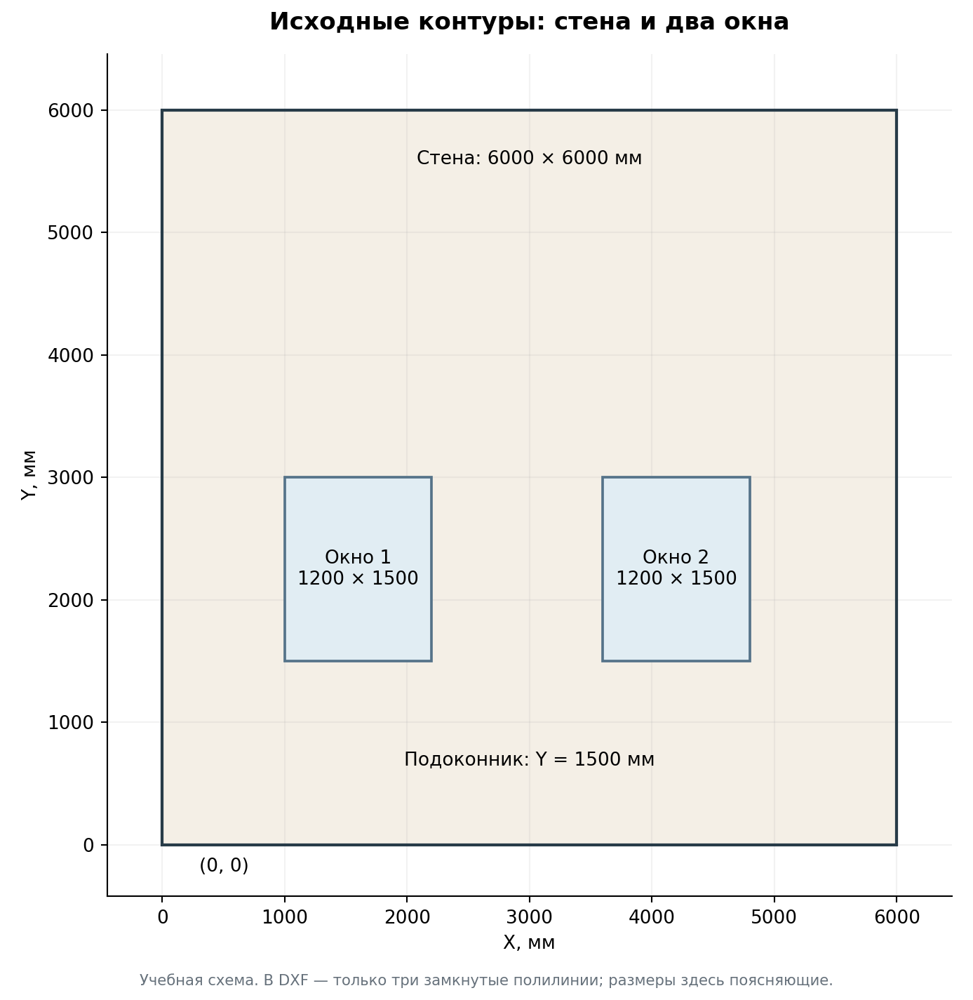
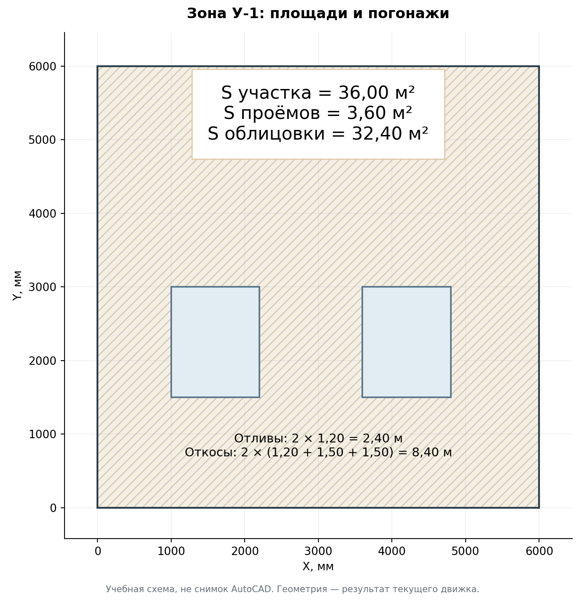
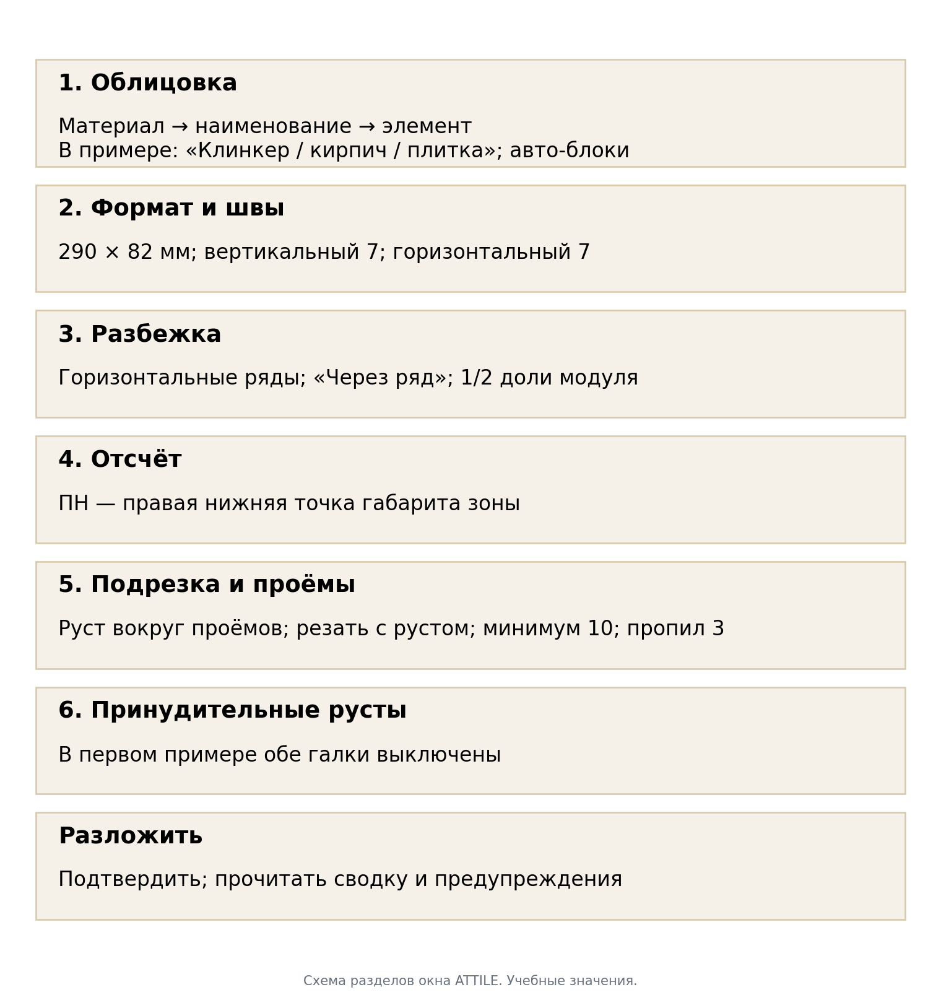
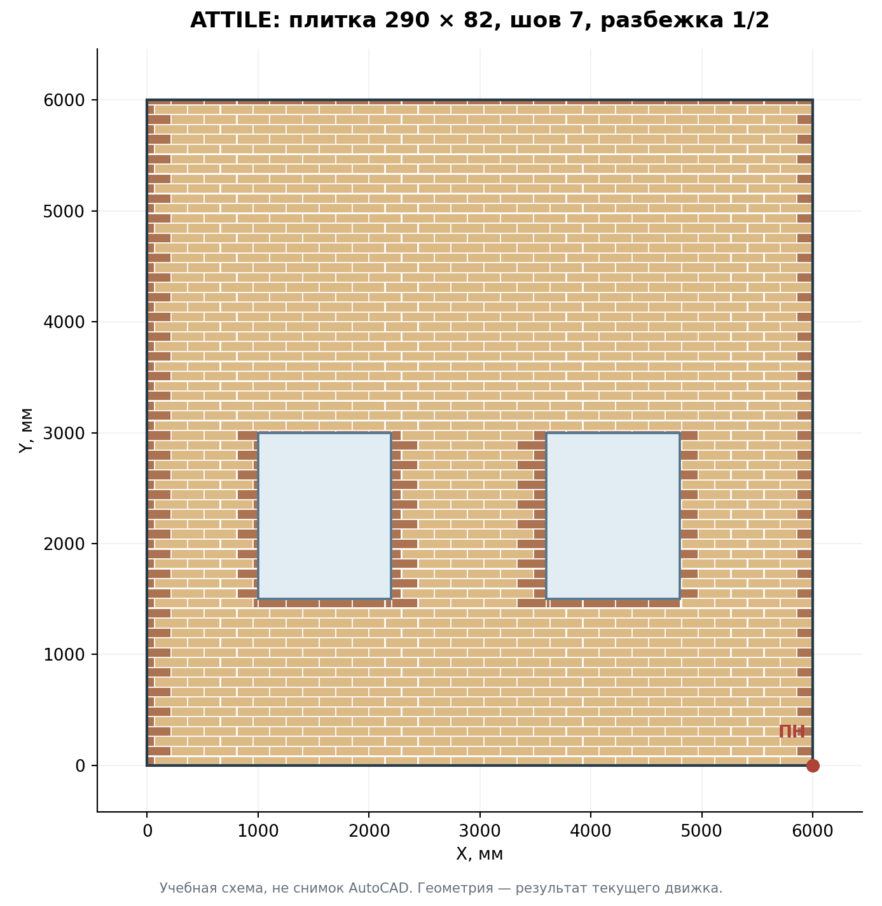
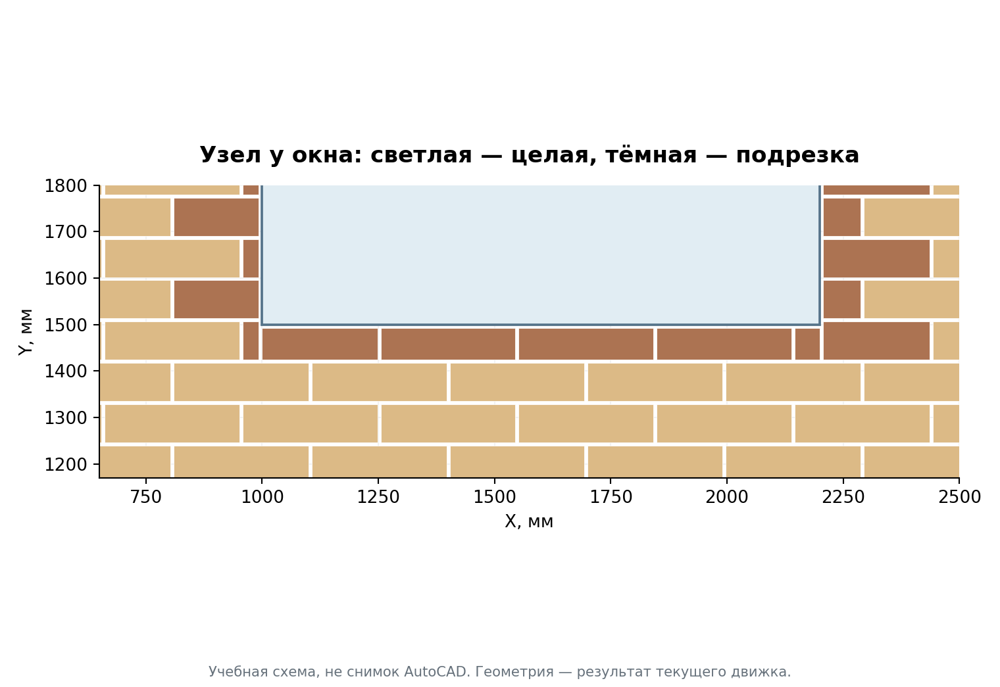
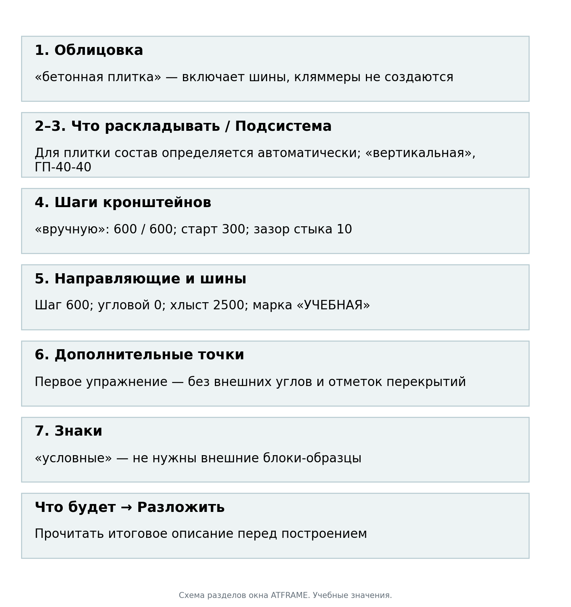
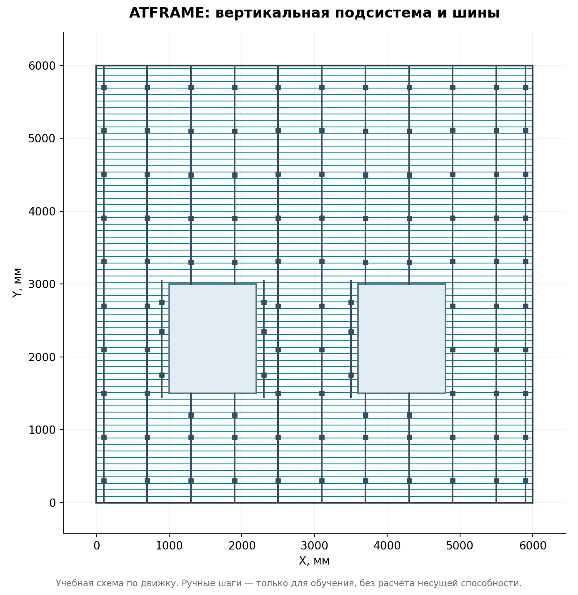
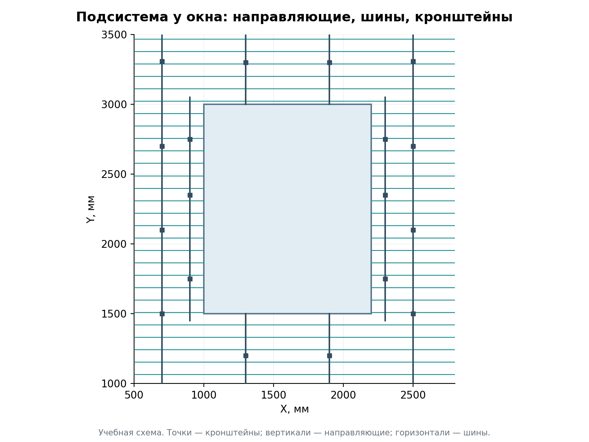
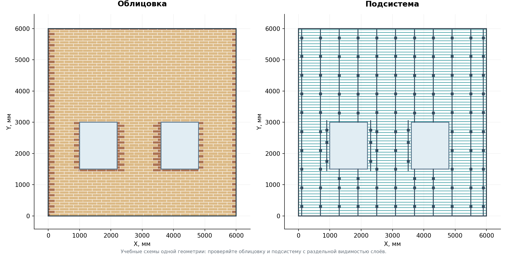
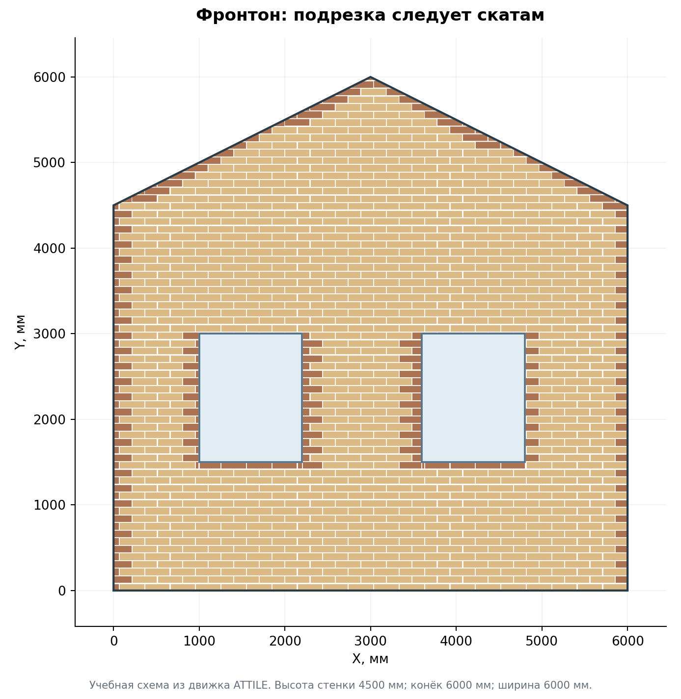

# Фасадные модули в AutoCAD
# Руководство с нуля: зоны, раскладка облицовки, подсистема и ведомости

Учебный комплект: AFacades + AClad + AFrame. Основа инструкции — текущие команды и поля окон на 30 сентября 2026 года. Целевая среда комплекта: полный AutoCAD для Windows, 64-разрядный, версии 2021–2024. Названия разделов и команд сохранены так, как они написаны в программе.

Это руководство ведёт от пустого учебного чертежа к проверенному результату. Сначала выполните один пример целиком. Затем используйте справочные главы для своего проекта. Все размеры учебного примера заданы в миллиметрах. Числа для подсистемы в упражнении помогают освоить программу; рабочие профили, шаги и крепления назначают по проекту.

Иллюстрации с координатами — учебные схемы, построенные из результатов движков. Они не являются снимками запущенного AutoCAD. Схемы окон показывают реальные названия полей, но не имитируют экран AutoCAD. Данные примера искусственные и не содержат частных проектов.

## Какой версией пользоваться

Руководство описывает исправленный код текущей сессии. Установочные архивы с этими изменениями ещё должны быть выпущены отдельной сборкой. **Исходная сборка №30 и случайно скачанный `latest` не гарантируют описанное здесь новое поведение.** Номер будущей сборки в инструкции не назначается заранее.

Для самостоятельного прохода получите согласованную тройку бандлов с исправлениями 30.09 и сопоставьте описание выпуска, файл `build-info` при его наличии и строки загрузки DLL. В описании должны быть отражены безопасная перегенерация/отмена, проверка актуальности геометрии зон и раскладок, защита шин без опор и новая команда ATFZONERESET. Если нужной сборки ещё нет, материал можно изучать и открыть учебные исходники, но не считать старый установленный комплект прошедшим этот сценарий. Точный идентификатор проверенного кода/выпуска приведён в листе версии комплектной инструкции.

## 1. Что установлено и какой результат даёт каждый модуль

| Модуль | Основная команда | Что выбираете | Что получаете |
|---|---|---|---|
| AFacades | ATFZONE | Замкнутый наружный контур и контуры окон/дверей | Зону с маркой, штриховкой, площадями и погонажами |
| AClad | ATTILE | Созданную зону либо исходные замкнутые контуры | Раскладку облицовки: целые элементы и подрезки |
| AFrame | ATFRAME | Зону с раскладкой | Направляющие, кронштейны; кляммеры или шины в зависимости от облицовки |
| AFacades | ATFTABLE | Зоны по слою или выбранные штриховки/марки | Ведомость зон либо ведомость работ в чертеже и/или XLSX |

Рабочая последовательность: **контуры → ATFZONE → ATTILE → ATFRAME → ATFTABLE → проверка → сохранение**.

Зона — это участок фасада с общей облицовкой. Окно внутри зоны уменьшает площадь стены. Отдельный контур рядом со стеной может стать другой зоной, поэтому нельзя выбирать рамкой случайную геометрию. Полилинии, штриховки, марки и созданные элементы имеют разные задачи: старайтесь понимать, что именно вы выбираете на каждом этапе.

ATFTABLE составляет ведомость геометрии зон и видов работ. Она не заменяет поштучную закупочную спецификацию всех плиток, кронштейнов и профилей. Счётчики раскладки и подсистемы смотрят отдельно в итогах соответствующих команд.

## 2. Установка трёх модулей

### 2.1. Что подготовить

Нужны три архива одной согласованной сборки: `AFacades.bundle.zip`, `AClad.bundle.zip`, `AFrame.bundle.zip`. Установка отдельных библиотек Python не требуется: движки входят в комплект. Не берите исходный код GitHub вместо установочных архивов.

1. Закройте все окна AutoCAD.
2. Если Windows показывает у скачанного архива свойство «Разблокировать», разблокируйте архив от доверенного поставщика до распаковки.
3. Распакуйте каждый архив. Получатся три папки с окончанием `.bundle`.
4. В Проводнике Windows вставьте в адресную строку `%APPDATA%\Autodesk\ApplicationPlugins\` и нажмите Enter.
5. Поместите сюда три папки. Если обновляетесь, сохраните прежние папки вне `ApplicationPlugins`, затем замените их новыми целиком. Не оставляйте рядом ещё одну копию того же модуля под другим названием.
6. Проверьте вложенность по таблице ниже. Частая ошибка — лишняя папка архива над `.bundle` либо `.bundle` внутри `.bundle`.
7. Запустите AutoCAD. При запросе доверия проверьте, что загружаются именно файлы установленного комплекта. Не отключайте глобальную защиту загрузки ради установки.

| Проверяемый файл | Правильное расположение относительно ApplicationPlugins |
|---|---|
| Манифест зон | `AFacades.bundle\PackageContents.xml` |
| Плагин зон | `AFacades.bundle\Contents\net48\AFacadesPlugin.dll` |
| Движок зон | `AFacades.bundle\Contents\engine\facades_engine.exe` |
| Плагин раскладки | `AClad.bundle\Contents\net48\ACladPlugin.dll` |
| Движок раскладки | `AClad.bundle\Contents\engine\clad_engine.exe` |
| Плагин подсистемы | `AFrame.bundle\Contents\net48\AFramePlugin.dll` |
| Движок и справочник | `AFrame.bundle\Contents\engine\frame_engine.exe` и `systems.json` |

### 2.2. Как убедиться, что установилась нужная сборка

Откройте историю командной строки клавишей F2. Найдите три сообщения: `AFacades загружен (сборка DLL от ...)`, `AClad загружен (сборка DLL от ...)`, `AFrame загружен (сборка DLL от ...)`. Сохраните даты/время из всех трёх строк вместе с номером полученной сборки. Значение `0.1.0` в свойствах пакета само по себе не отличает рабочие выпуски.

Наберите `ATFZONE`, затем Esc; повторите для `ATTILE` и `ATFRAME`. Команда должна перейти к выбору объектов, а не ответить «Неизвестная команда». Для начала надёжнее пользоваться командной строкой: расположение ленты и панелей зависит от рабочего пространства. У AClad основная кнопка «Раскладка» вызывает ATTILE.

Если строка загрузки только одна или две, переходить к учебному примеру рано. Проверьте соответствующую папку, наличие DLL/EXE, версию AutoCAD и доверие к файлам. Этот комплект не заявляет поддержку AutoCAD для Mac, LT и 2025+; для них не следует переносить эти действия автоматически.

## 3. Пять правил перед первым чертежом

**Миллиметры.** Одна единица координат в упражнении равна 1 мм. Стена шириной 6 м имеет длину 6000, а не 6. Команда `_DIST` позволяет измерить уже нарисованный объект. Изменение поля единиц в `_UNITS` не увеличивает существующие линии в тысячу раз.

**Плоский фасад.** Работайте в пространстве «Модель», в плоскости XY, с Z=0. Горизонталь фасада — X, вертикаль — Y. Эти команды предназначены для схемы фасада, а не для выбора произвольных граней 3D-модели.

**Мировая система координат.** Для упражнения введите `_UCS`, затем `_World`; после этого `_PLAN`, затем `_World`. Снята неопределённость между повёрнутой пользовательской системой и координатами примера.

**Замкнутые полилинии.** Наружная граница стены и каждое окно — отдельная замкнутая полилиния. Четыре отдельных отрезка визуально похожи на прямоугольник, но это ещё не один замкнутый контур. В «Свойствах» должны быть тип «Полилиния», замкнутость «Да» и нулевая отметка.

**Отдельная папка проекта.** До запуска ATFZONE сохраните учебный файл как DWG в собственной папке. Рядом будет файл зон с тем же базовым именем и суффиксом `_fzones.json`. Для передачи и резервирования сохраняйте пару DWG + JSON вместе.

Нажатие Enter подтверждает ввод или значение по умолчанию в угловых скобках. Esc отменяет текущий запрос; надпись «Отмена» в окне закрывает его без построения. Всегда смотрите, какой именно ответ ждёт командная строка. Если вместо выбора объектов в строке осталась другая команда, сначала нажмите Esc.

## 4. Учебный фасад: исходник и проверочные размеры

В упражнении стена имеет размер 6000×6000 мм, два окна — по 1200×1500 мм. Подоконники расположены на Y=1500, верх окон — на Y=3000.

| Контур | Нижний левый угол X,Y | Верхний правый угол X,Y |
|---|---|---|
| Стена | 0,0 | 6000,6000 |
| Окно 1 | 1000,1500 | 2200,3000 |
| Окно 2 | 3600,1500 | 4800,3000 |

### Вариант А — открыть готовый учебный DXF

Откройте `01_source_rect.dxf` через обычную команду открытия AutoCAD. Выполните «Сохранить как» и сохраните `Facade_Lesson_01.dwg`. Исходник содержит только три полилинии: наружную на `SOURCE_OUTER`, окна на `SOURCE_WINDOWS`. Выполните `_ZOOM`, затем `_Extents`, чтобы увидеть всё.

### Вариант Б — нарисовать самому

В новом чертеже установите мировую систему координат и миллиметры. Для точного ввода координат удобно временно отключить динамический ввод F12 и объектные привязки F3, затем вернуть их после построения.

Выполните три раза `_RECTANG`. Для первого прямоугольника укажите `0,0`, затем `6000,6000`. Для второго — `1000,1500` и `2200,3000`. Для третьего — `3600,1500` и `4800,3000`. Каждую пару вводят в ответ на соответствующий запрос команды, с Enter после точки. Команда RECTANG создаёт замкнутую полилинию.

Проверьте `_DIST`: ширина стены 6000, ширина окна 1200, высота окна 1500. Это полезнее, чем доверять внешнему виду. Сохраните DWG до следующего шага.

**Контроль перед продолжением:** одна наружная полилиния; два внутренних контура; окна не пересекаются и не выходят за стену; нет наложенных дублей.

## 5. Шаг 1 — создать зону командой ATFZONE

### 5.1. Что выбрать

Введите `ATFZONE`. На начальный запрос **«Что обработать [Зоны/Парапет] <Зоны>»** нажмите Enter — выбирается «Зоны». Затем выберите три полилинии: стену и оба окна. Для готового чистого исходника удобно обвести их общей рамкой. Нажмите Enter для завершения выбора. Окна отдельно из стены вырезать не надо: программа определяет вложенность контуров.

Если забыли окно, в открывшемся окне используйте **«+ Добавить контуры»**, добавьте полилинию и завершите выбор Enter. Уже выбранные контуры сохраняются.

### 5.2. Как заполнить окно

| Поле или галка | Значение для упражнения | Для чего это нужно |
|---|---|---|
| Наименование облицовки (= имя слоя) | УЧЕБНАЯ бетонная плитка 290×82 | Имя слоя зоны и понятное обозначение материала |
| Префикс марки | У- | Получится марка У-1 |
| Начальный № | 1 | В новом учебном DWG это первая зона |
| Высота текста, мм | 120 | Читаемая учебная марка; размер в пространстве модели |
| Штриховка | ANSI31 | Показывает область стены |
| Масштаб | 25 | Плотность рисунка штриховки, не масштаб геометрии |
| Цвет (ACI 1–255) | 8 | Цвет зоны для визуального разделения |
| Объединить выбранные контуры в ОДНУ зону | Выключено | Здесь уже один наружный контур с окнами |
| Проставить линейные размеры | Выключено | В первом проходе оставляем схему простой |
| Вставить таблицу площадей и погонажей | Выключено | Ведомость построим отдельной командой в конце |
| Сохранить зоны в JSON рядом с чертежом | Включено | Сохраняет геометрию для следующих модулей |
| После OK указать витражи, двери и парапет | Выключено | Оба внутренних контура — обычные окна |

Параметры окон запоминаются, поэтому сверяйте значения даже при повторении упражнения. Нажмите OK. Если оставили включённой вставку таблицы, программа дополнительно запросит точку: укажите свободное место справа от фасада. Если оставили выбор видов проёмов, последовательно нажмите Enter на запросах витражей, дверей и парапета — в этом примере их нет.

### 5.3. Что проверить

На стене появляется штриховка с двумя отверстиями, марка У-1 и площадь. Штриховка не должна закрывать окна. В командной строке не должно быть непринятых контуров.

Новая ATFZONE сохраняет **контрольный снимок геометрии**: форму и положение выбранных наружных контуров, зарегистрированных проёмов и границ штриховки, а также рассчитанные данные зоны. Здесь «снимок» означает служебную запись для проверки, а не картинку. Следующие команды сверяют с ней текущий чертёж. Поэтому исходные контуры сохраняйте: одной красивой штриховки недостаточно для дальнейшей работы.

| Показатель | Проверочное значение |
|---|---:|
| S участка | 36,00 м² |
| S проёмов | 3,60 м² |
| S облицовки, нетто | 32,40 м² |
| Отливы | 2,40 м.п. |
| Откосы | 8,40 м.п. |
| Окна | 2 |

Проверка вручную: 6×6 − 2×1,2×1,5 = 32,4 м². Отливы — нижние кромки окон: 2×1,2 = 2,4 м. Откосы — верх и две боковые кромки: 2×(1,2+1,5+1,5) = 8,4 м. Окна на границе зоны, двери и витражи имеют отдельные правила; этот пример намеренно не содержит таких случаев.

Откройте папку чертежа: после сохранения зон должен находиться `Facade_Lesson_01_fzones.json`. Этот файл редактировать вручную не нужно.

## 6. Шаг 2 — разложить плитку командой ATTILE

### 6.1. Выбор и основные настройки

Введите `ATTILE`. Выберите **штриховку зоны У-1 или её марку**, затем Enter. Не выбирайте каждую будущую плитку: команда работает с зоной. В первом проходе не нужны образцы динамических блоков — выберем элементы, которые создаёт сама программа.

Настройте окно по порядку сверху вниз. Выбор материала может сменить начальные значения, поэтому сначала материал, затем размеры и остальные параметры.

| Раздел | Поле | Значение упражнения |
|---|---|---|
| 1. Облицовка | Материал | Клинкер / кирпич / плитка |
| 1 | Наименование | УЧЕБНАЯ бетонная плитка 290×82 |
| 1 | Элемент | Прямоугольник — блоки создаст программа |
| 1 | Раскраска по образцу (тип — слой) | Выключено |
| 2. Формат и швы | Формат Ш×В, мм | 290 × 82 |
| 2 | Шов вертик., мм / горизонт., мм | 7 / 7 |
| 3. Разбежка | Ряды | Горизонтальные ряды |
| 3 | Смещение | Через ряд (0, s, 0, s …) |
| 3 | Величина s / единицы | 1/2 / доля модуля |
| 3 | Направление | Вправо |
| 4. Отсчёт | Кнопка точки | ПН — правый нижний угол |
| 4 | Считать от | Габарита зоны |
| 4 | Общая точка для всех зон | Выключено |
| 5. Подрезка и проёмы | Руст вокруг проёмов | Включено |
| 5 | Смежные контуры — одна плоскость | Выключено для упражнения |
| 5 | Г-образные куски | Резать, руст по продолжению грани проёма |
| 5 | Не класть куски тоньше, мм | 10 |
| 5 | Пропил, мм | 3 |
| 5 | Предупреждать о подрезке меньше, мм | 30 |
| 6. Принудительные русты | Вертикальные / горизонтальные | Обе галки выключены |

В ATTILE выбранный материал — набор начальных параметров раскладки. Поэтому бетонная плитка здесь находится в общей группе «Клинкер / кирпич / плитка». В ATFRAME материал бетонной плитки выбирается уже отдельно, поскольку определяет состав подсистемы.

**Что означает 1/2.** Модуль по ширине равен 290+7 = 297 мм. Половина модуля — 148,5 мм. Это не 145 мм и не половина высоты плитки. Каждый второй ряд смещается относительно первого; рисунок повторяется через два ряда. В кратком описании окна величина может отображаться округлённо — расчёт использует точное значение.

Просмотр справа помогает проверить рисунок и положение исходной целой плитки. Он показывает принцип раскладки, а не точную геометрию именно вашего фасада. Нажмите **«Разложить»** и дождитесь завершения команды. Не нажимайте команду повторно, пока ещё идёт текущий расчёт/вставка.

### 6.2. Результат и проверка

Проверьте четыре участка: правый нижний угол, левый край стены, низ окна, верх окна. Ряды идут снизу вверх, окна остаются пустыми, около проёмов есть зазор, подрезки повторяют их грани. В свойствах целого прямоугольного элемента измерьте 290×82 мм; между целыми соседями должен быть шов 7 мм.

Различайте три количества. **Целые** — установленные без подрезки плитки. **Подрезки** — отдельные куски в чертеже. **Заготовки/плиток всего** — исходные плитки для целых и раскроя: из одной заготовки иногда получают несколько кусков. Поэтому число кусочков в чертеже не равно закупочному числу плиток. Поле «по площади» — ещё одна оценка; её нельзя подменять количеством по раскрою.

Для данного точного упражнения ориентир движка: **1127 целых + 204 подрезки = 1331 установленный элемент; 108 заготовок под подрезки; 1235 плиток всего**. Небольшие полоски тоньше 10 мм поглощаются швами; ожидается сообщение о 9 таких полосках. Предупреждение о 11 малых подрезках означает «проверьте технологичность», а не остановку команды. Эти значения относятся только к указанной геометрии и параметрам.

Площадь самих плиток меньше 32,40 м², потому что между ними есть швы, зазоры у окон и исключённые тонкие участки. Это не ошибка вычитания окон в ATFZONE.

После проверки сохраните DWG. На иллюстрации цвет подрезок специально усилен для обучения; реальные цвета/слои зависят от настроек раскладки.

## 7. Шаг 3 — построить подсистему ATFRAME

### 7.1. Как выбрать исходные данные

Введите `ATFRAME`. Выберите ту же штриховку или марку У-1, по которой выполнена ATTILE; завершите Enter. Программа читает связи раскладки с зоной. Выбор только плиток или только случайной направляющей не эквивалентен выбору зоны.

В окне должен появиться смысловой текст о рядах раскладки: для плитки **«Рядовые шины — по рядам раскладки зон (ATTILE)»**. Если программа пишет, что раскладки нет, нажмите «Отмена» в окне и проверьте выбор: для сквозного упражнения ряды должны поступить из ATTILE.

ATFRAME также проверяет актуальность самой раскладки. Если она создана старой сборкой без контрольного снимка, изменились её исходные контуры или после неё повторяли ATFZONE, сначала заново выполните ATTILE по актуальной зоне. Для прежнего проекта с ATCLAD повторите ATCLAD. Наличие старых плиток и осей на экране не заменяет эту проверку.

Если ранее раскладывали общий набор из нескольких зон или контуров с окнами, выбирайте его целиком. Проверка охватывает все источники одного запуска ATTILE/ATCLAD, даже независимые зоны: ATFRAME может потребовать выбрать весь этот набор. Выбор только одной части общей раскладки либо наружного контура без ранее учтённого окна отклоняется: выберите весь исходный набор с проёмами или сначала заново разложите нужный самостоятельный участок. При отказе использовать оси прежней раскладки существующая подсистема сохраняется.

### 7.2. Учебные параметры

| Раздел | Поле | Значение упражнения |
|---|---|---|
| 1. Облицовка | Материал | Бетонная плитка |
| 2. Что раскладывать | Состав | У плитки определяется автоматически: подсистема с шинами, без кляммеров |
| 3. Подсистема | Тип | Вертикальная |
| 3 | Профиль | ГП-40-40 |
| 4. Шаги кронштейнов | Способ задания | Вручную |
| 4 | Шаг рядовой, мм / шаг угловой, мм | 600 / 600 |
| 4 | Старт кронштейна | 300 |
| 4 | Зазор стыка, мм | 10 |
| 4 | Угловая зона, мм | 1500 |
| 5. Направляющие и шины | Шаг направляющих | 600 |
| 5 | В угловой зоне | 0 — как рядовой |
| 5 | Марка шины | УЧЕБНАЯ |
| 5 | Хлыст шины, мм | 2500 |
| 5 | Шаг рядов, мм | Берётся из раскладки; для этого примера модуль по высоте 89 мм |
| 6. После «Разложить» | Внешние углы / отметки перекрытий | Обе галки выключены |
| 7. Знаки | Вид | Условные |

В первом упражнении выбран ручной режим, поэтому данные ветрового расчёта здесь не задаются. Не переносите эти учебные значения на рабочий фасад как готовое инженерное решение.

Прочитайте блок **«Что будет»** справа. Убедитесь, что он описывает вертикальную подсистему под бетонную плитку и ручные шаги. Нажмите «Разложить». Если после окна появились дополнительные запросы точек или образцов, значит оставлена соответствующая галка/режим: либо дайте нужные данные осознанно, либо отмените и исправьте настройки.

### 7.3. Как читать результат

Тёмные вертикали на учебной схеме — направляющие, квадратные точки — кронштейны, горизонтали — шины. Для бетонной и клинкерной плитки создаются шины; кляммеров в этом режиме нет. **Нулевое количество кляммеров здесь правильно.**

Шины бывают стартовые, рядовые и концевые. Стартовые располагаются внизу и над проёмами, концевые — вверху и под проёмами; рядовые следуют горизонтальным рядам раскладки. Общий прогон делится на хлысты, а стык привязывается к направляющей. Поэтому один ряд может состоять из нескольких отдельных деталей.

Контрольный результат данного упражнения: **25 отрезков направляющих общей длиной 64,73 м; 111 рядовых кронштейнов; 211 деталей шин общей длиной 378,00 м**. Из них 5 стартовых, 201 рядовая, 5 концевых. Не путайте число вертикальных осей и число отрезков направляющих: окна и стыки дробят ось на отдельные элементы.

Так как отметки перекрытий в упражнении не заданы, в сводке может быть ноль несущих кронштейнов и все кронштейны будут одного типа. На реальном проекте задавайте утверждённые отметки и схему крепления; учебная демонстрация не заменяет их.

Перед сохранением проверьте: направляющие не проходят сквозь окна; около откосов есть элементы, предусмотренные алгоритмом; шины не висят отдельно от опор; верх/низ зоны не перепутаны; ошибок или отказа в командной строке нет. Если программа сообщает о шине без опоры и отказывается строить, не считайте старую подсистему новым успешным результатом — исправьте геометрию/параметры и повторите расчёт.

## 8. Шаг 4 — построить ведомость ATFTABLE

### 8.1. Обычная ведомость зон

1. Введите `ATFTABLE`.
2. На запрос **«Ведомость [Зон/Штукатурка/Вентфасад] <Зон>»** нажмите Enter: выбирается «Зон».
3. На запрос **«Зоны для ведомости [Слой/Объекты] <Слой>»** введите «Объекты».
4. Выберите штриховку или марку У-1 и нажмите Enter. Не выбирайте плитки.
5. На **«Куда вывести ведомость [Чертеж/Ексель/Оба]»** выберите «Оба».
6. Задайте высоту текста таблицы 120 мм.
7. Укажите точку в свободном месте справа от фасада, например X=7000,Y=5500. Если таблица слишком крупная, в следующем построении уменьшите высоту текста; это не меняет расчётные площади.
8. В диалоге сохранения XLSX задайте `Facade_Lesson_01_vedomost.xlsx` в папке урока.
9. Откройте файл и сравните строку У-1 с проверочной таблицей главы 5: 36,00 / 3,60 / 32,40 м²; 2,40 / 8,40 м.п.

Если выбрать режим «Слой», появится список существующих слоёв зон. Он удобен, когда нужно собрать все зоны одного материала, но новичку важно не включить соседние фасады. Сначала проверяйте ведомость одной зоной через «Объекты».

### 8.2. Ведомость работ

В том же первом запросе варианты **«Штукатурка»** и **«Вентфасад»** формируют соответствующую ведомость работ. После выбора программа берёт данные зон и раздельные категории проёмов/парапетов. Поэтому окно, дверь и витраж должны быть классифицированы правильно ещё на этапе ATFZONE.

Если на объекте присутствуют двери, витражи и парапет, включите в ATFZONE галку «После OK указать витражи, двери и парапет». После основного выбора задайте нужные контуры в дополнительных запросах; остальные внутренние контуры останутся окнами. Парапет считается отдельно, его нельзя случайно включать одновременно как обычную стену. Если нужны только парапеты без зон, запустите ATFZONE и в первом запросе выберите «Парапет»: допускаются подходящие закрытые и открытые полилинии. В ATFTABLE верхняя линия закрытого парапета также может служить объектом выбора; одна и та же исходная конструкция не должна учитываться повторно.

ATFTABLE проверяет актуальность выбранных зон до создания таблиц. Изменённая геометрия, скопированный носитель зоны или старая зона без контрольного снимка требуют повторить ATFZONE; совпадение прежней и новой площади не отменяет отказ. Обновите зону и остальные результаты по главе 10, затем повторите ведомость. Если толщина не задана в наименовании/данных, в форме явно указывается «толщина не указана» — программа не должна угадывать её.

Ведомость работ — результат выбранной формы и исходных зон. Проверьте наименования работ, единицы, виды проёмов и объёмы перед выдачей. Не переименовывайте столбцы произвольно, если таблица передаётся в согласованную форму заказчика.

## 9. Как проверять весь фасад, не запутавшись в слоях

Проверять всё сразу на густом чертеже неудобно. Через диспетчер слоёв `_LAYER` последовательно оставляйте видимыми исходные контуры и нужный результат.

| Проход проверки | Что оставить видимым | Что проверить |
|---|---|---|
| Зона | Контуры, штриховка, марка | Границы, окна, площадь, уникальная марка |
| Облицовка | Контуры, плитки | Отсчёт, разбежку, швы, мелкую подрезку |
| Подсистема | Контуры, направляющие, крепления/шины | Опоры, окна, углы, стыки и верхние участки |
| Ведомость | Марки и таблицу | Состав зон, площади, погонажи, отсутствие устаревших данных |

Видимость слоя — только способ просмотра. Выключение слоя не удаляет объекты и само по себе не означает, что они исключены из расчёта. Чтобы понять, какой слой выключить, выберите один элемент и посмотрите поле «Слой» в свойствах: имена зависят от материала и настроек.

Не редактируйте вручную сотни созданных плиток вместо изменения параметров ATTILE. Результат раскладки предназначен для повторного построения: ручные изменения отдельных элементов могут быть потеряны при следующем запуске.

## 10. Изменения, повторный запуск и отмена

### 10.1. Если меняется только рисунок плитки

Сохраните контрольную копию DWG с сопутствующим JSON. Запустите ATTILE по той же зоне, измените формат, швы, отсчёт или разбежку и выполните построение. Команда обновляет связанную раскладку. Затем **повторите ATFRAME**: старая подсистема сама не становится соответствующей новым рядам. В конце заново постройте/проверьте ведомость.

### 10.2. Если меняется контур стены или окна

После правки геометрии пользовательский порядок такой: **ATFZONE → ATTILE → ATFRAME → ATFTABLE**. В прежнем проекте, где применяется ATCLAD, повторите её вместо ATTILE. Простое растягивание штриховки или перемещение марки не обновляет всю цепочку.

Программа сравнивает форму и положение сохранённых контуров и границ штриховки, а не только площадь и габариты. Например, перенос окна при той же площади либо изменение формы стены с сохранением площади делает прежние данные неактуальными. ATTILE/ATCLAD, ATFRAME и ATFTABLE выдают отказ по такой зоне до построения или замены объектов; прежние объекты сохраняются. Старые зоны без контрольного снимка тоже требуют повторить ATFZONE.

**Новый проём нужно выбрать явно.** Если вы просто нарисовали ещё одну полилинию окна, программа не добавит её к ранее зарегистрированным проёмам автоматически. При повторном ATFZONE выберите наружный контур и все нужные проёмы, включая новый. Отсутствие отказа не доказывает, что невыбранное окно учтено.

В текущей архитектуре ATFZONE не является полным редактором старой зоны с гарантированной автоматической заменой всех прежних штриховок, марок и зависимых результатов. Поэтому понятный учебный способ изменения геометрии такой: откройте сохранённый исходный DWG с тремя полилиниями, сохраните его как новую версию в новой папке, измените контуры и заново пройдите главы 5–8. Например, увеличьте высоту обоих окон до 1800 мм: новая площадь нетто должна стать 36 − 2×1,2×1,8 = **31,68 м²**. Так вы получите законченный новый вариант без смешивания старой и новой выдачи.

В рабочем проекте перед повторным ATFZONE нужно организовать замену старой зоны и её зависимых результатов, сохранив исходники. Не удаляйте наугад только одну марку или штриховку, предполагая, что вся связанная раскладка исчезнет сама.

Проверьте, что обновляете существующую зону, а не добавляете вторую зону с прежней маркой. Если программа предлагает создать ещё раз уже существующую марку, остановитесь и разберитесь в выборе. Сообщение с перечислением дублей нельзя подтверждать машинально.

Когда для рабочего задания нужно полностью перенести фасад или сделать его копию, сначала сохраняйте отдельную версию и проверяйте связи заново. Скопированные марки и штриховки не признаются актуальными автоматически, даже если выглядят правильно. Оформите копию через ATFZONE по её исходным контурам, затем повторите раскладку, подсистему и ведомость. Не используйте метку копии как доказательство того, что данные исходной зоны относятся к новому месту.

### 10.3. Что делать при отказе или частичном результате

Прочитайте все сообщения в F2, а не только последнюю строку. Отказавшая зона должна быть исправлена до следующего этапа. При безопасной перегенерации предыдущая раскладка непринятой зоны сохраняется; это сохранённый старый результат, а не доказательство успешного нового построения. Для общей зоны из нескольких частей частичный расчёт может блокировать замену целиком.

Если отказ требует повторить ATFZONE, восстановите актуальные зоны по порядку из раздела 10.2, затем повторите раскладку и остальные этапы. Если ATFRAME сообщает об отсутствии контрольного снимка раскладки, сначала повторите ATTILE или ATCLAD по уже актуальной зоне. Новая зона сама по себе не делает прежнюю раскладку свежей. При работе напрямую по полилиниям ATTILE/ATCLAD нужно заново выбрать весь наружный контур и проёмы: раскладка сохранит контрольный снимок именно этих источников.

У копии общей раскладки, созданной напрямую по полилиниям, полный выбор контуров сам по себе может не снять отказ. Сначала сохраните рабочую копию DWG и вручную удалите **только скопированные плитки этого участка**, сохранив контуры и исходную раскладку. Затем выберите полный набор контуров копии с окнами и повторите ATTILE/ATCLAD. Для старых меток без проверяемых связей после очистки копии нужны новые самостоятельные контуры без старых меток; проще начать с чистых исходников, как в разделе 10.2.

### 10.4. Старая схема линий: команда ATFZONERESET

Если исправленная ATFZONE сообщает «прежняя схема сохранена, изменения отменены… нет безопасных связей с линиями (старая сборка)», это специальная защита старого чертежа. Программа не стала удалять линии по ненадёжной связи.

1. Сохраните контрольную копию DWG+JSON.
2. Введите `ATFZONERESET`.
3. Выберите указанные в сообщении контуры проёмов/парапетов. Их геометрия сохраняется.
4. Во втором выборе укажите **только старые служебные линии своего участка**, которые нужно убрать. Не выбирайте исходные контуры стены и не обводите весь чертёж большой рамкой.
5. Если старых линий на этом участке нет, нажмите Enter: выполняется только сброс старой связи. Esc отменяет операцию без изменений.
6. Повторите ATFZONE и проверьте линии/ведомость этого участка.

Эта команда нужна для восстановления старой схемы связей, а не для обычной чистки каждого нового чертежа. В старом `latest`, выпущенном до исправлений, команды может не быть — проверьте раздел о версии.

### 10.5. Отмена и возврат

Самый однозначный способ отказаться от генерации — кнопка «Отмена» в окне параметров до запуска. В ATFRAME при вводе внешних углов и отметок перекрытий Enter завершает список и продолжает работу, а Esc отменяет команду до расчёта и замены прежних объектов. В остальных командных запросах читайте подсказки: Enter может принять предложенное значение или закончить выбор. После построения обычная команда `_U` отменяет последний шаг AutoCAD. Учтите, что файл `_fzones.json` находится вне DWG: одной отменой AutoCAD нельзя гарантированно вернуть обе части проекта к одному состоянию. После отката, влияющего на зоны, заново согласуйте зону/JSON перед последующими командами либо восстановите **пару** файлов из контрольной копии.

Для экспериментов используйте отдельные версии папок `01_before`, `02_after_tiles`, `03_after_frame` или архивы пары DWG+JSON. Это понятнее новичку, чем серия непроверенных Undo после нескольких генераций.

## 11. Второе упражнение — фронтон со скатами

Откройте `02_source_gable.dxf` и сохраните в другую папку как `Facade_Gable_01.dwg`. Наружный контур имеет вершины `(0,0) → (6000,0) → (6000,4500) → (3000,6000) → (0,4500)` и замкнут обратно. Окна те же, что в первом примере.

Выполните ATFZONE с префиксом `ФР-`, затем ATTILE с теми же настройками. Габарит по высоте 6000 не означает прямоугольную стену: раскладка должна следовать обоим скатам. На границе будут фигурные/наклонные подрезки. Не заменяйте фронтон прямоугольником ради получения «красивой» равномерной сетки.

Проверка площади: прямоугольник 6×4,5 плюс треугольник 6×1,5/2 = 31,5 м² брутто. После двух окон остаётся **27,90 м²**. Откосы и отливы остаются **8,40 и 2,40 м.п.** Проверьте конёк, оба карниза и верхние подрезки: детали не должны выходить за контур.

При точном повторении параметров первого урока движок даёт **951 целую плитку и 208 подрезок, всего 1159 установленных элементов**. Среди подрезок 50 фигурных деталей у скатов; для раскроя требуется 136 заготовок, итого 1087 исходных плиток. Это контроль учебной геометрии, без дополнительного закупочного запаса.

Это упражнение заканчивается проверкой зоны и облицовки. ATFRAME геометрически работает с наклонным верхом, однако верхняя шина или короткий участок профиля требуют реальной опоры. Если для выбранного шага опоры нет, корректное действие — отказ и изменение разбиения/параметров по проекту. Для данного фронтона подсистема не дана как готовое утверждённое решение.

В файле `04_reference_gable.dxf` есть геометрический эталон раскладки, без подсистемы и без служебных связей плагина. Он предназначен для сравнения, а продолжать упражнения следует с исходного DXF и собственных команд.

## 12. ATTILE: справочник режимов после первого урока

### Разбежка

| Режим в окне | Пример последовательности | Когда полезен |
|---|---|---|
| Без смещения — шов в шов | 0; 0; 0 | Регулярная сетка с совпадающими вертикальными швами |
| Через ряд | 0; 1/2; 0; 1/2 | Шахматная перевязка |
| Лесенкой | 0; 1/3; 2/3; 0 | Каждый ряд продолжает заданный сдвиг |
| Своя последовательность сдвигов | 0; 1/2; 1/4; 3/4 | Повторяющийся рисунок по заданным фазам |
| По образцу из чертежа | Читается из образца | Повтор геометрии/рисунка существующего раппорта |

Сдвиг можно задавать долей модуля либо миллиметрами. Для последовательности разделитель — точка с запятой `;`. Поворот формата кнопкой «⇄» меняет ширину и высоту элемента; переключение «вертикальные столбцы» меняет направление организации рисунка. Это разные действия.

### Отсчёт

Сетка из девяти кнопок означает левую/центральную/правую позицию по горизонтали и нижнюю/центральную/верхнюю по вертикали. ЛН — левый низ, ПН — правый низ, Ц — центр. В центральных вариантах можно выбрать «плитка по оси» или «шов по оси». Поле «Считать от» различает габарит зоны и основную стену без выступов.

Галка «общая точка для всех зон» используется, когда нескольким участкам нужен единый рисунок. После «Разложить» укажите точку на чертеже. Для независимых участков общий отсчёт не обязателен; в первом упражнении он отключён.

### Подрезка

«Оставить фигурными» сохраняет Г-образный контур куска, если такой выпуск допускает выбранный способ построения. «Резать на прямоугольники» делит его на прямоугольные части. Третий режим добавляет шов по продолжению грани проёма. Для выбранного динамического блока фигурный кусок может быть недопустим: используйте подходящий режим деления.

«Не класть куски тоньше» — порог исключения слишком тонких полос. «Предупреждать о подрезке меньше» — порог сообщения, а не автоматический запрет. «Пропил» учитывается при оценке заготовок для раскроя; это не ширина шва между установленными плитками.

### Принудительные русты

После включения нужных галок команда запросит точки. Для вертикального руста точка задаёт **ось шва**. Для горизонтального — **низ руста**; точка по верху окна позволяет провести руст над окном. Укажите точки по одной и завершите Enter. При повторе программа может предложить сохранить прежние точки или задать новые. Принудительный руст меняет раскладку, а не просто рисует декоративную линию.

### Раскраска по образцу

Подготовьте отдельно от фасада полный повторяющийся прямоугольный образец: понятные плитки на слоях типов/цветов, без размерных линий и случайных объектов. Включите «Раскраска по образцу (тип — слой)»; при необходимости режим разбежки «По образцу из чертежа». После окна выберите только элементы образца. Программа поддерживает полилинии, штриховки и подходящие блоки. Если число плиток в рядах не образует корректный раппорт, исправьте образец.

Галка «слои и блоки образца» переносит в раскладку соответствующие слои и определения образца. Если нужна только схема цветов с автоматически созданными элементами, настройте этот флажок осознанно. Сначала проверьте небольшой участок: тип определяется по слою, а не по визуальному цвету, случайно назначенному одному объекту.

## 13. ATFRAME: какие режимы выбирать

### Материал и состав

Для керамогранита используются направляющие, кронштейны и кляммеры. Возможны «подсистему и кляммеры», «только подсистему (без кляммеров)» и «только кляммеры (на существующие направляющие)». Последний режим требует уже существующих пригодных направляющих и проверенной сетки облицовки.

Для бетонной и клинкерной плитки используются горизонтальные шины, а шаг вертикальных направляющих задаётся отдельно. Он не должен слепо повторять частые швы мелкой плитки. Марка шины задаётся по проекту отдельно для бетонной/клинкерной облицовки. Для композита в исправленной сборке применяется «только подсистему (без кляммеров)»; крепление композитной облицовки не следует подменять кляммерами керамогранита.

### Тип подсистемы

| Тип | Что важно новичку |
|---|---|
| Вертикальная | Вертикальные направляющие, кронштейны, дополнительные участки у проёмов; учебный первый выбор |
| Межэтажная | Нужны реальные отметки перекрытий; НСП связываются с ними. Автоматический шаг этажа — только заранее осознанное упрощение |
| Ортогональная | Вертикальные и горизонтальные элементы работают совместно; короткие участки у проёмов и верхнего края проверяют особо |

У межэтажной системы вдоль боковых откосов применяются НСП между перекрытиями. Не заменяйте этот узел правилом вертикальной системы без проекта. Для НСП-2 расчётный подбор не доступен до подтверждения сечения; ручной выбор — только с проверенными проектными параметрами.

### Ручные шаги и расчёт

Вручную задают одобренные проектом шаги рядовой/угловой зоны, старт кронштейна и зазор стыка. Значение «0» в отдельных полях имеет специальный смысл, например «как рядовой» или «по швам»; читайте подпись/описание конкретного поля.

В режиме «по расчёту несущей способности» вводятся ветровой район, тип местности, высота здания в метрах, масса облицовки в кг/м², вынос в миллиметрах и несущая способность анкера на вырыв в ньютонах. Это не поля для подбора «похожего» числа. Возьмите данные из задания/расчёта проекта и проверьте сформированный отчёт. Наличие геометрической раскладки не означает, что расчёт прошёл.

Для межэтажной системы расчётный режим проверяет опоры каждого куска НСП и отказывает при свободных концевых консолях, для которых нет расчётной модели. При таком отказе прежняя схема сохраняется. Успешный результат проверяет реализованную цепочку и шаги; соединения, противопожарные узлы и проект в целом принимает конструктор отдельно.

Для ГП-60-40 расчётный подбор пока недоступен: не подтверждены сечение и масса профиля. Выберите профиль с известными характеристиками либо ручные шаги по отдельному инженерному расчёту. Замечания об отсутствующих узлах после ATFRAME означают, что эти детали программа не построила и не проверила.

### Углы и перекрытия

При включении «внешние углы здания» после окна указывают точки по X настоящих внешних углов; Enter завершает список. Если углы не заданы, используется правило краёв контура. Это может отличаться от реального участка большого фасада, вырезанного для обработки.

При включении «отметки перекрытий» указывают точки на соответствующих уровнях Y; Enter завершает список. В межэтажной системе без указанных отметок может использоваться «Этаж без отметок, мм». На рабочем чертеже условная сетка по 3000 мм не заменяет реальные этажи и отметки.

В исправленной сборке смена типа подсистемы не должна сама менять уже заданную массу облицовки. У старых сохранённых настроек внимательно проверьте массу: ранее введённое значение, например 8 кг/м², сохраняется как пользовательское и не становится автоматически верным для новой облицовки. Коэффициент нагрузки по материалу отображается в описании расчёта; исходные данные всё равно берутся из проекта.

### Условные знаки и блоки-образцы

Условные знаки позволяют освоить цепочку без внешних блоков. В режиме образцов после окна последовательно запрашиваются подходящие блоки кронштейнов, кляммеров и направляющей; Enter в допускающем его запросе означает условный знак. Динамический образец должен иметь поддерживаемые свойства размеров/видимости. Одинаковая картинка блока на экране ещё не подтверждает его пригодность для автоматической подгонки.

После пробной вставки сравните габарит и атрибуты нескольких элементов с расчётными размерами. Для облицовки используйте проверенный блок с базовой точкой в левом нижнем углу: блок с базой в центре не считается поддержанным только потому, что похож на прямоугольник. Исправленная AClad проверяет обратное чтение динамических размеров, фактический габарит и положение с допуском 0,5 мм. При несоответствии построение отменяется с сохранением прежнего результата. Сообщение о неустановленном динамическом свойстве — повод проверить блок; в учебном ATTILE вернитесь к автоматически создаваемому прямоугольнику.

Если программа сообщает, что автоматически создаваемый блок с таким именем уже существует, но имеет другой размер или состав, задайте другое имя облицовки. Для старых коротких направляющих без служебной метки ATFRAME может потребовать один раз полностью перестроить подсистему; неоднозначный старый объект не будет молча принят за правильный.

## 14. Размеры и поиск дублей

`ATCLADDIM` помогает поставить размеры раскладки. `ATFRAMEDIM` — размеры между центрами кронштейнов в выбранной области. Это дополнительные команды после получения правильной геометрии. Прежде чем размерять весь фасад, выделите небольшой участок, проверьте действующий размерный стиль и читаемость текста.

`ATDEDUP` предназначена для проверки совпадающих элементов подсистемы. Выберите конкретную область; программа сообщает найденные дубли и спрашивает подтверждение удаления. Режим всего чертежа требует отдельного подтверждения. Не запускайте очистку всего проекта «на всякий случай»: рядом могут находиться варианты решений и повторяющиеся фасады.

После удаления проверьте количество и выполните Undo, если результат не соответствует ожиданию. Наличие одинакового имени блока не означает, что объекты являются дублями: могут отличаться положение, параметры, атрибуты и исполнение.

## 15. Зачем осталась команда ATCLAD

ATTILE — основной путь для новых раскладок. ATCLAD сохранена для прежних чертежей и специального алгоритма кассет: размещение целых камней относительно простенков/углов, подрезка у проёмов и заданные русты. Не запускайте ATTILE и ATCLAD поверх одной зоны без понимания, какая раскладка заменяется.

Последовательность ATCLAD: выбрать зоны/контуры → выбрать образец блока → максимальные ширина и высота → наименование облицовки → точка старта → вертикальный и горизонтальный русты → точки вертикальных рустов → точки горизонтальных рустов, завершив каждый список Enter.

У ATCLAD нужен подходящий образец блока с поддерживаемыми динамическими размерами. Для фронтона фигурная подрезка может быть выдана полилинией, а не стандартным блоком. Поэтому поштучный подсчёт только блоков не охватит все элементы у скатов. В новом учебном проекте проще пользоваться ATTILE с автосозданием прямоугольных элементов и отдельно проверять фигурные куски.

## 16. Частые ошибки: что делать по сообщению

| Что видите | Вероятная причина | Действие |
|---|---|---|
| Неизвестная команда | Бандл не загружен, неподдерживаемая версия, неверная папка | Проверить три строки загрузки, структуру папок и AutoCAD 2021–2024 Win64 |
| Не найден движок EXE | Перенесли только DLL или защитное ПО убрало файл | Восстановить полный доверенный комплект; проверить папку Contents/engine |
| Нет пригодных контуров/зон | Выбраны отрезки, плитки, незамкнутая полилиния | Выбрать правильные исходные полилинии либо штриховку/марку зоны |
| Площадь в тысячу/миллион раз неверна | Геометрия в метрах либо другая единица | Измерить DIST; исправить масштаб исходной геометрии, затем пересчитать цепочку |
| Окно заложено плиткой | Его контур не выбран или не распознан как внутренний | Проверить замкнутость, Z, вложенность; восстановить зону по разделу 10.2 и повторить цепочку |
| Команда требует повторить ATFZONE | Изменены контуры, проёмы или штриховка; либо зона создана без контрольного снимка | Восстановить актуальную зону по разделу 10.2, затем повторить раскладку, подсистему и ведомость |
| Площадь прежняя, но команда отказывает | Форма или положение геометрии изменились; проверяется не только площадь | Повторить цепочку после правки; не пытаться обойти отказ редактированием марки |
| ATFRAME требует повторить ATTILE/ATCLAD | У старой раскладки нет снимка, изменились источники или заново создана зона | Сначала актуальная ATFZONE, затем нужная команда раскладки и ATFRAME |
| Скопированная марка или штриховка не принимается | COPY не подтверждает актуальность зоны/раскладки | По исходным контурам копии создать собственную зону и повторить цепочку |
| Две одинаковые марки зоны | Повторное создание/копирование без новой идентичности | Отменить сомнительное действие; назначить самостоятельную зону копии |
| В ATTILE рисунок начинается не там | Изменён отсчёт/общая точка/«основная стена» | Проверить раздел 4 и повторить на одной зоне |
| Цвета образца не совпали | Типы на разных/неверных слоях, выбрана лишняя графика | Упростить образец, проверить слои типов, повторить небольшой участок |
| Очень узкие полоски отсутствуют | Сработал порог «не класть куски тоньше» | Прочитать число исключений; изменить технологию/отсчёт осознанно |
| В ATFRAME нет осей раскладки | Выбрана другая зона или старая метка | Отменить; выполнить ATTILE по правильной зоне, затем ATFRAME |
| Кляммеров нет у бетонной плитки | В этом режиме применяются шины | Проверить количество шин; это ожидаемое поведение |
| Не удаётся построить шину без опоры | Для короткого участка нет направляющей | Проверить координату из сообщения; изменить разбиение/шаг по проекту, пересчитать |
| Композит с кляммерами не принимается | Неподходящий состав крепления | Выбрать «только подсистему» и проектное решение крепления |
| Таблица слишком большая | Высота текста задана в единицах модели | Перестроить таблицу с меньшей высотой текста; контуры не масштабировать |
| После Save As не найдены зоны | Отдельный JSON не перенесён/не соответствует DWG | Проверить пару файлов и пересчитать/сохранить зоны в новой папке |
| Вставка идёт долго | Большая зона, много разных подрезок или сложные блоки | Дождаться сообщения завершения; первый тест делать на небольшом участке |
| Старая схема линий, предложен ATFZONERESET | У старых объектов нет безопасных связей | Выполнить главу 10.4 на контрольной копии, выбрать только свой участок |
| Внутренняя ошибка | Нужны исходные данные и журнал | Сохранить копию; передать комплект диагностики из главы 18 |

## 17. Сохранение и передача результата

Минимальный рабочий комплект — DWG, соответствующий `_fzones.json`, итоговая ведомость XLSX и запись версии трёх бандлов. Если использованы внешние подложки/изображения, включите их по обычным правилам передачи проекта. Для просмотра без AutoCAD дополнительно выпустите PDF нужного листа штатной печатью AutoCAD.

Перед передачей откройте сохранённый DWG повторно, проверьте наличие зон и JSON, выполните ведомость одной зоны и сравните контрольные числа. В итоговом сообщении укажите, какие зоны обработаны, какой материал/формат/швы использованы, какой тип подсистемы и режим шагов приняты, какие предупреждения остались.

Контрольные снимки не заменяют внешний `_fzones.json`: храните соответствующий файл рядом с DWG. После правки исходников, переноса или копирования подтвердите актуальность всей цепочки. Любой новый проём должен быть явно включён в выбор ATFZONE, даже если команды ещё не сообщили об устаревании.

Исходный учебный DXF и DXF-эталон имеют разное назначение. Файлы `03_reference_rect.dxf` и `04_reference_gable.dxf` показывают геометрию результата, но **не содержат созданных внутри AutoCAD служебных связей зон и генераторов**. Их нельзя выдавать за прошедший полный пользовательский цикл; рабочий учебный DWG вы получаете собственным запуском команд из `01_source_rect.dxf`.

## 18. Как сообщить о проблеме, чтобы её можно было исправить

Передайте: номер архива сборки; три строки загрузки с датами DLL; версию AutoCAD; DWG вместе с его JSON; точное имя команды и последовательность ответов; текст F2 после сбоя; общий снимок фасада и увеличенный снимок проблемного узла. На снимке полезно оставить курсор/размеры и отметить место, где ожидался другой результат.

Пример сообщения: «Facade_Lesson_01, зона У-1; ATTILE: плитка 290×82 мм, швы 7/7 мм, разбежка через ряд на 1/2 модуля, отсчёт ПН. У нижнего левого угла окна 1 ожидал руст 7 мм; получил... В приложении DWG + JSON, журнал F2 и два снимка». Такое описание позволяет повторить случай без догадок.

## 19. Словарь начинающего пользователя

| Термин | Простое объяснение |
|---|---|
| Зона | Учётный участок фасада с выбранной облицовкой |
| Контур | Замкнутая граница участка или проёма |
| Полилиния | Один объект AutoCAD из нескольких соединённых сегментов |
| Проём | Внутренняя область, исключаемая из стены: окно, дверь, витраж |
| Брутто / S участка | Площадь наружного участка до вычета проёмов |
| Нетто / S облицовки | Площадь после вычета проёмов; включает будущую сетку швов |
| Откосы | Верхние и боковые кромки проёма по соответствующему правилу |
| Отлив | Нижняя кромка окна, учитываемая в погонных метрах |
| Руст / шов | Зазор между элементами либо около проёма |
| Модуль | Размер элемента плюс соответствующий шов |
| Разбежка | Смещение соседних рядов или столбцов |
| Отсчёт | Место, от которого начинается сетка целых элементов |
| Подрезка | Установленный кусок неполного размера |
| Заготовка | Исходная целая плитка, из которой получают куски |
| Пропил | Ширина материала, теряемая при резке |
| Направляющая | Профиль подсистемы, на который передаётся нагрузка облицовки |
| НСП | Обозначение вертикального несущего профиля межэтажной подсистемы; конкретное сечение выбирают по проекту |
| НГП | Горизонтальный несущий профиль межэтажной подсистемы |
| Кронштейн | Элемент крепления подсистемы к основанию |
| Кляммер | Штучное крепление соответствующей плитной облицовки |
| Шина | Горизонтальный элемент крепления бетонной/клинкерной плитки |
| Хлыст | Деталь исходной/предельной длины, на которую делится прогон |
| Перегенерация | Повторное создание связанных элементов по новым параметрам |
| Контрольный снимок геометрии | Сохранённые данные о форме и положении исходников, с которыми команда сравнивает текущий чертёж |
| JSON рядом с DWG | Дополнительный файл геометрии/данных зон |
| Слой | Группа объектов AutoCAD с общей организацией и видимостью |

## 20. Финальная самопроверка первого урока

Урок выполнен, когда вы можете самостоятельно повторить всю цепочку и подтвердить результат:

- три модуля загрузились, версии записаны;
- открыты правильный DWG и соответствующий JSON;
- одна зона У-1, два окна, площадь нетто 32,40 м²;
- плитка 290×82 мм, швы 7/7 мм, разбежка через ряд на 1/2 модуля, отсчёт ПН;
- окна свободны, подрезки просмотрены, предупреждения поняты;
- все новые проёмы включены в ATFZONE, после правок повторена вся цепочка, отказов об устаревших данных нет;
- ATFRAME прочитал ряды ATTILE, построена учебная вертикальная подсистема с шинами;
- ведомость получена в DWG и XLSX, площади и погонажи совпали;
- известно, что менять в исходниках и какие команды повторять;
- сохранён комплект для передачи и контрольная копия до экспериментов.

Следующий учебный шаг — повторить упражнение с другим рисунком ATTILE, затем с фронтоном. Рабочий объект начинайте с одной небольшой зоны, сверенной вручную, и только после этого расширяйте выбор.
