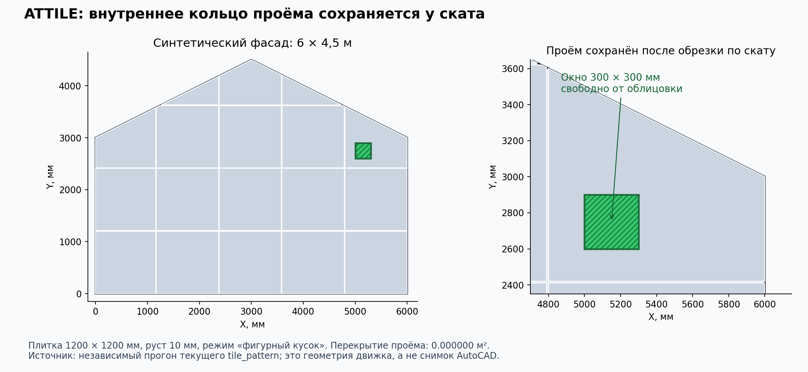

# AClad — исправления по ревизии 30.09.2026

Исправлены пять доказанных замечаний CL-1–CL-5 из `docs/review_3009/AClad.md`, дополнительные ошибки, выявленные независимыми геометрическими проверками, и опасные пути работы с блоками. Обычная ортогональная раскладка и эталон 290×82 сохранены. Код движка использует только стандартную библиотеку Python.

## Геометрия

- **Проёмы и вогнутые скаты.** Новый `AClad/engine/polygon_clip.py` пересекает границы полигонов, сохраняет внутренние кольца и отдельные компоненты. ATTILE и ATCLAD больше не заменяют невыпуклый контур пересечением бесконечных полуплоскостей. Окно 300×300 мм в плитке у ската остаётся пустым; на соединении двух фронтонов прежняя потеря 0,72 м² устранена.
- **Обёртка контура.** Если ступенчатая обёртка бокового выреза самопересекается, используется гарантированная обёртка по габариту. Итоговые куски всё равно обрезаются настоящим контуром. При незамкнутом графе пересечения клиппер выдаёт ошибку вместо неполного результата.
- **Треугольники.** ATCLAD принимает правильный контур из трёх вершин; вырожденная площадь отклоняется.
- **Большие координаты.** Площадь считается относительно локального начала с `math.fsum`; та же формула используется при определении вложенности CLI. Перенос на X=Y=4·10⁹ мм сохраняет геометрию и состав раскладки в проверенных сценариях. ATCLAD начинает обход рядов у нижней грани стены, сохраняя фазу датума, вместо перебора миллионов пустых рядов от нуля.
- **Нулевой руст у окна.** Даже шов шириной 0 задаёт границу разбиения камня. Раньше вычитание окна по высоте могло снять всю ширину пересекающего его камня; дополнительные тесты выявили потерю 270 000 мм² возле одного маленького окна.
- **Итоговые свойства.** После обрезки пересчитываются площадь, признаки `tiny`/`small` и поглощение полоски; режим `tiny_mode=layer` сохраняет полосу. Площадь зоны после проёмов и принудительных рустов считается внутри настоящего контура — наружная часть выреза за скатом не вычитается повторно.



Изображение построено из ответа Python, не из AutoCAD. Историческая иллюстрация ошибки в `docs/review_3009/` сохранена. Новый рисунок воспроизводится командой `python3 tools/review_3009/test_clad_frontons.py --render-fixed`.

## Перегенерация и блоки

- `cladding_plan` явно возвращает список обработанных контуров. `clad_engine` не включает пропущенный контур в `per_zone`; поэтому такой владелец не допускается C# к удалению прежних элементов.
- Чистый C#-метод `LayoutSafety.IncompleteRoots` проверяет все ожидаемые части владельца. Если рассчиталась лишь часть общей зоны, ATTILE/ATCLAD останавливаются **до вставок и удаления** с сообщением. Полностью пропущенная независимая зона сохраняется, остальные независимые зоны могут быть рассчитаны.
- `TrySetNum` теперь проверяет конечное значение после setter, в том числе молчаливое округление/отказ свойства. После установки обоих размеров они проверяются ещё раз: изменение высоты не должно незаметно менять ширину.
- Если динамический блок не принял размер, команда прекращается; ATCLAD откатывает транзакцию, ATTILE откатывает текущую пачку и удаляет уже записанные новые пачки. Старые объекты удаляются только после успешной отрисовки. Блок без параметров ширины/высоты ATCLAD больше не выдаёт за рассчитанную раскладку.
- Перед принятием новой динамической вставки проверяется её фактический габарит и положение с допуском 0,5 мм. При несовпадении команда отказывает с объяснением. Скрытые кривые исключены из `CellExtents`. Неизвестная схема растяжки не компенсируется предположением о базовой точке.
- Существующий автоблок ATTILE проверяется по простому прямоугольному контуру, размерам и наличию требуемой заливки SOLID. Требуется собственный формат генератора: `BlockTableRecord.Origin` около нуля, контур и заливка в XY при Z=0 с нормалью +Z, нулевая толщина полилинии. Одних 2D-вершин недостаточно для проверки положения плоскости. Коллизия имени приводит к отказу с предложением изменить наименование облицовки; чужое определение не перезаписывается. Эти свойства подтверждены документацией официального SDK и компиляцией; поведение чужого блока в живом AutoCAD не воспроизводилось.

## Актуальность исходной геометрии и общие группы

- ATCLAD и ATTILE проверяют каждую выбранную штриховку/марку через общий `ZoneGeometryGuard` **до формирования входа движка**. ATTILE сначала полностью добирает транзитивные группы прежней раскладки. Используются только проверенные `Parts`, включая все части объединённой зоны; равенство площади или габарита больше не считается достаточным. Непроверяемая, изменённая или отсутствующая зона останавливает всю команду до изменений. Для старой зоны без нового паспорта требуется повторить ATFZONE.
- `IncompleteSharedGroups` запрещает частичную замену прежних групп A+B, включая цепочку A+B/B+C. Он применяется в обеих командах после ответа движка, до рисования. Это закрывает переход от общей ATTILE к ATCLAD только одного участника.
- `LayoutGeometryGuard.Capture` снимает геометрию всех фактически переданных исходных полилиний, включая проёмы, и проверенные версии зон до расчёта. `Store` ещё раз проверяет источники и сохраняет отдельный Xrecord `ATCLAD_GEOMETRY`/`ATTILE_GEOMETRY` вместе с мягкими ссылками, хэндлом носителя и контрольной суммой метки раскладки. Повтор ATFZONE меняет версию даже при прежней форме: старые оси требуют новой раскладки.
- При выборе одной марки команда также читает прежнюю раскладку и записывает новую на основной штриховке зоны. У каждого запуска раскладки своя версия; `ATLAYOUT_CURRENT` на штриховке связывает её с видом и контрольной суммой текущей метки. ATFRAME отвергает невыбранную старую марку после новой раскладки с другими параметрами, даже если форма зоны и версия ATFZONE не менялись. Отсутствующая или изменённая метка основной штриховки также вызывает отказ.
- При штатном переходе ATCLAD ↔ ATTILE `RemoveData` удаляет прежнюю метку вместе с её `*_GEOMETRY` в одной транзакции, в том числе оставшийся одиночный снимок. Метка другого вида и текущий stamp не затрагиваются. Поэтому переключение команд не оставляет ложный признак повреждения, а строгая проверка orphan-снимка в ATFRAME сохраняется.
- Снимок охватывает **весь набор источников одного запуска**. Поэтому ATFRAME может потребовать выбрать весь этот набор даже для нескольких независимых зон. Это намеренно консервативное ограничение. Точная структурная проверка исходных полилиний может потребовать новую раскладку после изменения порядка вершин или REVERSE при сохранении формы.
- Исходный raw-контур с дугой останавливает весь запуск до движка: неподдерживаемое дуговое окно не должно исчезнуть перед определением вложенности. Зоны с дугами движок отклоняет целиком. Поддержка дуг не добавлена.
- Прямой JSON/CLI-вызов пока сохраняет прежний пропуск неподдерживаемого raw-контура: дуговое отверстие может быть потеряно. `test_clad_source_completeness.py` содержит два явно ожидаемых отказа для этого обхода C# preflight и четыре успешных метода, подтверждающих отказ всей дуговой зоны и сохранение независимой корректной зоны. Контракт независимых далёких raw-контуров в этом проходе не менялся.
- Скопированная общая raw-раскладка с оставшимися скопированными плитками не заменяется автоматически: строковые `members` указывают на оригиналы. На рабочей копии DWG требуется вручную удалить только скопированные плитки, затем выбрать полный набор исходных контуров копии. Если у древней метки нет мягких ссылок, после ручной очистки нужны новые самостоятельные контуры без прежних меток. Один выбор всей копии этот отказ не снимает. Одиночные копии с доказуемыми ссылками сохраняют прежний путь.

Чтение живых контуров, перевод ссылок при COPY и откат транзакций в AutoCAD не выполнялись в этой среде. Проверены чистая логика полноты групп, компиляция по официальному SDK и статический порядок проверок относительно вставок/удаления.

## Проверки

| Проверка | Результат |
|---|---|
| `test_cladding_plan.py` | 66 проверок, OK |
| `test_clad_engine.py` | 12 тестов, OK |
| `test_tile_pattern.py` | 180 проверок, OK |
| `audit_clad.py` | 124 сценария, 0 нарушений, 0 крашей |
| `attile_synth.py --quick` | 164 сценария, 113 504 куска, 0 провалов |
| `attile_synth.py` | 741 сценарий, 376 086 кусков, 0 провалов |
| `test_clad_frontons.py` | 15 методов, OK; внутри 200 случайных и 14 граничных сравнений клиппера с независимым Shapely, а также сквозные проверки форм/окон/сетки/обхода/переноса/CLI |
| `CladSafetyCheck.cs`, реальный Mono | 107 проверок, 0 ошибок: владельцы, транзитивные общие группы и числовая запись в ru-RU/en-US |
| `test_zone_geometry_adapter.py` | 30/30 PASS: production helpers с моделью CAD API; в том числе новая версия canonical hatch, старая марка, утрата ATFZONE, подмена ключа и метаданных |
| `test_clad_label_cleanup.py` | 41 проверка, 0 ошибок: неизменённый метод `RemoveData`, извлечённый из production-кода, исполняется с CAD doubles; проверены обе замены, одиночный снимок, повтор и сохранение текущих записей |
| `test_clad_source_completeness.py` | 4 метода PASS, 2 expectedFailure фиксируют ограничение прямого CLI для raw-дугового проёма; C# preflight этот вход отклоняет |
| `label_refs_check.py` | OK; проверка исходников/модели ссылок |
| `engine_contract.py` | Все читаемые ключи AClad найдены в ответах |
| ACladPlugin, Roslyn 4.8 + официальные net48/AutoCAD 24.0.0 reference assemblies | Полная компиляция, PASS |

Повторный прогон публичного эталона: **159 695 элементов = 118 367 целых + 41 328 кусков; 26 966 заготовок на подрезку; 145 333 плитки; отходы 3,230554%**. В этой среде чистый движок отработал за 1,895 с. Это не время вставки AutoCAD.

Логи текущего исправления находятся в `docs/fixes_3009/logs/clad_*`. Для воспроизведения чистого C#:

```bash
mcs -warnaserror -out:CladSafetyCheck.exe AClad/src/ACladPlugin/LayoutSafety.cs tools/fixes_3009/CladSafetyCheck.cs
mono CladSafetyCheck.exe
```

## Пределы проверки

AutoCAD не запускался. Полная компиляция с официальными ссылочными сборками и реальные тесты чистой C#-логики не подтверждают выполнение `DeepCloneObjects`, обновление габаритов динамического блока, корректность Undo или фактический откат при Esc в AutoCAD. Эти действия требуют живого прогона на блоках Германа. Проверка габарита может безопасно отклонить блок с неподдерживаемой внутренней графикой; это не заявление, что произвольные блоки с базой в центре стали поддерживаться.

Фигурные куски ATCLAD остаются полилиниями и не включаются в блоковую спецификацию — ранее согласуемое ограничение не изменено. Дуги внешнего контура и неортогональные проёмы по-прежнему не поддерживаются. Нового выпуска/установки пользователю в этом проходе не было.
