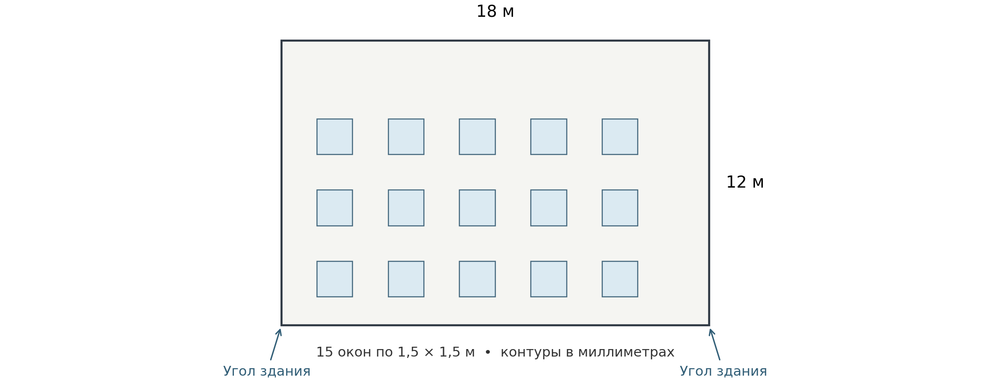

# Фасадные модули в AutoCAD
# Руководство с нуля: зоны, раскладка облицовки, подсистема и ведомости

Учебный комплект: AFacades + AClad + AFrame. Основа инструкции — команды и поля окон программы после исправлений выпуска 105. Номер нового установочного комплекта смотрите на странице выпуска GitHub; до его публикации новые действия из этого руководства недоступны в старых архивах. Целевая среда комплекта: полный AutoCAD для Windows, 64-разрядный, версии 2021–2024. Названия разделов и команд сохранены так, как они написаны в программе.

Это руководство ведёт от пустого учебного чертежа к результату с проверенной геометрией. Сначала выполните один пример целиком. Затем используйте справочные главы для своего проекта. Все размеры учебного примера заданы в миллиметрах. Числа для подсистемы в упражнении помогают освоить программу; рабочие профили, шаги и крепления назначают по проекту.

Иллюстрации с координатами — учебные схемы, построенные из результатов движков. Они не являются снимками запущенного AutoCAD. Схемы окон сохраняют базовые разделы интерфейса; новые поля каталога и параметров проекта описаны текстом в главе 13. Данные примера искусственные и не содержат частных проектов.

## Какой версией пользоваться

**Руководство описывает исправленную программу после выпуска 105.** В расчёте вертикальной подсистемы теперь учитывается каждый отдельный кусок направляющей у окна, его пролёты и свесы. Короткий остаток при резке перераспределяется; исходный участок, на котором нельзя разместить две опоры, получает понятный отказ. Старую зону можно принять без пересоздания её марки и штриховки. Появились проверка согласованности версий и кнопки команд проекта, зон и схемы узла.

**В уже скачанных архивах build-105 этих изменений нет.** Для занятий нужен новый выпуск, содержащий исправления. Откройте [страницу выпусков GitHub](https://github.com/zinchenko-denis/AutoCAD/releases), прочитайте её описание и скачайте AFacades, AClad и AFrame одного номера. Отдельная короткая инструкция объясняет скачивание и установку на AutoCAD 2024. Не устанавливайте один новый фасадный модуль рядом с двумя старыми.

Руководство охватывает зоны, раскладку, подсистему, ведомости и справочные команды параметров и узла. Оно не подтверждает живую приёмку AutoCAD и не превращает учебные параметры в проектное решение. Межэтажная система в режиме «по расчёту», полный монтажный узел с крепежом и автоматический подбор монтажного варианта пока не готовы.

## 1. Что установлено и какой результат даёт каждый модуль

| Модуль | Основная команда | Что выбираете | Что получаете |
|---|---|---|---|
| AFacades | ATFZONE | Замкнутый наружный контур и контуры окон/дверей | Зону с маркой, штриховкой, площадями и погонажами |
| AClad | ATTILE | Созданную зону либо исходные замкнутые контуры | Раскладку облицовки: целые элементы и подрезки |
| AFrame | ATFRAME | Зону с раскладкой | Направляющие, кронштейны; кляммеры или шины в зависимости от облицовки |
| AFacades | ATFTABLE | Зоны, раскладку или подсистему по слою/объектам | Ведомость зон, работ, деталей облицовки или элементов подсистемы; DWG/XLSX |

Рабочая последовательность: **контуры → ATFZONE → ATTILE → ATFRAME → ATFTABLE → проверка → сохранение**. Для пилота Вектор-1 с общими параметрами добавьте перед ATFRAME шаги **ATFPROJECT → ATFZONEPARAMS** из главы 13. ATFPROJECT хранит общие параметры DWG, а ATFZONEPARAMS — явные привязки и исключения настоящих зон ATFZONE; обе команды сохраняют параметры без построения геометрии. Отдельная команда **ATFNODE** создаёт размерную схему известных слоёв и плоскостей одной привязанной зоны. Основной учебный пример с бетонной плиткой остаётся самостоятельным упражнением без этого выбора.

Зона — это участок фасада с общей облицовкой. Окно внутри зоны уменьшает площадь стены. Отдельный контур рядом со стеной может стать другой зоной, поэтому нельзя выбирать рамкой случайную геометрию. Полилинии, штриховки, марки и созданные элементы имеют разные задачи: старайтесь понимать, что именно вы выбираете на каждом этапе.

ATFTABLE составляет ведомости зон, видов работ, фактических деталей облицовки и созданных элементов подсистемы. В режиме «Облицовка» отдельно можно показать заготовки и отходы принятого раскроя ATTILE. Режим «Подсистема → Элементы» считает элементы схемы и длины профилей. «Подсистема → Соединения» выводит геометрический паспорт для проверки опор и пролётов. Эти таблицы не подтверждают статическую модель, комплектность узлов или закупку. Ручные детали регистрируют через «Ручные» с явным образцом, свойствами и способом измерения; затем они входят в обычные ведомости. Полная спецификация системы остаётся отдельной задачей.

## 2. Установка трёх модулей

### 2.1. Что подготовить

Нужны три архива одной согласованной сборки: `AFacades.bundle.zip`, `AClad.bundle.zip`, `AFrame.bundle.zip`. Установка отдельных библиотек Python не требуется: движки входят в комплект. Не берите исходный код GitHub вместо установочных архивов.

1. Закройте все окна AutoCAD.
2. Если Windows показывает у скачанного архива свойство «Разблокировать», разблокируйте архив от доверенного поставщика до распаковки.
3. Распакуйте каждый архив. Получатся три папки с окончанием `.bundle`.
4. В Проводнике Windows вставьте в адресную строку `%APPDATA%\Autodesk\ApplicationPlugins\` и нажмите Enter.
5. Поместите сюда три папки. Если обновляетесь, сохраните прежние папки вне `ApplicationPlugins`, затем замените их новыми целиком. Не оставляйте рядом ещё одну копию того же модуля под другим названием.
6. Проверьте вложенность по таблице ниже. Частая ошибка — лишняя папка архива над `.bundle` либо `.bundle` внутри `.bundle`.
7. Запустите AutoCAD. При запросе доверия проверьте, что загружаются именно файлы установленного комплекта. Не отключайте глобальную защиту загрузки ради установки.

| Проверяемый файл | Правильное расположение относительно ApplicationPlugins |
|---|---|
| Манифест зон | `AFacades.bundle\PackageContents.xml` |
| Плагин зон | `AFacades.bundle\Contents\net48\AFacadesPlugin.dll` |
| Движок зон | `AFacades.bundle\Contents\engine\facades_engine.exe` |
| Плагин раскладки | `AClad.bundle\Contents\net48\ACladPlugin.dll` |
| Движок раскладки | `AClad.bundle\Contents\engine\clad_engine.exe` |
| Плагин подсистемы | `AFrame.bundle\Contents\net48\AFramePlugin.dll` |
| Движок и справочник | `AFrame.bundle\Contents\engine\frame_engine.exe` и `systems.json` |

### 2.2. Как убедиться, что установилась нужная сборка

Откройте историю командной строки клавишей F2. Найдите сообщения загрузки AFacades, AClad и AFrame. Запишите номер скачанного выпуска и сохраните эти строки. Значение `0.1.0` в свойствах пакета само по себе не различает выпуски.

После загрузки программа сопоставляет версии трёх фасадных модулей. При несовпадении или отсутствии сведений появится одно предупреждение со списком проблемных модулей. Закройте AutoCAD, проверьте, откуда загружены DLL, уберите прежние копии и замените все три папки одним комплектом. Повторение ATFZONE при смешанных версиях проблему установки не исправляет.

Наберите `ATFZONE`, затем Esc; повторите для `ATTILE` и `ATFRAME`. Команда должна перейти к выбору объектов, а не ответить «Неизвестная команда». У AClad основная кнопка «Раскладка» вызывает ATTILE. На ленте и в классическом меню доступны команды из таблицы ниже. Если рабочее пространство скрывает панель, ту же команду можно ввести вручную.

| Кнопка | Команда | Для чего нужна |
|---|---|---|
| Параметры проекта | ATFPROJECT | Общие параметры выбранного фасадного решения в DWG |
| Параметры зоны | ATFZONEPARAMS | Наследование, свои значения и снятие привязки зоны |
| Схема узла | ATFNODE | Справочная размерная схема и её проверка |
| Принять старую зону | ATFZONEACCEPT | Принятие существующих контуров старой зоны |
| Связи контуров | ATFZONERESET | Исправление старых связей линий откосов и парапета |

Если строка загрузки только одна или две, переходить к учебному примеру рано. Проверьте соответствующую папку, наличие DLL/EXE, версию AutoCAD и доверие к файлам. Этот комплект не заявляет поддержку AutoCAD для Mac, LT и 2025+; для них не следует переносить эти действия автоматически.

## 3. Пять правил перед первым чертежом

**Миллиметры.** Одна единица координат в упражнении равна 1 мм. Стена шириной 6 м имеет длину 6000, а не 6. Команда `_DIST` позволяет измерить уже нарисованный объект. Изменение поля единиц в `_UNITS` не увеличивает существующие линии в тысячу раз.

**Плоский фасад.** Работайте в пространстве «Модель», в плоскости XY, с Z=0. Горизонталь фасада — X, вертикаль — Y. Эти команды предназначены для схемы фасада, а не для выбора произвольных граней 3D-модели.

**Мировая система координат.** Для упражнения введите `_UCS`, затем `_World`; после этого `_PLAN`, затем `_World`. Снята неопределённость между повёрнутой пользовательской системой и координатами примера.

**Замкнутые полилинии.** Наружная граница стены и каждое окно — отдельная замкнутая полилиния. Четыре отдельных отрезка визуально похожи на прямоугольник, но это ещё не один замкнутый контур. В «Свойствах» должны быть тип «Полилиния», замкнутость «Да» и нулевая отметка.

**Отдельная папка проекта.** До запуска ATFZONE сохраните учебный файл как DWG в собственной папке. Рядом будет файл зон с тем же базовым именем и суффиксом `_fzones.json`. Для передачи и резервирования сохраняйте пару DWG + JSON вместе.

Нажатие Enter подтверждает ввод или значение по умолчанию в угловых скобках. Esc отменяет текущий запрос; надпись «Отмена» в окне закрывает его без построения. Всегда смотрите, какой именно ответ ждёт командная строка. Если вместо выбора объектов в строке осталась другая команда, сначала нажмите Esc.

## 4. Учебный фасад: исходник и проверочные размеры

В упражнении стена имеет размер 6000×6000 мм, два окна — по 1200×1500 мм. Подоконники расположены на Y=1500, верх окон — на Y=3000.

| Контур | Нижний левый угол X,Y | Верхний правый угол X,Y |
|---|---|---|
| Стена | 0,0 | 6000,6000 |
| Окно 1 | 1000,1500 | 2200,3000 |
| Окно 2 | 3600,1500 | 4800,3000 |

### Вариант А — открыть готовый учебный DXF

Скачайте [учебный исходник 01_source_rect.dxf](https://github.com/zinchenko-denis/AutoCAD/raw/refs/heads/feat/auto-reactor/docs/facades_beginner_3009/assets/01_source_rect.dxf) и откройте его через обычную команду открытия AutoCAD. Выполните «Сохранить как» и сохраните `Facade_Lesson_01.dwg`. Исходник содержит только три полилинии: наружную на `SOURCE_OUTER`, окна на `SOURCE_WINDOWS`. Выполните `_ZOOM`, затем `_Extents`, чтобы увидеть всё.

### Вариант Б — нарисовать самому

В новом чертеже установите мировую систему координат и миллиметры. Для точного ввода координат удобно временно отключить динамический ввод F12 и объектные привязки F3, затем вернуть их после построения.

Выполните три раза `_RECTANG`. Для первого прямоугольника укажите `0,0`, затем `6000,6000`. Для второго — `1000,1500` и `2200,3000`. Для третьего — `3600,1500` и `4800,3000`. Каждую пару вводят в ответ на соответствующий запрос команды, с Enter после точки. Команда RECTANG создаёт замкнутую полилинию.

Проверьте `_DIST`: ширина стены 6000, ширина окна 1200, высота окна 1500. Это полезнее, чем доверять внешнему виду. Сохраните DWG до следующего шага.

**Контроль перед продолжением:** одна наружная полилиния; два внутренних контура; окна не пересекаются и не выходят за стену; нет наложенных дублей.

## 5. Шаг 1 — создать зону командой ATFZONE

### 5.1. Что выбрать

Введите `ATFZONE`. На начальный запрос **«Что обработать [Зоны/Парапет] <Зоны>»** нажмите Enter — выбирается «Зоны». Затем выберите три полилинии: стену и оба окна. Для готового чистого исходника удобно обвести их общей рамкой. Нажмите Enter для завершения выбора. Окна отдельно из стены вырезать не надо: программа определяет вложенность контуров.

Если забыли окно, в открывшемся окне используйте **«+ Добавить контуры»**, добавьте полилинию и завершите выбор Enter. Уже выбранные контуры сохраняются.

### 5.2. Как заполнить окно

| Поле или галка | Значение для упражнения | Для чего это нужно |
|---|---|---|
| Наименование облицовки (= имя слоя) | УЧЕБНАЯ бетонная плитка 290×82 | Имя слоя зоны и понятное обозначение материала |
| Префикс марки | У- | Получится марка У-1 |
| Начальный № | 1 | В новом учебном DWG это первая зона |
| Высота текста, мм | 120 | Читаемая учебная марка; размер в пространстве модели |
| Штриховка | ANSI31 | Показывает область стены |
| Масштаб | 25 | Плотность рисунка штриховки, не масштаб геометрии |
| Цвет (ACI 1–255) | 8 | Цвет зоны для визуального разделения |
| Объединить выбранные контуры в ОДНУ зону | Выключено | Здесь уже один наружный контур с окнами |
| Проставить линейные размеры | Выключено | В первом проходе оставляем схему простой |
| Вставить таблицу площадей и погонажей | Выключено | Ведомость построим отдельной командой в конце |
| Сохранить зоны в JSON рядом с чертежом | Включено | Сохраняет геометрию для следующих модулей |
| После OK указать витражи, двери и парапет | Выключено | Оба внутренних контура — обычные окна |

Параметры окон запоминаются, поэтому сверяйте значения даже при повторении упражнения. Нажмите OK. Если оставили включённой вставку таблицы, программа дополнительно запросит точку: укажите свободное место справа от фасада. Если оставили выбор видов проёмов, последовательно нажмите Enter на запросах витражей, дверей и парапета — в этом примере их нет.

### 5.3. Что проверить

На стене появляется штриховка с двумя отверстиями, марка У-1 и площадь. Штриховка не должна закрывать окна. В командной строке не должно быть непринятых контуров.

Новая ATFZONE сохраняет **контрольный снимок геометрии**: форму и положение выбранных наружных контуров, зарегистрированных проёмов и границ штриховки, а также рассчитанные данные зоны. Здесь «снимок» означает служебную запись для проверки, а не картинку. Следующие команды сверяют с ней текущий чертёж. Поэтому исходные контуры сохраняйте: одной красивой штриховки недостаточно для дальнейшей работы.

| Показатель | Проверочное значение |
|---|---:|
| S участка | 36,00 м² |
| S проёмов | 3,60 м² |
| S облицовки, нетто | 32,40 м² |
| Отливы | 2,40 м.п. |
| Откосы | 8,40 м.п. |
| Окна | 2 |

Проверка вручную: 6×6 − 2×1,2×1,5 = 32,4 м². Отливы — нижние кромки окон: 2×1,2 = 2,4 м. Откосы — верх и две боковые кромки: 2×(1,2+1,5+1,5) = 8,4 м. Окна на границе зоны, двери и витражи имеют отдельные правила; этот пример намеренно не содержит таких случаев.

Откройте папку чертежа: после сохранения зон должен находиться `Facade_Lesson_01_fzones.json`. Этот файл редактировать вручную не нужно.

## 6. Шаг 2 — разложить плитку командой ATTILE

### 6.1. Выбор и основные настройки

Введите `ATTILE`. Выберите **штриховку зоны У-1 или её марку**, затем Enter. Не выбирайте каждую будущую плитку: команда работает с зоной. В первом проходе не нужны образцы динамических блоков — выберем элементы, которые создаёт сама программа.

Настройте окно по порядку сверху вниз. Выбор материала может сменить начальные значения, поэтому сначала материал, затем размеры и остальные параметры.

| Раздел | Поле | Значение упражнения |
|---|---|---|
| 1. Облицовка | Материал | Клинкер / кирпич / плитка |
| 1 | Наименование | УЧЕБНАЯ бетонная плитка 290×82 |
| 1 | Элемент | Прямоугольник — блоки создаст программа |
| 1 | Раскраска по образцу (тип — слой) | Выключено |
| 2. Формат и швы | Формат Ш×В, мм | 290 × 82 |
| 2 | Шов вертик., мм / горизонт., мм | 7 / 7 |
| 3. Разбежка | Ряды | Горизонтальные ряды |
| 3 | Смещение | Через ряд (0, s, 0, s …) |
| 3 | Величина s / единицы | 1/2 / доля модуля |
| 3 | Направление | Вправо |
| 4. Отсчёт | Кнопка точки | ПН — правый нижний угол |
| 4 | Считать от | Габарита зоны |
| 4 | Общая точка для всех зон | Выключено |
| 5. Подрезка и проёмы | Руст вокруг проёмов | Включено |
| 5 | Смежные контуры — одна плоскость | Выключено для упражнения |
| 5 | Г-образные куски | Резать, руст по продолжению грани проёма |
| 5 | Не класть куски тоньше, мм | 10 |
| 5 | Пропил, мм | 3 |
| 5 | Предупреждать о подрезке меньше, мм | 30 |
| 6. Принудительные русты | Вертикальные / горизонтальные | Обе галки выключены |

В ATTILE выбранный материал — набор начальных параметров раскладки. Поэтому бетонная плитка здесь находится в общей группе «Клинкер / кирпич / плитка». В ATFRAME материал бетонной плитки выбирается уже отдельно, поскольку определяет состав подсистемы.

**Что означает 1/2.** Модуль по ширине равен 290+7 = 297 мм. Половина модуля — 148,5 мм. Это не 145 мм и не половина высоты плитки. Каждый второй ряд смещается относительно первого; рисунок повторяется через два ряда. В кратком описании окна величина может отображаться округлённо — расчёт использует точное значение.

Просмотр справа помогает проверить рисунок и положение исходной целой плитки. Он показывает принцип раскладки, а не точную геометрию именно вашего фасада. Нажмите **«Разложить»** и дождитесь завершения команды. Не нажимайте команду повторно, пока ещё идёт текущий расчёт/вставка.

### 6.2. Результат и проверка

Проверьте четыре участка: правый нижний угол, левый край стены, низ окна, верх окна. Ряды идут снизу вверх, окна остаются пустыми, около проёмов есть зазор, подрезки повторяют их грани. В свойствах целого прямоугольного элемента измерьте 290×82 мм; между целыми соседями должен быть шов 7 мм.

Различайте три количества. **Целые** — установленные без подрезки плитки. **Подрезки** — отдельные куски в чертеже. **Заготовки/плиток всего** — исходные плитки для целых и раскроя: из одной заготовки иногда получают несколько кусков. Поэтому число кусочков в чертеже не равно закупочному числу плиток. Поле «по площади» — ещё одна оценка; её нельзя подменять количеством по раскрою.

Для данного точного упражнения ориентир движка: **1127 целых + 204 подрезки = 1331 установленный элемент; 108 заготовок под подрезки; 1235 плиток всего**. Небольшие полоски тоньше 10 мм поглощаются швами; ожидается сообщение о 9 таких полосках. Предупреждение о 11 малых подрезках означает «проверьте технологичность», а не остановку команды. Эти значения относятся только к указанной геометрии и параметрам.

Площадь самих плиток меньше 32,40 м², потому что между ними есть швы, зазоры у окон и исключённые тонкие участки. Это не ошибка вычитания окон в ATFZONE.

После проверки сохраните DWG. На иллюстрации цвет подрезок специально усилен для обучения; реальные цвета/слои зависят от настроек раскладки.

## 7. Шаг 3 — построить подсистему ATFRAME

### 7.1. Как выбрать исходные данные

Введите `ATFRAME`. Выберите ту же штриховку или марку У-1, по которой выполнена ATTILE; завершите Enter. Программа читает связи раскладки с зоной. Выбор только плиток или только случайной направляющей не эквивалентен выбору зоны.

В окне должен появиться смысловой текст о рядах раскладки: для плитки **«Рядовые шины — по рядам раскладки зон (ATTILE)»**. Если программа пишет, что раскладки нет, нажмите «Отмена» в окне и проверьте выбор: для сквозного упражнения ряды должны поступить из ATTILE.

ATFRAME также проверяет актуальность самой раскладки. Если она создана старой сборкой без контрольного снимка, изменились её исходные контуры или после неё повторяли ATFZONE, сначала заново выполните ATTILE по актуальной зоне. Для прежнего проекта с ATCLAD повторите ATCLAD. Наличие старых плиток и осей на экране не заменяет эту проверку.

Если ранее раскладывали общий набор из нескольких зон или контуров с окнами, выбирайте его целиком. Проверка охватывает все источники одного запуска ATTILE/ATCLAD, даже независимые зоны: ATFRAME может потребовать выбрать весь этот набор. Выбор только одной части общей раскладки либо наружного контура без ранее учтённого окна отклоняется: выберите весь исходный набор с проёмами или сначала заново разложите нужный самостоятельный участок. При отказе использовать оси прежней раскладки существующая подсистема сохраняется.

### 7.2. Учебные параметры

Схема сохранена для первого упражнения. Новая кнопка «Решение и каталог…» и различие между выносом облицовки и плечом расчёта описаны в главе 13. Для бетонной плитки этого упражнения новое альбомное решение не выбирайте.

| Раздел | Поле | Значение упражнения |
|---|---|---|
| 1. Облицовка | Материал | Бетонная плитка |
| 2. Что раскладывать | Состав | У плитки определяется автоматически: подсистема с шинами, без кляммеров |
| 3. Подсистема | Тип | Вертикальная |
| 3 | Профиль | ГП-40-40 |
| 4. Шаги кронштейнов | Способ задания | Вручную |
| 4 | Шаг рядовой, мм / шаг угловой, мм | 600 / 600 |
| 4 | Старт кронштейна | 300 |
| 4 | Зазор стыка, мм | 10 |
| 4 | Угловая зона, мм | 1500 |
| 5. Направляющие и шины | Шаг направляющих | 600 |
| 5 | В угловой зоне | 0 — как рядовой |
| 5 | Марка шины | УЧЕБНАЯ |
| 5 | Хлыст шины, мм | 2500 |
| 5 | Шаг рядов, мм | Берётся из раскладки; для этого примера модуль по высоте 89 мм |
| 6. После «Разложить» | Внешние углы / отметки перекрытий | Обе галки выключены |
| 7. Знаки | Вид | Условные |

В первом упражнении выбран ручной режим, поэтому данные ветрового расчёта здесь не задаются. Не переносите эти учебные значения на рабочий фасад как готовое инженерное решение.

Прочитайте блок **«Что будет»** справа. Убедитесь, что он описывает вертикальную подсистему под бетонную плитку и ручные шаги. Нажмите «Разложить». Если после окна появились дополнительные запросы точек или образцов, значит оставлена соответствующая галка/режим: либо дайте нужные данные осознанно, либо отмените и исправьте настройки.

### 7.3. Как читать результат

Тёмные вертикали на учебной схеме — направляющие, квадратные точки — кронштейны, горизонтали — шины. Для бетонной и клинкерной плитки создаются шины; кляммеров в этом режиме нет. **Нулевое количество кляммеров здесь правильно.**

Шины бывают стартовые, рядовые и концевые. Стартовые располагаются внизу и над проёмами, концевые — вверху и под проёмами; рядовые следуют горизонтальным рядам раскладки. Общий прогон делится на хлысты, а стык привязывается к направляющей. Поэтому один ряд может состоять из нескольких отдельных деталей.

Контрольный результат данного упражнения: **25 отрезков направляющих общей длиной 64,73 м; 111 рядовых кронштейнов; 211 деталей шин общей длиной 378,00 м**. Из них 5 стартовых, 201 рядовая, 5 концевых. Не путайте число вертикальных осей и число отрезков направляющих: окна и стыки дробят ось на отдельные элементы.

Так как отметки перекрытий в упражнении не заданы, в сводке может быть ноль несущих кронштейнов и все кронштейны будут одного типа. На реальном проекте задавайте утверждённые отметки и схему крепления; учебная демонстрация не заменяет их.

Перед сохранением проверьте: направляющие не проходят сквозь окна; около откосов есть элементы, предусмотренные алгоритмом; шины не висят отдельно от опор; верх/низ зоны не перепутаны; ошибок или отказа в командной строке нет. Если программа сообщает о шине без опоры и отказывается строить, не считайте старую подсистему новым успешным результатом — исправьте геометрию/параметры и повторите расчёт.

### 7.4. Проверка расчёта на фасаде с пятнадцатью окнами

Это отдельное упражнение под керамогранит. Оно позволяет проверить исправление коротких направляющих и работу режима «по расчёту» на фасаде с окнами. Сначала выполните его по указанным исходным данным, затем переходите к своему объекту. Установленные здесь нагрузки и шаги служат повторяемости проверки программы.

Скачайте [Facade_18x12_15windows.dxf](https://github.com/zinchenko-denis/AutoCAD/raw/refs/heads/feat/auto-reactor/docs/pilot/assets/Facade_18x12_15windows.dxf). Откройте и сохраните его как `Pilot_windows.dwg` в отдельной папке. В файле только наружный контур и 15 окон; готовых зон, раскладки и подсистемы нет. Обе стороны учебной стены считаем наружными углами здания.

На рисунке показана схема исходников, не результат запуска AutoCAD. Стена: от 0,0 до 18000,12000 мм. Окна: 1500×1500 мм; их левые координаты X равны 1500, 4500, 7500, 10500 и 13500 мм, нижние Y — 1200, 4200 и 7200 мм. Такое описание позволяет восстановить исходник самостоятельно.

1. Выполните **ATFZONE**, выбрав наружный контур и все 15 окон. Создайте одну зону, сохраните JSON рядом с DWG. Проверьте площадь: 18×12 − 15×1,5×1,5 = **182,25 м²**.
2. До ATTILE вызовите **ATFRAME** по этой зоне. Историческую карточку «Решение и каталог» здесь не выбирайте: у неё отдельные ограничения, описанные в главе 13.
3. Введите параметры из таблицы. После «Разложить» задайте первую ось точкой **608,0**, наружные углы точками **0,0** и **18000,0**. Каждый список завершайте Enter.

| Параметр | Учебное значение |
|---|---|
| Материал и состав | Керамогранит, только подсистема |
| Схема и профиль | Вертикальная, профиль «Авто» |
| Способ задания шагов | По расчёту несущей способности |
| Район и местность | II и B |
| Высота здания и масса облицовки | 30 м и 25 кг/м² |
| Плечо расчёта и анкер | 230 мм и 3000 Н |
| Шаг осей и горизонтальных швов | 608 и 605 мм |
| Старт кронштейна и зазор стыка | 300 и 10 мм |
| Внешние углы | Включены, обе точки указаны явно |
| Отметки перекрытий | Выключены |

Увеличьте низ окон, простенки и верх стены над последним рядом окон. На каждом отдельном куске должно быть не меньше двух кронштейнов. Окна остаются пустыми, у обоих наружных краёв присутствуют направляющие. Для этих точных входов проверенный движок даёт **148 направляющих и 553 кронштейна**. Один участок получает дополнительную опору при локальном уменьшении шага. Это числовой ориентир упражнения, не норматив расхода и не результат уже выполненной живой проверки AutoCAD.

При другом количестве или отказе сначала сохраните F2 и снимок нужного места. Не переходите сразу в ручной режим: иначе будет потерян исходный пример проблемы. Предыдущая подсистема, оставшаяся на экране после отказа, не является новым успешным результатом.

### 7.5. Ручной вариант и полный проход по тем же окнам

На отдельной копии исходной зоны повторите ATFRAME вручную: шаги **800/800 мм**, старт **300 мм**, зазор **10 мм**, те же оси и наружные углы. Для точных входов ожидаются **148 направляющих и 552 кронштейна**, без одноопорных хвостов. Эти ручные шаги не являются инженерным назначением для рабочего объекта.

На следующей копии зоны выполните ATTILE: плита **600×600 мм**, шов **10 мм**, прямая раскладка. Проверьте, что окна свободны и крайние подрезки приемлемы. Заново постройте подсистему по этой раскладке с теми же наружными углами. Теперь оси берутся из облицовки, поэтому числа 148 и 553 из отдельного теста ручных осей уже не служат эталоном.

Выдайте через ATFTABLE ведомости облицовки и подсистемы в DWG и XLSX. Сопоставьте несколько деталей и длин с чертежом. Сохраните и заново откройте проект; на копии измените одно окно и проверьте, что прежние данные требуют обновления. При отмене построения прежний результат должен сохраниться. Затем повторите цепочку на небольшом участке своего рабочего фасада с его исходными данными.

## 8. Шаг 4 — построить ведомость ATFTABLE

### 8.1. Обычная ведомость зон

1. Введите `ATFTABLE`.
2. На запрос **«Ведомость [Зон/Штукатурка/Вентфасад/Облицовка/Подсистема/Ручные] <Зон>»** нажмите Enter: выбирается «Зон».
3. На запрос **«Зоны для ведомости [Слой/Объекты] <Слой>»** введите «Объекты».
4. Выберите штриховку или марку У-1 и нажмите Enter. Не выбирайте плитки.
5. На **«Куда вывести ведомость [Чертеж/Ексель/Оба]»** выберите «Оба».
6. Задайте высоту текста таблицы 120 мм.
7. Укажите точку в свободном месте справа от фасада, например X=7000,Y=5500. Если таблица слишком крупная, в следующем построении уменьшите высоту текста; это не меняет расчётные площади.
8. В диалоге сохранения XLSX задайте `Facade_Lesson_01_vedomost.xlsx` в папке урока.
9. Откройте файл и сравните строку У-1 с проверочной таблицей главы 5: 36,00 / 3,60 / 32,40 м²; 2,40 / 8,40 м.п.

Если выбрать режим «Слой», появится список существующих слоёв зон. Он удобен, когда нужно собрать все зоны одного материала, но новичку важно не включить соседние фасады. Сначала проверяйте ведомость одной зоной через «Объекты».

### 8.2. Ведомость работ

В том же первом запросе варианты **«Штукатурка»** и **«Вентфасад»** формируют соответствующую ведомость работ. После выбора программа берёт данные зон и раздельные категории проёмов/парапетов. Поэтому окно, дверь и витраж должны быть классифицированы правильно ещё на этапе ATFZONE.

Если на объекте присутствуют двери, витражи и парапет, включите в ATFZONE галку «После OK указать витражи, двери и парапет». После основного выбора задайте нужные контуры в дополнительных запросах; остальные внутренние контуры останутся окнами. Парапет считается отдельно, его нельзя случайно включать одновременно как обычную стену. Если нужны только парапеты без зон, запустите ATFZONE и в первом запросе выберите «Парапет»: допускаются подходящие закрытые и открытые полилинии. В ATFTABLE верхняя линия закрытого парапета также может служить объектом выбора; одна и та же исходная конструкция не должна учитываться повторно.

ATFTABLE проверяет актуальность выбранных зон до создания таблиц. Изменённая геометрия и скопированная зона требуют восстановления по главе 10. Для старой зоны без контрольного снимка сначала выполните ATFZONEACCEPT по разделу 10.3, затем повторите зависимые результаты. Совпадение площади не отменяет проверку формы и положения контуров. Если толщина не задана в наименовании/данных, в форме явно указывается «толщина не указана» — программа не должна угадывать её.

Ведомость работ — результат выбранной формы и исходных зон. Проверьте наименования работ, единицы, виды проёмов и объёмы перед выдачей. Не переименовывайте столбцы произвольно, если таблица передаётся в согласованную форму заказчика.

### 8.3. Ведомость деталей облицовки

Этот режим работает с результатом ATTILE или ATCLAD, заново созданным версией с ведомостями, и с явно зарегистрированными ручными деталями из раздела 8.7. Старую раскладку без сохранённого состава нужно пересоздать. Геометрический DXF-эталон не содержит этих данных.

1. Введите ATFTABLE и выберите **«Облицовка»**.
2. Выберите **«Объекты»**, затем штриховку или марку зоны У-1. Можно выбрать деталь, но тогда в ведомость войдёт **вся её зона**, а не только выбранная плитка. Режим «Слой» проверяет все объекты отмеченных слоёв; проверьте, нет ли там лишнего.
3. Выберите **«ПоЗонам»** или «Общая». Общая группировка объединяет только совместимые позиции.
4. Выберите **«Детали»**. Вариант «ДеталиИРаскрой» дополнительно показывает заготовки и отходы ATTILE.
5. В предпросмотре проверьте область, строки, итог и сообщения о неполноте. Здесь же введите примечание пользователя и нажмите «Продолжить».
6. Выберите **«Чертеж»**, «Ексель» или «Оба». Для чертежа выберите **«Новая»**, задайте высоту текста и точку вставки. Для Excel укажите файл. До завершения этих запросов результат не записывается.
7. Для точного упражнения главы 6 итог установленных деталей должен быть **1331 шт.** Сопоставьте DWG и XLSX: они построены по одним строкам.

Точка новой таблицы переводится из текущей ПСК в мировые координаты. Таблица сохраняет прежнее направление; автоматически вслед за ПСК она не поворачивается. Смена ПСК после выбора точки вызывает отказ до записи. При «Обновить» используется прежнее место таблицы, новую точку задавать не нужно.

Габариты контура по осям X/Y даны в миллиметрах, количество — в штуках, площадь деталей — в м². При повороте ручной панели габариты X/Y охватывают её повёрнутый контур в чертеже; это не номинальные размеры каталожной панели и не размеры заготовки. Площадь учитывает контур и отверстия детали по раскладке; она не равна площади зоны со швами. Заливка, внешний и внутренние контуры одной фигурной детали не добавляют отдельных штук. Фигурные детали получают в таблице местные обозначения форм Ф-1, Ф-2; одинаковый габарит разных форм не объединяет их в одно изделие.

Если расчёт успешно дал пустую выбранную область, появится сообщение «В выбранной области нет деталей облицовки» и известный итог **0 шт.** Это отличается от отсутствующих или повреждённых данных: они требуют восстановления раскладки, а не подстановки нуля.

Неизвестные материал, марка или цвет показаны явно. Посторонние выбранные объекты не превращаются в детали: вкладка «Не учтено объектов» содержит их Handle, тип, слой и причину. Этот список также включается в DWG и XLSX. Если не учтено ничего, программа показывает отказ с проверкой объектов, а не подтверждённый ноль. Количества с предупреждениями не выдаются за полную спецификацию.

### 8.4. Раскрой и обновление ведомости облицовки

Для раскроя нужно выбрать **всю его группу зон**. Частичный выбор не распределяет заготовки между зонами: выберите всю группу либо режим «Детали». Если одна физическая деталь объединённой раскладки относится к нескольким зонам, для неё также требуется вся область. Проверка актуальности всегда охватывает исходную раскладку целиком.

«Заготовки для подрезок» входят в «Заготовки всего» — эти строки не складывают. Отходы показаны отдельно в м². Дополнительный запас на бой не добавляется; это не готовая закупка. Для учебного примера ориентиры — 108 заготовок под подрезки и 1235 заготовок всего. Если данных раскроя нет, потребность в заготовках остаётся неопределённой.

Чтобы обновить таблицу, повторите выбор области и предпросмотр, выберите вывод в чертёж, затем **«Обновить»** и укажите существующую ведомость облицовки ATFTABLE. Программа покажет новый состав вместе с сохранённым примечанием. Подтвердите его и высоту текста: обновляется выбранная таблица на прежнем месте, без второй копии. Скопированная таблица с чужими связями не принимается как исходная.

Примечание редактируют в предпросмотре; оно хранится отдельно от вычисленных количеств. Ручная правка ячеек DWG или Excel не меняет раскладку и не загружается обратно. На любом запросе **Esc сохраняет прежнюю таблицу и файл**. Удалённая, изменённая или скопированная деталь, подменённый образец либо устаревший источник останавливают выдачу до пересоздания соответствующей раскладки.

Ведомость проверяет состав геометрии. Она не подтверждает статическую схему каркаса, состав крепежа или применимость узлов. Ограничения главы 13 продолжают действовать.

Если программа сообщает, что область слишком велика для сохранения состава, уменьшите её и создайте несколько самостоятельных раскладок. Не пытайтесь получить ведомость по неполному или оборванному результату.

### 8.5. Ведомость элементов подсистемы

Для созданной программой подсистемы сначала выполните ATFRAME в версии, сохраняющей её состав. Для ручных деталей выполните регистрацию из раздела 8.7. Старые направляющие и условные знаки без такого состава не дают проверенную ведомость: перестройте нужную область. Сами линии и блоки учебного DXF-эталона для этого не подходят.

1. Введите ATFTABLE и выберите **«Подсистема»**. На запрос **«Вид ведомости [Элементы/Соединения] <Элементы>»** нажмите Enter.
2. Выберите «Объекты» и укажите зоны, метки ATFRAME либо созданные элементы. Выбор отдельного профиля или кронштейна включает **всю его зону**. Вариант «Слой» проверяет все объекты отмеченных слоёв; посторонние объекты отмечаются как неучтённые.
3. Выберите **«ПоЗонам»** или «Общая». Позиции с разными длиной, системой, маркой и другими характеристиками не объединяются.
4. В предпросмотре прочитайте область, состав, итоги по категориям и ограничения. Полный текст длинной ячейки можно прочитать, наведя на неё указатель. Введите примечание и нажмите «Продолжить».
5. Выберите **«Чертеж»**, «Ексель» или «Оба». Для новой таблицы задайте высоту текста и точку вставки; для XLSX — имя файла. DWG и XLSX получают одинаковые строки.
6. Для упражнения 7.1–7.3 сопоставьте категории: **25 направляющих / 64,73 м; 111 кронштейнов; 211 шин / 378,00 м**. Эти числа относятся только к учебной геометрии и параметрам, а не к нормам расхода.

В таблице отдельно показаны направляющие, горизонтальные направляющие, шины, кронштейны, кляммеры и условные соединения — только если они есть в созданном составе. Длина отдельной линейной детали указана в миллиметрах; суммарный погонаж — в метрах; количество — в штуках. Итоги разных категорий разделены: погонаж направляющих нельзя складывать с количеством кронштейнов. Для точечного условного знака в столбце длины стоит «—».

Марка берётся из сохранённых данных. Неизвестные материал, покрытие, цвет или каталоговая позиция не подменяются догадкой: в строках и замечаниях явно указана неполнота. Масса не вычисляется из условной графики. Условная вставка или скоба не означает, что посчитан весь комплект болтов, анкеров и остальных метизов.

Если подтверждённый результат ATFRAME не содержит элементов в выбранной области, ведомость показывает известный **0 шт.** Отсутствующий состав, удалённые детали или повреждённые связи — причины отказа, а не нулевого результата. Проверка охватывает все источники одного построения, даже при ведомости отдельной зоны. Элемент, общий для нескольких зон, нельзя разделить между ними произвольно: выберите всю указанную область.

### 8.6. Оценка хлыстов, обновление и границы ведомости

Под установленными элементами может быть отдельный блок **«Оценка хлыстов по сумме длин — не раскрой и не закупка»**. Длина в этом блоке относится к исходному хлысту. Оценка появляется только при наличии исходных данных и выборе всей её области; при частичном выборе она пропускается с объяснением. Установленные детали при этом можно вывести. Не добавляйте оценку хлыстов к количеству отрезков профиля и не выдавайте её за готовую закупку: фактический раскрой и отходы здесь не рассчитаны.

При режиме ATFRAME «только кляммеры» новая оценка хлыстов не рассчитывается. Если сохранённые элементы предыдущего каркаса проходят проверку, ведомость может включить их вместе с новыми кляммерами. Это прямо описывается в сообщениях; прежние инженерные ограничения сохраняются, новый статический расчёт каркаса не подразумевается.

Для обновления снова выберите область, проверьте предпросмотр и выберите вывод в чертёж → **«Обновить»**. Укажите прежнюю ведомость элементов подсистемы ATFTABLE, проверьте сохранённое примечание и высоту текста. Меняется выбранная таблица на прежнем месте, без второй копии. Ведомость облицовки, паспорт соединений и скопированная таблица с чужими связями не принимаются как цель этого обновления.

Примечание редактируется в предпросмотре. Ручная правка чисел в DWG или Excel не меняет исходный состав и при обновлении не импортируется. **Esc до завершения команды сохраняет прежнюю выдачу**; во время заполнения большой таблицы отмена также проверяется. При отказе записи XLSX таблица не подтверждается как готовая. Дождитесь итогового сообщения команды; последняя строка показывает время проверки, группировки и вывода. Живую скорость на вашем чертеже проверяют отдельно.

Перед выдачей повторите ведомость после последнего ATFRAME. Ручное растяжение, удаление, копирование или подмена детали требует восстановить исходники и пересоздать подсистему. Ведомость подтверждает учёт созданной геометрии; ручные шаги, ограниченная расчётная цепочка, свободные концы, стыки и неподтверждённые соединения не становятся инженерно согласованными из-за наличия таблицы. Все ограничения главы 13 сохраняются.

### 8.7. Явная регистрация ручных деталей

Этот сценарий нужен, если часть фасада вы начертили сами или получили в виде блоков. Программа не узнаёт изделие по имени слоя, похожему виду либо самому большому числу в свойствах блока. Вы выбираете образец, назначение и источник каждого значения. Один выбранный объект должен представлять одну физическую деталь.

1. Сохраните рабочую копию DWG. Создайте и проверьте зону ATFZONE, к которой относятся ручные детали.
2. Запустите **ATFTABLE → Ручные → Импорт**. Выберите объекты для регистрации, затем укажите проверенную штриховку зоны. Окно покажет количество всех выбранных объектов.
3. Выберите **«Образец»** из списка. Для блоков это конкретное определение блока; для простых объектов — тип геометрии. Объекты другого образца останутся в списке, но для них понадобится отдельная регистрация.
4. Явно выберите **«Ведомость»**, **«Категория»** и **«Геометрия»** по таблице ниже. Для линейного блока дополнительно выберите локальную ось X или Y. Подтвердите галку, что каждый объект этого образца является одной физической деталью.
5. На вкладке **«Соответствие полей»** задайте марку, тип, материал, покрытие, систему и цвет. Источник каждого поля — «Не задано», «Текст», «Атрибут» либо «Динамическое свойство». Для атрибута или свойства выберите точное имя из списка; значения выбранного объекта можно прочитать на вкладке всех объектов. Поле «Марка / артикул» не присваивает позицию подтверждённого каталога.
6. Для линейного блока обязательно укажите **«Сверка длины, мм»**: конкретное свойство или подтверждённое значение. Оно проверяется по фактической геометрии выбранной оси с учётом масштаба блока. Для простого отрезка длина берётся из его концов. Сверка ширины и высоты облицовки необязательна; заданные значения должны соответствовать геометрии.
7. Нажмите **«Проверить»**. На вкладке всех выбранных объектов изучите состояния, размеры и причины. Выбор строки раскрывает полные сведения и значения свойств. Непринятые объекты и объекты другого образца не исчезают. Изменение любого параметра снова отключает регистрацию до повторной проверки.
8. Нажмите **«Зарегистрировать N из M»**, только если принятый состав верен. Остальные выбранные объекты не изменяются. Перед записью программа повторно проверит зону и весь просмотренный набор; изменение после проверки отменяет регистрацию. **Esc или «Отмена» сохраняют прежний учёт и геометрию.**

| Ведомость | Категория | Геометрия и единицы |
|---|---|---|
| Облицовка | Деталь облицовки | Замкнутый прямолинейный контур; штуки, размеры и площадь |
| Подсистема | Вертикальный или горизонтальный профиль, шина | Линейная деталь; штуки и фактический погонаж |
| Подсистема | Кронштейн, кляммер, соединительная деталь | Один явно классифицированный блок как условный знак; только штуки |

Замкнутый контур может быть простой полилинией или однозначным контуром блока. Линейная деталь — прямой отрезок, двухвершинная открытая полилиния либо блок с подтверждаемой линейной геометрией. Дуги, неоднозначные составные блоки и неподдержанные формы дают точную причину отказа. Обозначение кронштейна не позволяет вычислить его массу, вылет или комплект анкеров.

Неизвестное текстовое свойство остаётся неизвестным. Размер не заменяется нулём и не подменяется условной длиной. Для числовой сверки динамическое свойство должно быть именно линейным размером; угол или произвольный числовой параметр для этого не подходит. При неодинаковом масштабе по осям проверьте выбранную ось и фактический результат. Габариты облицовки в ведомости измерены по осям X/Y чертежа; поворот блока меняет эти габариты. Поля сверки ширины и высоты блока относятся к его локальным осям; номинальные размеры изделия из этого не назначаются.

Начните с двух-трёх одинаковых по назначению ручных объектов. Пример без готовых DXF: начертите два отдельных отрезка длиной 1000 и 1500 мм, зарегистрируйте в отдельной зоне ATFZONE без подсистемы как вертикальные профили с линейной геометрией и назначенной вами учебной маркой. В ведомости должны быть 2 шт. и 2,5 м, с отдельными строками длин. Это упражнение учит учёту; оно не назначает рабочий профиль и не подтверждает расчёт.

### 8.8. Совместная ведомость и исправление регистрации

После импорта выполните обычную команду **ATFTABLE → Облицовка** или **«Подсистема»**. Выбор зарегистрированной детали включает всю её зону: ведомость проверяет ручной и созданный программой состав. По слоям сначала показаны слои известных источников; галка **«Показать остальные непустые слои»** позволяет проверить и другие объекты. Название или видимость слоя не определяют изделие и не снимают уже зарегистрированную деталь с учёта.

Ручные позиции сохраняют своё происхождение и явное сопоставление свойств. Похожие размеры не доказывают, что ручная и автоматически созданная детали — одно каталожное изделие. Подозрительные совпадения показаны с предупреждением: программа не удаляет их и не вычитает из количества автоматически. Проверьте назначение каждого совпавшего объекта перед выдачей.

В совместной ведомости раскрой ATTILE и оценка хлыстов ATFRAME относятся к исходной автоматически созданной области. Добавленные вручную детали в эти оценки не входят. Не переносите старые заготовки, отходы или число хлыстов на увеличенный ручными позициями состав; готовая закупка и полная комплектность узлов здесь не рассчитываются.

Если изменилась геометрия, атрибут или динамическое свойство зарегистрированной детали, ведомость останавливается до проверки новой версии. Повторите «Ручные → Импорт» для изменённых объектов и заново задайте соответствие. Принимаются только явно выбранные объекты: остальные позиции зоны не перезаписываются. Копию зарегистрированного ручного блока тоже нужно импортировать отдельно; скопированная регистрация не делает её проверенной второй деталью. Созданный плагином объект нельзя переоформить как ручной для обхода проверки исходной раскладки.

Чтобы снять регистрацию без удаления геометрии, выберите **«Ручные → Исключить → Объекты»** и укажите нужные объекты. Для утраченных ссылок или полностью пересматриваемого ручного состава выберите **«ВсяЗона»**, вид ведомости и штриховку зоны. Последний вариант очищает ручной учёт выбранного вида во всей зоне, включая утраченные ссылки; используйте его, если готовы заново импортировать нужные позиции. Геометрия и автоматически созданный состав сохраняются. Если сама зона удалена, сохранившуюся ручную деталь можно снять с учёта через «Объекты». При отказе из-за старого паспорта подсистемы выберите исходную марку зоны либо заново постройте зону и подсистему; скопированная марка не заменяет исходную.

После исправления регистрации повторите ведомость и обновите существующую таблицу по разделу 8.4 или 8.6. Старая таблица сама не меняется. Наличие ведомости ручных деталей не подтверждает систему крепления, каталоговые характеристики, статическую схему или узлы; инженерные ограничения главы 13 сохраняются.

### 8.9. Паспорт соединений по геометрии

Первый паспорт доступен для предустановки **«Вектор-1»**, **вертикальной** схемы под **керамогранит**. Он показывает кандидаты опор, интервалы и свободные концы каждого куска направляющей. Сначала выполните ATFRAME в версии с паспортом. В основном учебном примере с бетонной плиткой паспорт ожидаемо не сформирован; количества элементов доступны. Старый состав и регистрация ручных деталей сами по себе не создают сведения о соединениях.

1. Введите **ATFTABLE → Подсистема → Соединения**.
2. Выберите «Объекты» и укажите зону, метку ATFRAME или элемент подсистемы. Выбор отдельной детали включает всю её зону; «Слой» работает с выбранными слоями, как в обычной ведомости.
3. Выберите «ПоЗонам» или «Общая». В обоих режимах сохраняется принадлежность каждой физической детали к зоне: её опоры и пролёты нельзя сложить с опорами соседнего профиля.
4. В предпросмотре **«Паспорт соединений — геометрия схемы»** проверьте зону и элемент, число позиций опор, интервалы и свободные участки в миллиметрах, закрепление, соседние куски, справочную идентификацию и примечание. Введите примечание, если оно нужно для инженерной проверки.
5. Выведите паспорт в «Чертеж», «Ексель» или «Оба». Для повторной выдачи выберите «Обновить» и прежний паспорт соединений. Обычную ведомость элементов обновляют отдельно в режиме «Элементы»; старые таблицы без признака вида относятся к элементам.

**Кандидат опоры** означает геометрическое совпадение элементов в схеме. Оно ещё не устанавливает, что узел передаёт нужную нагрузку. Число интервалов между кандидатами не объявляется подтверждённым числом расчётных пролётов. При отсутствии кандидатов показано «Опор-кандидатов нет». В режиме расчёта свободные концы участвуют в поперечной проверке отдельного куска. Эта проверка не подтверждает фактическую передачу усилий и монтажное закрепление; их сверяют с проектным узлом.

Один физический кронштейн, попавший в кандидаты нескольких отдельных кусков ГП, получает адресное предупреждение **«Монтажная принадлежность не определена»**. В строках затронутых направляющих показано число общих кандидатов-кронштейнов; в предупреждениях отчёта — ID кронштейна и всех связанных направляющих. Это неоднозначность геометрической схемы, а не установленная ошибка монтажа или назначенная опора. Сопоставьте перечисленные детали с проектным узлом; не удаляйте их ради исчезновения сообщения.

Сообщение **«ID есть в проверенном составе, но отсутствует среди ссылок кандидатов опор этого паспорта»** указывает ID кронштейна и его зону. Сверьте их с проектным узлом. Кронштейн остаётся в ведомости и не объявляется лишним; наличие и тип фактического крепления неизвестны. Ручные детали и результаты без доступного паспорта по этому признаку не оцениваются.

Неподвижность или подвижность соединения и непрерывность профиля через стык остаются **неизвестными**, пока не подтверждены проектным решением. Даже нулевой зазор между соседними кусками не объединяет их в непрерывный элемент. Марка или выбор предустановки «Вектор-1» также не присваивает изделию подтверждённую позицию каталога. Данные одного первичного расчёта относятся к его собственному решению, а не ко всем фасадам этой системы. Такое предупреждение помогает найти место для проверки; оно не заменяет расчёт соединений и подбор монтажного варианта.

Для старого результата, ручных деталей и неподдержанного случая паспорт явно показывает **«не сформирован»** с причиной. Это отсутствие сведений; оно не означает ноль соединений и не удаляет детали из обычной ведомости. Если изменена геометрия, утрачен элемент или устарели источники, выдача останавливается целиком, как в режиме «Элементы»: восстановите актуальную цепочку и повторите ATFRAME. Прежняя таблица сохраняется при отказе или Esc.

Перед передачей паспорта сопоставьте его с фасадом и передайте конструктору участки с неоднозначными опорами, свободными концами и отсутствующими данными. Паспорт не выполняет подбор кронштейнов, не назначает крепёж, не меняет динамические блоки и не снимает ограничения главы 13.

## 9. Как проверять весь фасад, не запутавшись в слоях

Проверять всё сразу на густом чертеже неудобно. Через диспетчер слоёв `_LAYER` последовательно оставляйте видимыми исходные контуры и нужный результат.

| Проход проверки | Что оставить видимым | Что проверить |
|---|---|---|
| Зона | Контуры, штриховка, марка | Границы, окна, площадь, уникальная марка |
| Облицовка | Контуры, плитки | Отсчёт, разбежку, швы, мелкую подрезку |
| Подсистема | Контуры, направляющие, крепления/шины | Опоры, окна, углы, стыки и верхние участки |
| Ведомость | Марки и таблицу | Состав зон, площади, погонажи, отсутствие устаревших данных |

Видимость слоя — только способ просмотра. Выключение слоя не удаляет объекты и само по себе не означает, что они исключены из расчёта. Чтобы понять, какой слой выключить, выберите один элемент и посмотрите поле «Слой» в свойствах: имена зависят от материала и настроек.

Не редактируйте вручную сотни созданных плиток вместо изменения параметров ATTILE. Результат раскладки предназначен для повторного построения: ручные изменения отдельных элементов могут быть потеряны при следующем запуске.

## 10. Изменения, повторный запуск и отмена

### 10.1. Если меняется только рисунок плитки

Сохраните контрольную копию DWG с сопутствующим JSON. Запустите ATTILE по той же зоне, измените формат, швы, отсчёт или разбежку и выполните построение. Команда обновляет связанную раскладку. Затем **повторите ATFRAME**: старая подсистема сама не становится соответствующей новым рядам. В конце заново постройте/проверьте ведомость.

### 10.2. Если меняется контур стены или окна

После правки геометрии пользовательский порядок такой: **ATFZONE → ATTILE → ATFRAME → ATFTABLE**. В прежнем проекте, где применяется ATCLAD, повторите её вместо ATTILE. Простое растягивание штриховки или перемещение марки не обновляет всю цепочку.

Программа сравнивает форму и положение сохранённых контуров и границ штриховки, а не только площадь и габариты. Например, перенос окна при той же площади либо изменение формы стены с сохранением площади делает прежние данные неактуальными. ATTILE/ATCLAD, ATFRAME и ATFTABLE выдают отказ по такой зоне до построения или замены объектов; прежние объекты сохраняются. Для старой зоны без контрольного снимка сначала используйте «Принять старую зону» по разделу 10.3. Если исходные связи утрачены, потребуется восстановить зону.

**Новый проём нужно выбрать явно.** Если вы просто нарисовали ещё одну полилинию окна, программа не добавит её к ранее зарегистрированным проёмам автоматически. При повторном ATFZONE выберите наружный контур и все нужные проёмы, включая новый. Отсутствие отказа не доказывает, что невыбранное окно учтено.

В текущей архитектуре ATFZONE не является полным редактором старой зоны с гарантированной автоматической заменой всех прежних штриховок, марок и зависимых результатов. Поэтому понятный учебный способ изменения геометрии такой: откройте сохранённый исходный DWG с тремя полилиниями, сохраните его как новую версию в новой папке, измените контуры и заново пройдите главы 5–8. Например, увеличьте высоту обоих окон до 1800 мм: новая площадь нетто должна стать 36 − 2×1,2×1,8 = **31,68 м²**. Так вы получите законченный новый вариант без смешивания старой и новой выдачи.

В рабочем проекте перед повторным ATFZONE нужно организовать замену старой зоны и её зависимых результатов, сохранив исходники. Не удаляйте наугад только одну марку или штриховку, предполагая, что вся связанная раскладка исчезнет сама.

Проверьте, что обновляете существующую зону, а не добавляете вторую зону с прежней маркой. Если программа предлагает создать ещё раз уже существующую марку, остановитесь и разберитесь в выборе. Сообщение с перечислением дублей нельзя подтверждать машинально.

Когда для рабочего задания нужно полностью перенести фасад или сделать его копию, сначала сохраняйте отдельную версию и проверяйте связи заново. Скопированные марки и штриховки не признаются актуальными автоматически, даже если выглядят правильно. Оформите копию через ATFZONE по её исходным контурам, затем повторите раскладку, подсистему и ведомость. Не используйте метку копии как доказательство того, что данные исходной зоны относятся к новому месту.

### 10.3. Принять старую зону без пересоздания

Этот путь нужен для зоны, сделанной прежней версией программы и ещё не имеющей контрольного снимка. Он сохраняет контуры, штриховку, марку и номер зоны. Зона с уже существующим, но повреждённым снимком не превращается таким способом в «старую»; скопированные и неоднозначные связи также требуют восстановления.

1. Сохраните резервную копию пары DWG и её родного файла `_fzones.json`. Если через «Сохранить как» создан `Pilot_copy.dwg`, рядом положите копию прежнего JSON под именем `Pilot_copy_fzones.json`. Содержимое JSON вручную не меняйте; исходную пару сохраните отдельно. Если JSON утрачен, сначала восстановите его из своей резервной копии.
2. Нажмите **«Принять старую зону»** или введите **ATFZONEACCEPT**. Выберите марку либо штриховку нужной старой зоны.
3. Прочитайте номер зоны и пересчитанную площадь. Сопоставьте с текущими контурами и окнами. Команда принимает именно их нынешнее положение как исходное; она не возвращает старую форму стены.
4. В ответ на запрос выберите **«Принять»**. Enter с вариантом по умолчанию **«Отмена»**, как и Esc, оставляет данные без изменений.
5. После принятия повторите нужную раскладку, ATFRAME и ведомости. Старые плитки, каркас, линии откосов и таблицы автоматически не перестраиваются и не получают подтверждения.

При конфликте файлов или изменении исходников во время подтверждения повторите операцию после проверки. Если программа сообщает о восстановлении JSON из резервного файла, выполните именно это действие до продолжения. Undo возвращает изменения внутри DWG; внешний JSON в него не входит. После отката восстановите согласованную пару файлов либо повторно сохраните актуальные данные зоны.

### 10.4. Что делать при отказе или частичном результате

Прочитайте все сообщения в F2, а не только последнюю строку. Отказавшая зона должна быть исправлена до следующего этапа. При безопасной перегенерации предыдущая раскладка непринятой зоны сохраняется; это сохранённый старый результат, а не доказательство успешного нового построения. Для общей зоны из нескольких частей частичный расчёт может блокировать замену целиком.

Если это старая зона без снимка, сначала выполните раздел 10.3. Если изменена геометрия уже современной зоны, восстановите актуальные зоны по порядку из раздела 10.2, затем повторите раскладку и остальные этапы. Если ATFRAME сообщает об отсутствии контрольного снимка раскладки, сначала повторите ATTILE или ATCLAD по уже актуальной зоне. Новая зона сама по себе не делает прежнюю раскладку свежей. При работе напрямую по полилиниям ATTILE/ATCLAD нужно заново выбрать весь наружный контур и проёмы: раскладка сохранит контрольный снимок именно этих источников.

У копии общей раскладки, созданной напрямую по полилиниям, полный выбор контуров сам по себе может не снять отказ. Сначала сохраните рабочую копию DWG и вручную удалите **только скопированные плитки этого участка**, сохранив контуры и исходную раскладку. Затем выберите полный набор контуров копии с окнами и повторите ATTILE/ATCLAD. Для старых меток без проверяемых связей после очистки копии нужны новые самостоятельные контуры без старых меток; проще начать с чистых исходников, как в разделе 10.2.

### 10.5. Старая схема линий и команда ATFZONERESET

Если исправленная ATFZONE сообщает «прежняя схема сохранена, изменения отменены… нет безопасных связей с линиями (старая сборка)», это специальная защита старого чертежа. Программа не стала удалять линии по ненадёжной связи.

1. Сохраните контрольную копию DWG+JSON.
2. Введите `ATFZONERESET`.
3. Выберите указанные в сообщении контуры проёмов/парапетов. Их геометрия сохраняется.
4. Во втором выборе укажите **только старые служебные линии своего участка**, которые нужно убрать. Не выбирайте исходные контуры стены и не обводите весь чертёж большой рамкой.
5. Если старых линий на этом участке нет, нажмите Enter: выполняется только сброс старой связи. Esc отменяет операцию без изменений.
6. Повторите ATFZONE и проверьте линии/ведомость этого участка.

Эта команда нужна для восстановления старой схемы связей, а не для обычной чистки каждого нового чертежа. В старом `latest`, выпущенном до исправлений, команды может не быть — проверьте раздел о версии.

### 10.6. Отмена и возврат

Самый однозначный способ отказаться от генерации — кнопка «Отмена» в окне параметров до запуска. В ATFRAME при вводе ручных осей стоек, внешних углов и отметок перекрытий Enter завершает список и продолжает работу, а Esc отменяет команду до расчёта и замены прежних объектов, даже если часть точек уже указана. В остальных командных запросах читайте подсказки: Enter может принять предложенное значение или закончить выбор. После построения обычная команда `_U` отменяет последний шаг AutoCAD. Учтите, что файл `_fzones.json` находится вне DWG: одной отменой AutoCAD нельзя гарантированно вернуть обе части проекта к одному состоянию. После отката, влияющего на зоны, заново согласуйте зону/JSON перед последующими командами либо восстановите **пару** файлов из контрольной копии.

Для экспериментов используйте отдельные версии папок `01_before`, `02_after_tiles`, `03_after_frame` или архивы пары DWG+JSON. Это понятнее новичку, чем серия непроверенных Undo после нескольких генераций.

## 11. Второе упражнение — фронтон со скатами

Скачайте [исходник фронтона 02_source_gable.dxf](https://github.com/zinchenko-denis/AutoCAD/raw/refs/heads/feat/auto-reactor/docs/facades_beginner_3009/assets/02_source_gable.dxf), откройте его и сохраните в другую папку как `Facade_Gable_01.dwg`. Наружный контур имеет вершины `(0,0) → (6000,0) → (6000,4500) → (3000,6000) → (0,4500)` и замкнут обратно. Окна те же, что в первом примере.

Выполните ATFZONE с префиксом `ФР-`, затем ATTILE с теми же настройками. Габарит по высоте 6000 не означает прямоугольную стену: раскладка должна следовать обоим скатам. На границе будут фигурные/наклонные подрезки. Не заменяйте фронтон прямоугольником ради получения «красивой» равномерной сетки.

Проверка площади: прямоугольник 6×4,5 плюс треугольник 6×1,5/2 = 31,5 м² брутто. После двух окон остаётся **27,90 м²**. Откосы и отливы остаются **8,40 и 2,40 м.п.** Проверьте конёк, оба карниза и верхние подрезки: детали не должны выходить за контур.

При точном повторении параметров первого урока движок даёт **951 целую плитку и 208 подрезок, всего 1159 установленных элементов**. Среди подрезок 50 фигурных деталей у скатов; для раскроя требуется 136 заготовок, итого 1087 исходных плиток. Это контроль учебной геометрии, без дополнительного закупочного запаса.

Это упражнение заканчивается проверкой зоны и облицовки. ATFRAME геометрически работает с наклонным верхом, однако верхняя шина или короткий участок профиля требуют реальной опоры. Если для выбранного шага опоры нет, корректное действие — отказ и изменение разбиения/параметров по проекту. Для данного фронтона подсистема не дана как готовое утверждённое решение.

В файле `04_reference_gable.dxf` есть геометрический эталон раскладки, без подсистемы и без служебных связей плагина. Он предназначен для сравнения, а продолжать упражнения следует с исходного DXF и собственных команд.

## 12. ATTILE: справочник режимов после первого урока

### Разбежка

| Режим в окне | Пример последовательности | Когда полезен |
|---|---|---|
| Без смещения — шов в шов | 0; 0; 0 | Регулярная сетка с совпадающими вертикальными швами |
| Через ряд | 0; 1/2; 0; 1/2 | Шахматная перевязка |
| Лесенкой | 0; 1/3; 2/3; 0 | Каждый ряд продолжает заданный сдвиг |
| Своя последовательность сдвигов | 0; 1/2; 1/4; 3/4 | Повторяющийся рисунок по заданным фазам |
| По образцу из чертежа | Читается из образца | Повтор геометрии/рисунка существующего раппорта |

Сдвиг можно задавать долей модуля либо миллиметрами. Для последовательности разделитель — точка с запятой `;`. Поворот формата кнопкой «⇄» меняет ширину и высоту элемента; переключение «вертикальные столбцы» меняет направление организации рисунка. Это разные действия.

### Отсчёт

Сетка из девяти кнопок означает левую/центральную/правую позицию по горизонтали и нижнюю/центральную/верхнюю по вертикали. ЛН — левый низ, ПН — правый низ, Ц — центр. В центральных вариантах можно выбрать «плитка по оси» или «шов по оси». Поле «Считать от» различает габарит зоны и основную стену без выступов.

Галка «общая точка для всех зон» используется, когда нескольким участкам нужен единый рисунок. После «Разложить» укажите точку на чертеже. Для независимых участков общий отсчёт не обязателен; в первом упражнении он отключён.

### Подрезка

«Оставить фигурными» сохраняет Г-образный контур куска, если такой выпуск допускает выбранный способ построения. «Резать на прямоугольники» делит его на прямоугольные части. Третий режим добавляет шов по продолжению грани проёма. Для выбранного динамического блока фигурный кусок может быть недопустим: используйте подходящий режим деления.

«Не класть куски тоньше» — порог исключения слишком тонких полос. «Предупреждать о подрезке меньше» — порог сообщения, а не автоматический запрет. «Пропил» учитывается при оценке заготовок для раскроя; это не ширина шва между установленными плитками.

### Принудительные русты

После включения нужных галок команда запросит точки. Для вертикального руста точка задаёт **ось шва**. Для горизонтального — **низ руста**; точка по верху окна позволяет провести руст над окном. Укажите точки по одной и завершите Enter. При повторе программа может предложить сохранить прежние точки или задать новые. Принудительный руст меняет раскладку, а не просто рисует декоративную линию.

### Раскраска по образцу

Подготовьте отдельно от фасада полный повторяющийся прямоугольный образец: понятные плитки на слоях типов/цветов, без размерных линий и случайных объектов. Включите «Раскраска по образцу (тип — слой)»; при необходимости режим разбежки «По образцу из чертежа». После окна выберите только элементы образца. Программа поддерживает полилинии, штриховки и подходящие блоки. Если число плиток в рядах не образует корректный раппорт, исправьте образец.

Галка «слои и блоки образца» переносит в раскладку соответствующие слои и определения образца. Если нужна только схема цветов с автоматически созданными элементами, настройте этот флажок осознанно. Сначала проверьте небольшой участок: тип определяется по слою, а не по визуальному цвету, случайно назначенному одному объекту.

## 13. ATFRAME: какие режимы выбирать

### Материал и состав

Для керамогранита используются направляющие, кронштейны и кляммеры. Возможны «подсистему и кляммеры», «только подсистему (без кляммеров)» и «только кляммеры (на существующие направляющие)». Последний режим требует уже существующих пригодных направляющих и проверенной сетки облицовки.

Для бетонной и клинкерной плитки используются горизонтальные шины, а шаг вертикальных направляющих задаётся отдельно. Он не должен слепо повторять частые швы мелкой плитки. Марка шины задаётся по проекту отдельно для бетонной/клинкерной облицовки. Для композита в исправленной сборке применяется «только подсистему (без кляммеров)»; крепление композитной облицовки не следует подменять кляммерами керамогранита.

### Тип подсистемы

| Тип | Что важно новичку |
|---|---|
| Вертикальная | Вертикальные направляющие, кронштейны, дополнительные участки у проёмов; учебный первый выбор |
| Межэтажная | Нужны реальные отметки перекрытий; НСП связываются с ними. Автоматический шаг этажа — только заранее осознанное упрощение |
| Ортогональная | Вертикальные и горизонтальные элементы работают совместно; короткие участки у проёмов и верхнего края проверяют особо |

У межэтажной системы вдоль боковых откосов применяются НСП между перекрытиями. Не заменяйте этот узел правилом вертикальной системы без проекта. Для НСП-2 расчётный подбор не доступен до подтверждения сечения; ручной выбор — только с проверенными проектными параметрами.

### Ручные шаги и расчёт

Вручную задают одобренные проектом шаги рядовой/угловой зоны, старт кронштейна и зазор стыка. Значение «0» в отдельных полях имеет специальный смысл, например «как рядовой» или «по швам»; читайте подпись/описание конкретного поля.

В режиме «по расчёту несущей способности» вводятся ветровой район, тип местности, высота здания в метрах, масса облицовки в кг/м², **плечо расчёта** в миллиметрах и несущая способность анкера на вырыв в ньютонах. Поле «Плечо расчёта, мм» ранее называлось выносом; оно относится к расчётной цепочке и не задаёт расстояние до наружной поверхности облицовки. Возьмите данные из задания/расчёта проекта и проверьте отчёт. Наличие геометрической раскладки не означает, что расчёт прошёл.

**Вертикальная система и окна.** Само наличие окон больше не является причиной общего отказа. Каждый отдельный кусок профиля проверяется по реальному положению его опор, длинам пролётов и свободным концам. Рассчитываются в том числе куски с двумя опорами и одним пролётом, а также куски с разным числом пролётов на одном фасаде. Соседние куски через стык не считаются одним непрерывным профилем.

Если отдельный кусок не проходит проверку, программа пробует локально уменьшить шаг кронштейнов в пределах существующего подбора, сохраняя профиль и отступы от торцов. Поэтому на таком участке опор может быть больше, чем следовало бы из общего шага. Общая с соседним куском опора не переносится. Если допустимого варианта нет, команда сохраняет прежнюю подсистему и сообщает конкретное место и нарушенную проверку. Проверяйте координаты и числа из сообщения, а не меняйте нагрузку ради исчезновения отказа.

**Короткие остатки.** При делении длинного профиля программа при необходимости перераспределяет последние два куска: маленький хвост после целого хлыста больше не оставляется на одной опоре. Сохраняются длина прогона, зазор, максимальная длина и заданные отметки перекрытий. Если сам исходный участок слишком короток для двух разных опор при принятых отступах, исправить его одной резкой нельзя. Программа откажет и в ручном режиме. Проверьте стык и геометрию участка по проекту; уменьшение отступа допустимо только как осознанное проектное решение.

Успех этой проверки означает, что пройдена реализованная проверка поперечной нагрузки на отдельные куски. Распределение собственного веса, несущие и подвижные опоры, передача усилий через соединения и крепёж всего узла требуют отдельного инженерного подтверждения. Для геометрической проверки опор используйте **ATFTABLE → Подсистема → Соединения** по разделу 8.9.

**Межэтажная система.** Автоматический расчёт пока недоступен: схема опор и соединений НСП требует отдельной реализации и подтверждения. Ручное построение доступно по проектным параметрам; оно не подтверждает несущую способность. Короткие неподдержанные участки могут быть отклонены ещё до расчёта.

**Ортогональная система.** Проверяется геометрия опор вертикальных кусков и ограниченная модель этих кусков. Горизонтальные элементы и соединения не становятся проверенной совместной пространственной системой. Не переносите результат расчёта вертикального профиля на весь ортогональный каркас.

Для ГП-60-40 расчётный подбор пока недоступен: не подтверждены сечение и масса профиля. Выберите профиль с известными характеристиками либо ручные шаги по отдельному инженерному расчёту. Замечания об отсутствующих узлах после ATFRAME означают, что эти детали программа не построила и не проверила.

Тип 5 и NordFOX пока не реализованы. АТР Вектор-4 отсутствует, поэтому его правила нельзя считать проверенными. АКП поддерживается только как каркас без узла крепления кассеты. Программа не должна подставлять другую систему вместо неизвестной.

### Явный выбор решения и каталога

Первый выбор ограничен вертикальной схемой под керамогранит: Вектор-1, альбом 2015 года, тип 1, Г-профиль, узел КР2 + УК + ГП на листе 4.2.1, странице 20 PDF. Название предустановки и переключение на ручные шаги не выбирают этот узел автоматически. Это историческая номенклатура источника; её современная доступность и пригодность для вашего объекта не подтверждены.

1. Для зоны без привязки к проекту в окне ATFRAME нажмите **«Решение и каталог…»**. Явно выберите альбомное решение. Пока выбор не сделан, программа не должна подставлять ближайший узел по названию системы.
2. Для **КР2** выберите исполнение, номинальную ширину и L. Для **УК** отдельно выберите исполнение, номинальную ширину, L и толщину c. Для **ГП** отдельно выберите исполнение и альбомный размер a, затем введите проектные b и c. Эти положительные проектные размеры не имеют скрытых значений по умолчанию и не подтверждают характеристики сечения. Исполнение КС означает коррозионностойкую сталь; исполнение без КС в этом альбоме означает оцинкованную сталь с окраской. Марка стали из названия исполнения не определяется.
3. При наличии проектных данных заполните **«Вынос наружной поверхности облицовки от конструктивной стены, мм»** и **«Слои утеплителя, мм (через ;)»**. Пустые поля остаются неизвестными. Этот вынос отсчитывают от конструктивной стены до наружной поверхности облицовки; он не заменяет «Плечо расчёта, мм». Слои вводят отдельно через точку с запятой. Ни вынос, ни утеплитель не подбирают длину кронштейна.
4. Нажмите **«Применить выбор»** и проверьте описание в основном окне. Старый выбор профиля станет недоступен с пояснением **«Задан в решении и каталоге»**. Режим задания шагов сам не изменится: если выбран расчёт, программа откажет. Для выбранной альбомной номенклатуры расчётная цепочка пока не подтверждена; ручная геометрия допускается только по отдельному проекту.

Выбор сохраняется с результатом полного перестроения и восстанавливается по выбранной зоне. Он не становится глобальным последним выбором для другого проекта. Зоны с разными решениями, включая смесь зоны с явным выбором и зоны без него, нельзя обработать одним общим выбором: команда откажет, их нужно обрабатывать отдельно. Общие параметры текущего DWG и явные исключения зон задаются отдельно командами следующего подраздела; создание проекта не переносит их в старую зону автоматически.

В режиме **«только кляммеры»** диалог доступен только для чтения: оставшийся каркас нельзя незаметно переименовать. Главная кнопка «Сброс» сохраняет явное решение. Для его снятия используйте **«Снять выбор решения»** в диалоге; «Отмена» сохраняет прежний выбор. После изменения или снятия решения требуется полное перестроение, а не обновление старой подписи.

Совпадение размеров со списком альбома не проверяет совместимость произвольных КР2, УК и ГП, регулировку, прочность, неподвижность или непрерывность стыка. Выбранный УК не добавляется автоматически в ведомость как физически установленный удлинитель. Выбор не создаёт закупочную спецификацию и полный комплект метизов. Формула «кронштейн = вынос минус утеплитель» не применяется. Перед выпуском проекта конструктор подтверждает конкретную сборку и её расчёт.

### Параметры проекта и зон

**Один DWG — один проект параметров.** Этот режим предназначен для того же пилота Вектор-1 2015, тип 1, узел 4.2.1, КР2 + УК + ГП, керамогранит. Данные сохраняются внутри DWG. Новый проект не берёт решение из последних настроек ATFRAME; новые и прежние зоны получают его только после вашей явной привязки. СФТК и другие системы здесь не добавлены.

#### Задать общие значения через ATFPROJECT

1. Введите **ATFPROJECT**. При первом запуске окно сообщает, что проект ещё не создан. Выберите узел и заполните полный набор КР2/УК/ГП так же, как в предыдущем подразделе. Размеры b/c задайте по проекту; вынос и слои утеплителя можно оставить незаданными.
2. Нажмите **«Проверить изменения»**. Прочитайте список «было → станет» и последствия. На этой стадии в чертёж ещё ничего не записано.
3. При необходимости нажмите **«Назад»** и исправьте поля. Для записи нажмите **«Сохранить проект»**. **«Отмена»** закрывает окно без записи как при вводе, так и при просмотре изменений.

Первое сохранение создаёт редакцию 1. Изменение значений увеличивает редакцию; сохранение тех же значений её не меняет. Геометрия, таблицы и привязки зон автоматически не создаются и не обновляются. Число зависимых зон в окне не подсчитывается: это не сообщение об их отсутствии.

#### Привязать настоящие зоны через ATFZONEPARAMS

1. Сначала создайте актуальную зону командой ATFZONE. Введите **ATFZONEPARAMS** и выберите её **штриховку или марку**. Исходная полилиния, деталь облицовки или каркаса не заменяет зону. Скопированная либо повреждённая метка не подтверждает связь; при отказе восстановите зону по главе 10.
2. Если привязки ещё нет, окно показывает значения проекта для будущего наследования. Оставьте флажки выключенными, чтобы после сохранения наследовать весь выбор.
3. Для местного исключения включите **«Своё значение»** у нужного поля и введите своё значение. Источник, редакция каталога и узел заданы проектом; поменять их для одной зоны нельзя.
4. Нажмите **«Проверить изменения»**, прочитайте значения и происхождение, затем **«Сохранить зоны»**. **«Назад»** возвращает к редактированию; **«Отмена»** сохраняет прежнее состояние DWG.

| Действие у поля | Что сохранится для зоны |
|---|---|
| Флажок выключен | Наследование текущего значения проекта |
| Флажок включён и введено значение | Местное исключение, даже если число совпадает с проектом |
| Флажок включён, необязательный вынос или слои оставлены пустыми | Явное «в зоне не задано»; проектное значение не подставляется |
| Снять флажок после местного ввода | Возврат к наследованию проекта |

Обязательные исполнения и размеры оставлять пустыми нельзя. Слои утеплителя переопределяются всем списком через `;`. Итоговый выбор проверяется целиком; собственное значение не позволяет обойти проверку каталога. Наследование отличается от отсутствия привязки: зона без сохранённой привязки продолжает прежний режим, даже если в DWG уже есть проект.

Несколько зон можно редактировать одной командой только при одинаковом исходном состоянии привязки и исключений. Если у них разные местные настройки либо часть ещё не привязана, команда предложит отдельные группы. Она не стирает различия ради общего окна. При одинаковых исключениях номера редакций привязок могут различаться: общей редакции группы нет.

#### Применить выбор при построении и снять привязку

После сохранения параметров выберите нужные зоны в **ATFRAME** и выполните полное построение. У привязанных зон диалог **«Решение и каталог…»** доступен для просмотра: рядом с полями видно, что взято из проекта, задано в зоне или явно не задано. Изменения вносят через ATFPROJECT или ATFZONEPARAMS. Ручные шаги по отдельному проекту остаются обязательными для этого исторического выбора; автоматический расчёт по нему не открыт.

Одна операция ATFRAME принимает привязанные зоны с одинаковым итоговым решением. Происхождение одинаковых значений может различаться. Разные итоговые решения, а также смесь привязанных и непривязанных зон вызывают отказ с указанием зон: обработайте их отдельно или однородными группами. Программа не запускает скрытую серию расчётов для разных решений.

Чтобы полностью отказаться от наследования у уже привязанной зоны, откройте ATFZONEPARAMS, нажмите **«Снять привязку»**, прочитайте последствия и подтвердите сохранение. Это отдельное действие: очистка необязательного поля не снимает привязку, а выключенный флажок означает наследование. Прежний результат станет неактуальным. Последнее унаследованное решение не превращается автоматически в локальное: для следующего полного ATFRAME явно выберите местное решение либо используйте режим без каталога.

#### Когда нужно полное перестроение

Изменение проекта делает все зависимые результаты неактуальными, даже если отдельная зона переопределила изменённое поле и её итоговое число совпало. Такой порядок сохраняет проверяемую связь с редакцией проекта. Старые непривязанные результаты не получают зависимость от проекта автоматически.

Добавление, изменение или снятие привязки также требует заново подтвердить результат полным ATFRAME. Ведомость подсистемы и повтор **«только кляммеры»** не должны использовать прежнюю зависимость как текущую. Режим кляммеров сохраняет каркас, его решение и происхождение; обновить ими проектную редакцию нельзя. Само редактирование параметров не перемещает детали.

Если проект или зона изменились после открытия окна, сохранение отклоняется: откройте команду заново и проверьте актуальные значения. После Undo, SaveAs, копирования либо повторного открытия DWG проверьте параметры и актуальность одной зоны перед массовой операцией. Живые сценарии AutoCAD ещё требуют отдельной приёмки; учебные DXF не содержат готовых привязок к проекту.

### ATFNODE размерная схема одной зоны

Команда предназначена для того же пилота: **Вектор-1 2015, тип 1, узел 4.2.1, КР2 + УК + ГП, керамогранит**. Она показывает известные слои и плоскости отдельной схемой в текущем DWG. Состав выбранных изделий подписан как заявленный. Положение тел КР2/УК, отверстия, анкеры и кляммеры пока не определены; полной сборки и нативного динамического блока с ручками здесь нет.

Исходная плоскость — поверхность конструктивной стены, **x = 0**; положительное направление x идёт наружу. Слои утеплителя и вынос наружной поверхности облицовки берутся из итоговых параметров выбранной зоны. Толщина облицовки и её тыльная грань из выноса не выводятся. «Плечо расчёта» и длины КР2/УК не заменяют координаты схемы.

#### Создать схему

1. Создайте актуальную зону ATFZONE и явно привяжите её к проекту командами **ATFPROJECT → ATFZONEPARAMS**. Старый местный выбор ATFRAME без привязки для ATFNODE не подходит. В учебных DXF готовой привязки нет.
2. Введите **ATFNODE**, выберите **«Создать»** и укажите штриховку либо марку **одной** зоны. Проверьте единицы DWG: нужны миллиметры. Для чертежа без заданных единиц потребуется подтвердить «1 единица = 1 мм»; это не пересчитывает геометрию чертежа.
3. Проверьте итоговые слои, вынос и их происхождение. При наличии проектных данных заполните **«Координата ближайшей поверхности ГП x, мм (необязательно)»**. Эта координата отсчитывается от x = 0, а не от наружной поверхности утеплителя.
4. В поле **«Поверхность для проверки просвета»** выберите **«Не задана»**, **«Граница слоёв»** либо **«Заданная мембрана»**. Второй вариант явно подтверждает совпадение наружной поверхности мембраны с границей заявленных слоёв; для него нужен непустой список слоёв. Третий требует отдельной координаты в поле **«Наружная поверхность мембраны x, мм»**. Положение мембраны не добавляется автоматически.
5. Нажмите **«Проверить схему»** и прочитайте числа, недостающие данные и ограничения. Для исправления используйте **«Назад»**; изменение ввода требует нового просмотра. При допустимом результате нажмите **«Вставить схему»**, затем укажите точку вставки. **«Отмена»** или отмена выбора точки не создаёт схему.

Координата ГП и выбор поверхности относятся только к этому экземпляру схемы. Они не записываются как параметры проекта или исключения зоны и не перемещают существующие детали ATFRAME. Если проект или зона изменились во время диалога, вставка отклоняется: откройте команду заново и проверьте свежие данные.

Блок размещается в плоскости XY мировой системы координат; направление наружу соответствует +X схемы. Точка, указанная в текущей ПСК, переводится в мировые координаты. Смена ПСК во время выбора точки вызывает отказ без вставки. Работу с ПСК и динамической ПСК в живом AutoCAD проверяют отдельно.

Схема находится на слое **_01_УЗЛЫ_СХЕМЫ**, имя блока начинается с **AFNODE_SCHEMA_**. Если этот слой выключен, заморожен или заблокирован, включите его явно перед созданием. Схема не является установленной деталью и не регистрируется через «Ручные → Импорт» как один кронштейн или профиль.

#### Прочитать численный результат

Для узла 4.2.1 на странице 20 альбома проверяется **локальный просвет не менее 20 мм** между наружной поверхностью утеплителя/мембраны и ближайшей к стене поверхностью ГП. Просвет равен разности этих двух координат. Расстояние до наружной облицовки эту проверку не заменяет; минимум 30 мм другого узла сюда не переносится.

Синтетический пример для чтения результата: слои **100;50 мм** дают границы 0, 100 и 150 мм. Если явно подтверждена наружная граница 150 мм и ближайшая поверхность ГП задана как 170 мм, локальный просвет равен **20 мм**. Вынос облицовки 230 мм обозначает отдельную наружную плоскость. Это пример арифметики, а не рекомендуемый состав фасада. Изменение только выноса облицовки не меняет просвет между прежними плоскостями 150 и 170 мм.

| Результат просмотра | Что можно получить |
|---|---|
| Просвет проверен по заявленным плоскостям | Схему с числом и результатом только локальной проверки; прочность и пригодность всей сборки не подтверждены |
| Координата ГП или поверхность просвета неизвестна | Частичную схему с явной подписью о невыполненной проверке и перечнем недостающих данных |
| Нет ни одной известной ненулевой плоскости или слоя кроме основания | Вставка недоступна: сначала нужны исходные данные схемы |
| Просвет меньше 20 мм либо известные плоскости противоречат друг другу | Вставка запрещена; просмотр показывает причину и числа |

Пустой список утеплителя означает отсутствие декларации, а не нулевую толщину. Значение просвета 19,999 мм не округляется до допуска 20 мм. Если заявленные слои достигают наружной облицовки или выходят за неё, наружная мембрана оказалась внутри известных слоёв либо ближайшая поверхность ГП достигла наружной облицовки, нужно исправить проектные данные. Положение ГП внутри известных слоёв или на их наружной границе также запрещает вставку, даже при варианте поверхности «Не задана». Программа не подбирает длину кронштейна ради устранения отказа.

Даже при выполненном локальном просвете часть данных может отсутствовать, например наружная плоскость облицовки. Прочитайте перечень недостающего отдельно от результата 20 мм. Ошибка формата числа или неподдержанный набор входов не является инженерным заключением о фасаде: сначала исправьте ввод по сообщению.

#### Прочитать монтажный отчёт

После численного просмотра прокрутите текст вниз до раздела **«Монтажная проверка выбранного решения»**. Новых полей или отдельной команды для него нет. В отчёте показаны выбранные исполнения и размеры КР2, УК и ГП, а также страницы, листы и позиции первичного альбома. Значения L — заявленные длины изделий, а не результат подбора; размеры b/c ГП остаются проектными и не подтверждают расчётное сечение.

В разделе **«Номинальные базы по размерным линиям альбома»** показана уже определённая часть цепи. Она относится к плоской недеформированной схеме узла 4.2.1: КР2 прилегает к одной паронитовой прокладке ПП номинальной толщиной 2 мм, а ПП — к основанию. Дополнительных подкладок и зазоров нет; сжатие ПП, неровности, допуски и деформации здесь не вычисляются.

| Номинальная база | Координата x наружу от основания, мм |
|---|---|
| Основание | 0 |
| Наружная поверхность ПП и опорная поверхность КР2 | 2 |
| Свободный торец КР2 | 2 + L КР2 |

При выбранной длине КР2 **50 мм** номинальный торец находится на **52 мм**, при **350 мм** — на **352 мм**. Размер L на листе 3.2.1 / PDF 6 уже отсчитан от наружной опорной поверхности лапки: толщину металла повторно не прибавляют. Толщина ПП взята с листа 3.2.2 / PDF 7. Эти координаты не являются положением ГП или наружной облицовки и не подтверждают фактическую установку. Число 2 мм также не выбирает типоразмер, контур или отверстие прокладки.

Собственная длина УК на листе 3.3 / PDF 8 измерена от свободного торца до наружной стороны отогнутой лапки. Поэтому отчёт показывает **x пятки УК = 2 + L КР2 + L УК − h**. Здесь h — знаковая разность координат свободных торцов КР2 и УК. При положительном частичном вложении она описывает продольное перекрытие габаритов, но не разрешённую рабочую длину соединения. Число h, его допустимые пределы и положение УК пока не определены. Координату ближайшей поверхности ГП нельзя подставлять вместо координаты пятки УК.

В списке остаются семь монтажных зависимостей. Первые две теперь **частично подтверждены** по номинальной схеме; их применимость к фактической установке и продолжение цепи остаются отдельными вопросами:

- положение монтажной базы КР2 относительно стены — номинально определено;
- базы длины L кронштейна КР2 — номинальный торец определён;
- взаимное положение КР2–УК, перехлёст и диапазон регулировки;
- отверстия и закрепление КР2–УК;
- положение УК–ГП и ближайшей поверхности профиля;
- размерная цепь от ГП через кляммер до наружной облицовки;
- допустимость сочетания выбранных типоразмеров и исполнений.

В том же альбоме на PDF 34, 37, 44 и 46 есть минимум 30 мм для пары КР2–УК в других типах системы. Это подтверждённые аналоги, но не установленное правило пилота 4.2.1: программа не назначает по ним h и не вычисляет допустимый ход как L УК − 30 мм.

Статус **«Монтажная пригодность: не подтверждена»** сохраняется, даже если известны все плоскости и локальный просвет выполнен. Он не означает, что выбранная пара заведомо непригодна: для заключения не хватает подтверждённых монтажных данных. Совпадение номинальных ширин также не доказывает совместимость. Отчёт не подбирает кронштейн автоматически и не назначает установленное физическое изделие.

В предыдущем примере просвет 20 мм может быть выполнен при разных заявленных длинах КР2 и УК. Прочитайте выбранные L, номинальный торец КР2 и оставшиеся неизвестные связи; не складывайте длины как готовый вынос. Монтажный отчёт не меняет результат размерной проверки: допустимую схему можно вставить с прежними ограничениями, а запрет вставки при противоречии остаётся.

#### Проверить сохранённый снимок

Введите **ATFNODE → Проверить** и выберите созданный блок схемы. Команда проверяет его сохранённые данные, собственную геометрию и связь с текущими параметрами и зоной. Постоянная подпись в блоке сообщает о снимке параметров; она не доказывает вечную актуальность. Читайте новый результат проверки в командной строке.

После успешной проверки блока показывается и монтажный отчёт. Он заново составляется по проверенному действующему снимку, в том числе для ранее созданной схемы поддерживаемой версии; геометрия и служебные данные DWG при этом не меняются. Если проверка исходников или блока отклонена, актуальный монтажный отчёт не выдаётся.

Изменение проекта, привязки или геометрии зоны делает прежний снимок неактуальным. Совпадение отдельных чисел не восстанавливает связь с прежней редакцией. В этом этапе команда не заменяет снимок автоматически: после проверки исходных данных создайте новый через **«Создать»**, а старый отделите как исторический материал. Проверка не перестраивает каркас и ведомости.

После обновления программы проверка может сообщить, что прежняя схема создана другой версией алгоритма. Автоматического переноса нет: проверьте исходные данные и создайте новую схему через **ATFNODE → Создать**; старый снимок сохраните отдельно.

Перенос и поворот схемы в плоскости XY допускаются при сохранении её размеров. Копия через COPY не становится новым подтверждённым снимком; масштабирование, зеркальное отражение, наклон из плоскости и ручная правка содержимого вызывают отказ проверки. Для самостоятельного экземпляра используйте ATFNODE. Перед передачей проекта инженер отдельно подтверждает отсутствующие монтажные данные и расчёт; успешный локальный просвет не означает «узел годен».

### Углы и перекрытия

При включении «внешние углы здания» после окна указывают точки по X настоящих внешних углов; Enter завершает список. Наличие края выбранной зоны само по себе не обозначает внешний угол здания. При отсутствии явно заданных углов крайние направляющие могут отсутствовать. Для отдельной учебной стены задайте оба наружных края как углы; для фрагмента большой стены указывайте только действительные углы здания.

При включении «отметки перекрытий» указывают точки на соответствующих уровнях Y; Enter завершает список. В межэтажной системе без указанных отметок может использоваться «Этаж без отметок, мм». На рабочем чертеже условная сетка по 3000 мм не заменяет реальные этажи и отметки.

В исправленной сборке смена типа подсистемы не должна сама менять уже заданную массу облицовки. У старых сохранённых настроек внимательно проверьте массу: ранее введённое значение, например 8 кг/м², сохраняется как пользовательское и не становится автоматически верным для новой облицовки. Коэффициент нагрузки по материалу отображается в описании расчёта; исходные данные всё равно берутся из проекта.

### Условные знаки и блоки-образцы

Условные знаки позволяют освоить цепочку без внешних блоков. В режиме образцов после окна последовательно запрашиваются подходящие блоки кронштейнов, кляммеров и направляющей; Enter в допускающем его запросе означает условный знак. Динамический образец должен иметь поддерживаемые свойства размеров/видимости. Одинаковая картинка блока на экране ещё не подтверждает его пригодность для автоматической подгонки.

После пробной вставки сравните габарит и атрибуты нескольких элементов с расчётными размерами. Для облицовки используйте проверенный блок с базовой точкой в левом нижнем углу: блок с базой в центре не считается поддержанным только потому, что похож на прямоугольник. Исправленная AClad проверяет обратное чтение динамических размеров, фактический габарит и положение с допуском 0,5 мм. При несоответствии построение отменяется с сохранением прежнего результата. Сообщение о неустановленном динамическом свойстве — повод проверить блок; в учебном ATTILE вернитесь к автоматически создаваемому прямоугольнику.

Если программа сообщает, что автоматически создаваемый блок с таким именем уже существует, но имеет другой размер или состав, задайте другое имя облицовки. Для старых коротких направляющих без служебной метки ATFRAME может потребовать один раз полностью перестроить подсистему; неоднозначный старый объект не будет молча принят за правильный.

## 14. Размеры и поиск дублей

`ATCLADDIM` помогает поставить размеры раскладки. `ATFRAMEDIM` — размеры между центрами кронштейнов в выбранной области. Это дополнительные команды после получения правильной геометрии. Прежде чем размерять весь фасад, выделите небольшой участок, проверьте действующий размерный стиль и читаемость текста.

`ATDEDUP` предназначена для проверки совпадающих элементов подсистемы. Выберите конкретную область; программа сообщает найденные дубли и спрашивает подтверждение удаления. Режим всего чертежа требует отдельного подтверждения. Не запускайте очистку всего проекта «на всякий случай»: рядом могут находиться варианты решений и повторяющиеся фасады.

После удаления проверьте количество и выполните Undo, если результат не соответствует ожиданию. Наличие одинакового имени блока не означает, что объекты являются дублями: могут отличаться положение, параметры, атрибуты и исполнение.

## 15. Зачем осталась команда ATCLAD

ATTILE — основной путь для новых раскладок. ATCLAD сохранена для прежних чертежей и специального алгоритма кассет: размещение целых камней относительно простенков/углов, подрезка у проёмов и заданные русты. Не запускайте ATTILE и ATCLAD поверх одной зоны без понимания, какая раскладка заменяется.

Последовательность ATCLAD: выбрать зоны/контуры → выбрать образец блока → максимальные ширина и высота → наименование облицовки → точка старта → вертикальный и горизонтальный русты → точки вертикальных рустов → точки горизонтальных рустов, завершив каждый список Enter.

У ATCLAD нужен подходящий образец блока с поддерживаемыми динамическими размерами. Для фронтона фигурная подрезка может быть выдана полилинией, а не стандартным блоком. Поэтому поштучный подсчёт только блоков не охватит все элементы у скатов. В новом учебном проекте проще пользоваться ATTILE с автосозданием прямоугольных элементов и отдельно проверять фигурные куски.

## 16. Частые ошибки: что делать по сообщению

| Что видите | Вероятная причина | Действие |
|---|---|---|
| Предупреждение о версиях модулей | Загружены разные выпуски или отсутствуют сведения о версии | Закрыть AutoCAD, убрать старые копии и установить три папки одного выпуска |
| Неизвестная команда | Бандл не загружен, неподдерживаемая версия, неверная папка | Проверить три строки загрузки, структуру папок и AutoCAD 2021–2024 Win64 |
| Не найден движок EXE | Перенесли только DLL или защитное ПО убрало файл | Восстановить полный доверенный комплект; проверить папку Contents/engine |
| Нет пригодных контуров/зон | Выбраны отрезки, плитки, незамкнутая полилиния | Выбрать правильные исходные полилинии либо штриховку/марку зоны |
| Площадь в тысячу/миллион раз неверна | Геометрия в метрах либо другая единица | Измерить DIST; исправить масштаб исходной геометрии, затем пересчитать цепочку |
| Окно заложено плиткой | Его контур не выбран или не распознан как внутренний | Проверить замкнутость, Z, вложенность; восстановить зону по разделу 10.2 и повторить цепочку |
| Команда требует повторить ATFZONE | Геометрия изменена либо зона создана старой версией | Для старой зоны сначала ATFZONEACCEPT по разделу 10.3; для изменённой современной зоны — раздел 10.2 |
| Площадь прежняя, но команда отказывает | Форма или положение геометрии изменились; проверяется не только площадь | Повторить цепочку после правки; не пытаться обойти отказ редактированием марки |
| ATFRAME требует повторить ATTILE/ATCLAD | У старой раскладки нет снимка, изменились источники или заново создана зона | Сначала актуальная ATFZONE, затем нужная команда раскладки и ATFRAME |
| Ведомость облицовки требует повторить раскладку | Нет сохранённого состава либо изменены/удалены детали, образец или источники | Сохранить контрольную копию; восстановить исходники и повторить ATTILE/ATCLAD |
| Ведомость подсистемы требует повторить ATFRAME | Старый или повреждённый состав; изменены элементы, исходники или образец | Восстановить актуальные зону и раскладку, затем повторить ATFRAME и ведомость |
| Паспорт соединений «не сформирован» | Старый результат, ручные детали либо неподдержанный случай без данных соединений | Прочитать причину; для поддержанного нового результата повторить ATFRAME. Отсутствующие сведения не заменять нулём |
| «Монтажная принадлежность не определена» | Один кронштейн — кандидат для нескольких отдельных кусков ГП; ошибка монтажа не установлена | Сверить ID кронштейна и направляющих из предупреждения с проектным узлом; совпадение не назначает опору |
| ID кронштейна отсутствует среди ссылок кандидатов опор | В проверенном составе деталь есть, а в паспорте нет ссылки на неё как на кандидата | Сверить ID и зону с проектным узлом; деталь не удалять как лишнюю по одному сообщению |
| Не удаётся обновить таблицу другим видом подсистемы | Выбраны «Элементы» вместо «Соединения» либо наоборот | Повторить команду с тем же видом, что у целевой таблицы |
| Нет оценки хлыстов | Выбрана часть её области либо режим «только кляммеры» | Прочитать объяснение; при необходимости выбрать всю область. Не подменять отсутствие оценки нулём |
| Раскрой требует всю группу зон | Выбрана только часть общей раскладки | Выбрать всю указанную область либо «Детали» без раскроя |
| Скопированная марка или штриховка не принимается | COPY не подтверждает актуальность зоны/раскладки | По исходным контурам копии создать собственную зону и повторить цепочку |
| Две одинаковые марки зоны | Повторное создание/копирование без новой идентичности | Отменить сомнительное действие; назначить самостоятельную зону копии |
| В ATTILE рисунок начинается не там | Изменён отсчёт/общая точка/«основная стена» | Проверить раздел 4 и повторить на одной зоне |
| Цвета образца не совпали | Типы на разных/неверных слоях, выбрана лишняя графика | Упростить образец, проверить слои типов, повторить небольшой участок |
| Очень узкие полоски отсутствуют | Сработал порог «не класть куски тоньше» | Прочитать число исключений; изменить технологию/отсчёт осознанно |
| В ATFRAME нет осей раскладки | Выбрана другая зона или старая метка | Отменить; выполнить ATTILE по правильной зоне, затем ATFRAME |
| Кляммеров нет у бетонной плитки | В этом режиме применяются шины | Проверить количество шин; это ожидаемое поведение |
| Не удаётся построить шину без опоры | Для короткого участка нет направляющей | Проверить координату из сообщения; изменить разбиение/шаг по проекту, пересчитать |
| Межэтажный расчёт недоступен | Статическая модель НСП не подтверждена | Передать конструктору; ручную геометрию строить только по отдельному проекту |
| Расчёт недоступен для явного каталожного решения | Характеристики выбранной номенклатуры не связаны с подтверждённым расчётом | Сохранить выбор; согласовать отдельный инженерный проект. Ручной режим не подтверждает прочность |
| Выбраны зоны с разными решениями | Один общий выбор не может заменить разные сохранённые решения | Обработать зоны отдельно; не переносить выбор соседней зоны автоматически |
| ATFZONEPARAMS просит сначала ATFPROJECT | В текущем DWG нет явно сохранённого проекта | Задать полный выбор пилота, проверить изменения и сохранить проект |
| ATFZONEPARAMS не принимает выбранный объект | Нужна настоящая актуальная зона ATFZONE | Выбрать её штриховку или марку; для копии восстановить собственную зону |
| У зон разные привязки или исключения | Одно окно не может молча объединить разные местные настройки | Редактировать отдельными группами; проверить флажки «Своё значение» |
| ATFRAME сообщает о смеси привязанных и непривязанных зон | Происхождение параметров неоднородно | Обработать отдельно либо явно настроить привязки через ATFZONEPARAMS |
| После изменения проекта требуется полное ATFRAME | Сохранённый результат связан с прежней редакцией | Выполнить полное построение; обновление только кляммеров не заменяет его |
| ATFNODE требует привязанную зону | Выбранная зона не связана с проектом пилота | Проверить ATFPROJECT и явно сохранить привязку через ATFZONEPARAMS |
| ATFNODE не принимает единицы чертежа | DWG задан не в миллиметрах | Проверить единицы и фактические размеры; команда не пересчитывает масштаб DWG |
| «ПСК изменилась во время выбора точки» | Система координат изменилась после просмотра | Повторить ATFNODE и выбрать точку при неизменной ПСК |
| ATFTABLE сообщает «ПСК изменилась во время команды» | ПСК новой вставки изменена после выбора точки | Повторить ATFTABLE при неизменной ПСК; прежняя таблица и файл сохраняются |
| ATFNODE не даёт вставить схему | Нет известных плоскостей, не определена выбранная поверхность либо есть противоречие | Прочитать численный просмотр; задать подтверждённые данные. Неизвестное не заменять нулём |
| Локальный просвет меньше 20 мм | Расстояние между заявленными поверхностями не выполняет правило узла 4.2.1 | Проверить исходные координаты и проектное решение; вынос облицовки не заменяет этот просвет |
| Снимок ATFNODE неактуален | Изменились проект, привязка или геометрия зоны | Проверить текущие параметры и создать новый снимок; старую подпись не считать подтверждением |
| «У выбранного блока нет паспорта ATFNODE» | Выбран обычный блок либо утрачены служебные данные схемы | Выбрать исходную схему; для новой создать экземпляр через ATFNODE |
| Проверка ATFNODE отклоняет копию или изменённую схему | COPY, масштабирование, повреждение записи либо ручная правка содержимого | Создать отдельный проверяемый экземпляр через ATFNODE; сохранить проблемный для диагностики |
| Решение нельзя изменить при повторе только кляммеров | Направляющие и кронштейны сохраняются | Вернуться к полному перестроению по согласованному проекту |
| Указан кусок с недостатком опор | Исходный участок не вмещает две опоры при заданных отступах | Найти участок по координатам; проверить стык, отступы и проектное решение. Ручной режим не снимает этот отказ |
| Указана перегрузка конкретного куска | Профиль, кронштейн или анкер не проходят применённую проверку | Сопоставить исходные нагрузки и характеристики с проектом; не уменьшать их для обхода отказа |
| Композит с кляммерами не принимается | Неподходящий состав крепления | Выбрать «только подсистему» и проектное решение крепления |
| Таблица слишком большая | Высота текста задана в единицах модели | Перестроить таблицу с меньшей высотой текста; контуры не масштабировать |
| После Save As не найдены зоны | Отдельный JSON не перенесён/не соответствует DWG | Проверить пару файлов и пересчитать/сохранить зоны в новой папке |
| Вставка идёт долго | Большая зона, много разных подрезок или сложные блоки | Дождаться сообщения завершения; первый тест делать на небольшом участке |
| Старая схема линий, предложен ATFZONERESET | У старых объектов нет безопасных связей | Выполнить раздел 10.5 на контрольной копии, выбрать только свой участок |
| Внутренняя ошибка | Нужны исходные данные и журнал | Сохранить копию; передать комплект диагностики из главы 18 |

## 17. Сохранение и передача результата

Минимальный рабочий комплект — DWG, соответствующий `_fzones.json`, итоговая ведомость XLSX и запись версии трёх бандлов. Если использованы внешние подложки/изображения, включите их по обычным правилам передачи проекта. Для просмотра без AutoCAD дополнительно выпустите PDF нужного листа штатной печатью AutoCAD.

Параметры ATFPROJECT и привязки ATFZONEPARAMS хранятся внутри DWG; они не заменяют внешний файл геометрии зон. При передаче пилота укажите редакцию проекта, местные исключения и оставшиеся ограничения.

Для схемы ATFNODE передайте DWG с исходной зоной и сохранённым экземпляром. После повторного открытия выполните **ATFNODE → Проверить**, сохраните текст результата, местные координаты и выбранную поверхность просвета. Укажите источник: Вектор-1 2015, лист 4.2.1, страница 20; отметьте недостающие данные и статус локального просвета. Сохраните также монтажный отчёт с выбранными размерами, условиями номинальной цепи и перечнем оставшихся неподтверждённых связей. Печатный лист с подписью снимка не подтверждает его текущую актуальность и не заменяет рабочий узел. В комплекте пилота отдельно нужны подтверждённые монтажные данные и инженерный расчёт; живые действия в AutoCAD ещё проходят отдельную приёмку.

Перед передачей откройте сохранённый DWG повторно, проверьте наличие зон и JSON, выполните ведомость одной зоны и сравните контрольные числа. В итоговом сообщении укажите, какие зоны обработаны, какой материал/формат/швы использованы, какой тип подсистемы и режим шагов приняты, какие предупреждения остались. Отдельно укажите, что статическая модель каркаса программой не подтверждена и требуется инженерная проверка по главе 13.

Контрольные снимки не заменяют внешний `_fzones.json`: храните соответствующий файл рядом с DWG. После «Сохранить как» под новым именем копируйте родной JSON в новую папку и называйте по новому DWG: для `Facade_copy.dwg` нужен `Facade_copy_fzones.json`. Само сохранение DWG не означает автоматический перенос внешнего файла. После правки исходников, переноса или копирования подтвердите актуальность всей цепочки. Любой новый проём должен быть явно включён в выбор ATFZONE, даже если команды ещё не сообщили об устаревании.

Исходный учебный DXF и DXF-эталон имеют разное назначение. Файлы [03_reference_rect.dxf](https://github.com/zinchenko-denis/AutoCAD/raw/refs/heads/feat/auto-reactor/docs/facades_beginner_3009/assets/03_reference_rect.dxf) и [04_reference_gable.dxf](https://github.com/zinchenko-denis/AutoCAD/raw/refs/heads/feat/auto-reactor/docs/facades_beginner_3009/assets/04_reference_gable.dxf) показывают геометрию результата, но **не содержат созданных внутри AutoCAD служебных связей зон и команд построения**. Их нельзя выдавать за прошедший полный пользовательский цикл; рабочий учебный DWG вы получаете собственным запуском команд из `01_source_rect.dxf`.

## 18. Как сообщить о проблеме, чтобы её можно было исправить

Передайте: номер архива сборки; три строки загрузки с датами DLL; версию AutoCAD; DWG вместе с его JSON; точное имя команды и последовательность ответов; текст F2 после сбоя; общий снимок фасада и увеличенный снимок проблемного узла. На снимке полезно оставить курсор/размеры и отметить место, где ожидался другой результат.

Пример сообщения: «Facade_Lesson_01, зона У-1; ATTILE: плитка 290×82 мм, швы 7/7 мм, разбежка через ряд на 1/2 модуля, отсчёт ПН. У нижнего левого угла окна 1 ожидал руст 7 мм; получил... В приложении DWG + JSON, журнал F2 и два снимка». Такое описание позволяет повторить случай без догадок.

## 19. Словарь начинающего пользователя

| Термин | Простое объяснение |
|---|---|
| Зона | Учётный участок фасада с выбранной облицовкой |
| Контур | Замкнутая граница участка или проёма |
| Полилиния | Один объект AutoCAD из нескольких соединённых сегментов |
| Проём | Внутренняя область, исключаемая из стены: окно, дверь, витраж |
| Брутто / S участка | Площадь наружного участка до вычета проёмов |
| Нетто / S облицовки | Площадь после вычета проёмов; включает будущую сетку швов |
| Откосы | Верхние и боковые кромки проёма по соответствующему правилу |
| Отлив | Нижняя кромка окна, учитываемая в погонных метрах |
| Руст / шов | Зазор между элементами либо около проёма |
| Модуль | Размер элемента плюс соответствующий шов |
| Разбежка | Смещение соседних рядов или столбцов |
| Отсчёт | Место, от которого начинается сетка целых элементов |
| Подрезка | Установленный кусок неполного размера |
| Заготовка | Исходная целая плитка, из которой получают куски |
| Пропил | Ширина материала, теряемая при резке |
| Направляющая | Профиль подсистемы, на который передаётся нагрузка облицовки |
| НСП | Обозначение вертикального несущего профиля межэтажной подсистемы; конкретное сечение выбирают по проекту |
| НГП | Горизонтальный несущий профиль межэтажной подсистемы |
| Кронштейн | Элемент крепления подсистемы к основанию |
| Кляммер | Штучное крепление соответствующей плитной облицовки |
| Шина | Горизонтальный элемент крепления бетонной/клинкерной плитки |
| Хлыст | Деталь исходной/предельной длины, на которую делится прогон |
| Перегенерация | Повторное создание связанных элементов по новым параметрам |
| Привязка к проекту | Явное решение зоны наследовать общие параметры DWG с возможными местными исключениями |
| Своё значение | Местное исключение конкретного поля зоны; выключенный флажок возвращает наследование |
| Редакция проекта | Версия заявленных общих параметров, с которой сравнивается зависимый результат |
| Размерная схема ATFNODE | Снимок известных слоёв и плоскостей одной зоны с происхождением данных и ограничениями |
| Локальный просвет | Расстояние от объявленной наружной поверхности утеплителя/мембраны до ближайшей поверхности ГП в узле 4.2.1 |
| Контрольный снимок геометрии | Сохранённые данные о форме и положении исходников, с которыми команда сравнивает текущий чертёж |
| JSON рядом с DWG | Дополнительный файл геометрии/данных зон |
| Слой | Группа объектов AutoCAD с общей организацией и видимостью |

## 20. Финальная самопроверка первого урока

Урок выполнен, когда вы самостоятельно повторили цепочку и проверили результат:

- три модуля одного выпуска загрузились; номер записан, открыта соответствующая пара DWG и JSON;
- зона У-1 содержит два окна, площадь нетто равна 32,40 м²; новые проёмы явно включены в ATFZONE;
- плитка 290×82 мм, швы 7/7 мм, разбежка через ряд на 1/2 модуля, отсчёт ПН; окна свободны, подрезки и предупреждения просмотрены;
- ATFRAME прочитал ряды ATTILE и построил учебную вертикальную подсистему с шинами; после изменения исходников повторена вся цепочка;
- ведомости получены в DWG и XLSX; площади, погонажи и выбранные детали сверены с чертежом;
- ведомость облицовки показывает 1331 установленную деталь точного первого урока; заготовки и отходы не прибавлены к этому числу;
- ведомость подсистемы проверена по категориям и длинам; оценка хлыстов отделена от установленного состава и не принята за закупку;
- понятны границы результата: учебная геометрия не является готовым проектом, паспорт соединений не поддерживает этот пример бетонной плитки, ограниченный расчёт не подтверждает весь монтажный узел;
- известно, какие исходники и команды обновлять; сохранены рабочая пара файлов и контрольная копия до экспериментов.

Следующие учебные шаги — фасад с пятнадцатью окнами из разделов 7.4–7.5, другой рисунок ATTILE и фронтон. Рабочий объект начинайте с одной небольшой зоны, сверенной вручную, затем расширяйте выбор.
